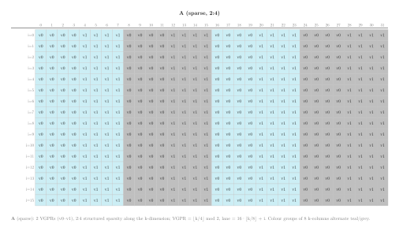
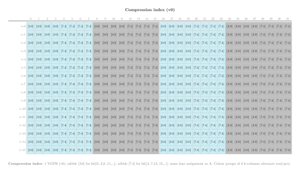
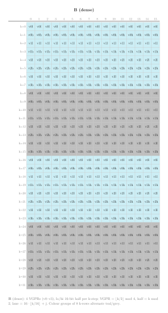
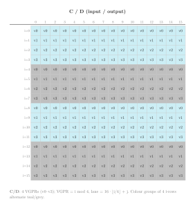
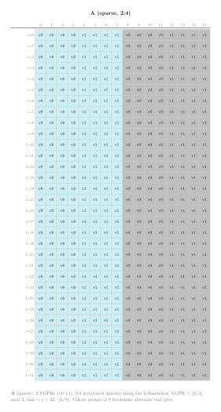
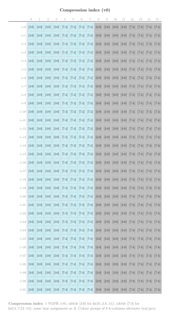
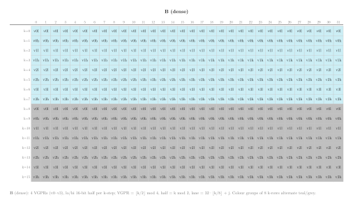
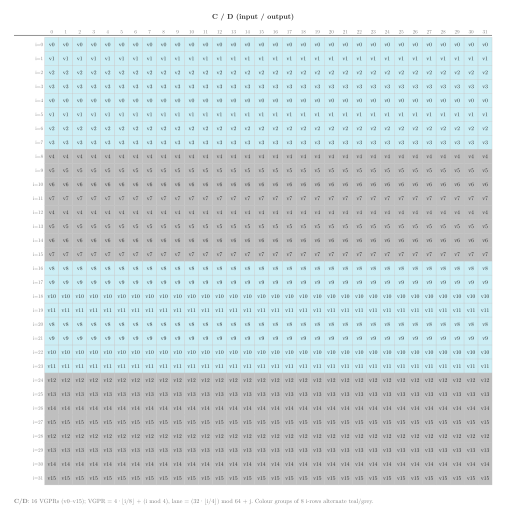

.. meta::
   :description: Reference for CDNA and CDNA2 sparse MFMA (SMFMAC) builtins, covering FP16, BF16, and INT8 variants with 4:2 structured sparsity on gfx908 and gfx90a.
   :keywords: AMD, ROCm, HIP, builtins, sparse, MFMA, SMFMAC, structured sparsity, matrix multiply, CDNA, CDNA2, gfx908, gfx90a, MI100, MI200

.. _cdna-sparse-mfma-builtins:

********************************************************************************
CDNA and CDNA2 sparse MFMA builtins
********************************************************************************

Sparse Matrix Fused Multiply-Accumulate (SMFMAC) builtins let you issue
hardware matrix multiply-accumulate operations that exploit 4:2 structured
sparsity directly from HIP device code on CDNA GPUs (``gfx908``, MI100) and
CDNA2 GPUs (``gfx90a``, MI200 series).  Each SMFMAC instruction multiplies a
compressed :math:`\pmb{A}` fragment by a dense :math:`\pmb{B}` fragment and
accumulates the result into a :math:`\pmb{C}` fragment, all within a single
wavefront of 64 lanes.  Because the :math:`\pmb{A}` operand is stored in
compressed form, these builtins halve the storage and memory bandwidth
required for :math:`\pmb{A}` compared to their dense MFMA counterparts, while
the hardware uses a sparsity index to reconstruct the original element
positions during the multiply.

Architecture availability
=========================

The builtins on this page target CDNA (``gfx908``, MI100) and CDNA2
(``gfx90a``, MI200 series).  Equivalent builtins for later CDNA
generations are documented on their own reference pages:

* :ref:`cdna3-sparse-mfma-builtins` -- CDNA3 (``gfx942``, MI300 series)
* :ref:`cdna4-sparse-mfma-builtins` -- CDNA4 (``gfx950``, MI350 series)

Naming convention
=================

All SMFMAC builtins follow the pattern:

.. code-block:: text

   __builtin_amdgcn_smfmac_<out_type>_<M>x<N>x<K>_<in_type_a>[_<in_type_b>]

``out_type``
    Accumulator element type (``f32`` or ``i32``).

``M``, ``N``, ``K``
    Tile dimensions in elements.  The instruction computes the contribution
    of a K-wide compressed panel of :math:`\pmb{A}` and a K-wide dense panel
    of :math:`\pmb{B}` to an :math:`M \times N` output tile.  Each
    instruction processes one K step; the caller loops over K to accumulate
    a full matrix product.

``in_type_a``
    Input element type of the :math:`\pmb{A}` matrix (``f16``, ``bf16``,
    or ``i8``).

``in_type_b`` (FP8/BF8 variants only)
    Input element type of the :math:`\pmb{B}` matrix.  Always present for
    FP8 and BF8 variants to disambiguate the four possible A×B type
    combinations (``fp8_fp8``, ``fp8_bf8``, ``bf8_fp8``, ``bf8_bf8``).
    Omitted for FP16, BF16, and INT8 variants where :math:`\pmb{A}` and
    :math:`\pmb{B}` always share the same type.

For example:

* ``__builtin_amdgcn_smfmac_f32_16x16x32_f16`` -- a :math:`16 \times 16`
  sparse MMA with :math:`K=32` that multiplies FP16 :math:`\pmb{A}` by
  FP16 :math:`\pmb{B}` and accumulates into FP32.

Structured sparsity (4:2 pattern)
=================================

The SMFMAC instructions require the :math:`\pmb{A}` matrix to obey 4:2
structured sparsity: in every contiguous group of four elements along the K
dimension, exactly two are non-zero and the other two are zero.  This
constraint allows the :math:`\pmb{A}` operand to be stored in a compressed
representation that contains only the non-zero values, reducing the storage
to half the original K dimension.

Along with the compressed non-zero values, the hardware requires a sparsity
index that encodes which two of the four positions in each group hold the
non-zeros.  This index is passed as the ``idx`` argument to every SMFMAC
builtin.  The hardware uses it at execution time to align the compressed
:math:`\pmb{A}` elements against the correct rows of the :math:`\pmb{B}`
operand before accumulating the products.

Host-side compression is straightforward: walk the K dimension in groups of
four, extract the two non-zero positions, and pack them consecutively into
the output buffer.  The example kernels in this topic adopt a fixed pattern
that keeps positions 0 and 2 of every group, producing a compressed buffer
of half the original K length.

.. _cdna-smfmac-accumulator-layout:

Accumulator layout
==================

Every SMFMAC instruction computes a single independent :math:`M \times N`
output tile (block count = 1).  The accumulator (:math:`\pmb{C}` /
:math:`\pmb{D}`) layout across wavefront lanes and VGPRs is identical to
the 1-block layout of the corresponding dense MFMA tile shape.

The formulas in the subsections below use the following notation:

* :math:`i` -- zero-based row index within the tile, :math:`0 \le i < M`
* :math:`j` -- zero-based column index within the tile, :math:`0 \le j < N`
* **lane** -- wavefront lane that holds the element,
  :math:`0 \le \text{lane} < 64`
* **VGPR** -- zero-based index into that lane's accumulator register file

:math:`16 \times 16` layout
---------------------------

The :math:`16 \times 16` output tile occupies 4 VGPRs per lane (``v4float``
or ``v4int``).

   :math:`16 \times 16`, **K=32 A (sparse, 2:4) operand layout.**

   :math:`16 \times 16`, **K=32 compression index layout.**

   :math:`16 \times 16`, **K=32 B (dense) operand layout.**

         per output element, with lane groups colour-coded.
   :align: center
   :width: 100%

   :math:`16 \times 16`, **K=32 accumulator layout.**  Each cell shows the
   VGPR index that holds output element :math:`(i, j)`.  Rows 0---3 (teal,
   lanes 0---15), rows 4---7 (grey, lanes 16---31), rows 8---11 (teal,
   lanes 32---47), rows 12---15 (grey, lanes 48---63).  Column :math:`j`
   gives the lane offset within the group.

Given output element :math:`(i, j)`:

.. math::

   \text{lane}    &= 16 \lfloor \frac{i}{4} \rfloor + j \\
   \text{VGPR}    &= i \bmod 4

Conversely, given lane :math:`L` and VGPR index :math:`G`:

.. math::

   i &= 4 \lfloor \frac{L}{16} \rfloor + (G \bmod 4) \\
   j &= L \bmod 16

The row-to-lane mapping:

.. list-table::
   :header-rows: 1
   :widths: auto

   * - Rows
     - Lanes
     - VGPRs
   * - 0---3
     - 0---15
     - 0---3
   * - 4---7
     - 16---31
     - 0---3
   * - 8---11
     - 32---47
     - 0---3
   * - 12---15
     - 48---63
     - 0---3

:math:`32 \times 32` layout
---------------------------

The :math:`32 \times 32` output tile occupies 16 VGPRs per lane
(``v16float`` or ``v16int``).

   :math:`32 \times 32`, **K=16 A (sparse, 2:4) operand layout.**

   :math:`32 \times 32`, **K=16 compression index layout.**

   :math:`32 \times 32`, **K=16 B (dense) operand layout.**

         per output element, with lane groups colour-coded.
   :align: center
   :width: 100%

   :math:`32 \times 32`, **K=16 accumulator layout.**  Each cell shows the
   VGPR index that holds output element :math:`(i, j)`.  Teal cells (rows
   where :math:`\lfloor i/4 \rfloor` is even) belong to lanes 0---31; grey
   cells to lanes 32---63.  Column :math:`j` gives the lane offset within
   the group.

Given output element :math:`(i, j)`:

.. math::

   \text{lane}   &= \bigl(32 \cdot \lfloor \frac{i}{4} \rfloor\bigr) \bmod 64 + j \\
   \text{VGPR}   &= 4 \lfloor \frac{i}{8} \rfloor + (i \bmod 4)

Conversely, given lane :math:`L` and VGPR index :math:`G`:

.. math::

   i &= \bigl(8 \cdot \lfloor \frac{G}{4} \rfloor\bigr) \bmod 32
       + 4 \lfloor \frac{L}{32} \rfloor + (G \bmod 4) \\
   j &= L \bmod 32

The row-to-lane mapping:

.. list-table::
   :header-rows: 1
   :widths: auto

   * - Rows
     - Lanes
     - VGPRs
   * - 0---3
     - 0---31
     - 0---3
   * - 4---7
     - 32---63
     - 0---3
   * - 8---11
     - 0---31
     - 4---7
   * - 12---15
     - 32---63
     - 4---7
   * - 16---19
     - 0---31
     - 8---11
   * - 20---23
     - 32---63
     - 8---11
   * - 24---27
     - 0---31
     - 12---15
   * - 28---31
     - 32---63
     - 12---15

Register types used in this reference
=====================================

The signatures below use the following type aliases, which you can declare
with C++ attributes in any HIP translation unit:

.. code-block:: cpp

   using v4float  = float    [[clang::ext_vector_type(4)]];
   using v16float = float    [[clang::ext_vector_type(16)]];
   using v4half   = _Float16 [[clang::ext_vector_type(4)]];
   using v8half   = _Float16 [[clang::ext_vector_type(8)]];
   using v4short  = short    [[clang::ext_vector_type(4)]];   // BF16 storage
   using v8short  = short    [[clang::ext_vector_type(8)]];   // BF16 storage
   using v2int    = int      [[clang::ext_vector_type(2)]];
   using v4int    = int      [[clang::ext_vector_type(4)]];
   using v16int   = int      [[clang::ext_vector_type(16)]];

Each type alias maps one-to-one to the corresponding LLVM vector type used
in the builtin definition.  The number in the name is the element count
per lane; the total VGPR count equals the element count multiplied by the
element size in 32-bit words.

Common parameters
=================

The SMFMAC builtins do not use the ``cbsz``, ``abid``, or ``blgp``
modifiers from the dense MFMA family.  See :doc:`mfma-common-parameters`
for a description of those modifiers in the dense context.

Using sparse MFMA builtins as a compute policy
================================================

The following example kernels demonstrate SMFMAC builtins in the context
of a tiled matrix multiplication.  Each kernel loads tiles of the compressed
:math:`\pmb{A}` matrix and the dense :math:`\pmb{B}` matrix into LDS,
then calls the SMFMAC builtin to replace the inner-product loop of a
conventional scalar kernel.

The complete source file is available for download:

* :download:`matrix_multiply_cdna_sparse_mfma.hip <../../tools/example_codes/matrix_multiply_cdna_sparse_mfma.hip>`

FP16 16×16 sparse kernel
------------------------

This kernel uses ``__builtin_amdgcn_smfmac_f32_16x16x32_f16`` to compute
a :math:`16 \times 16` sparse matrix multiply-accumulate with :math:`K=32`
per instruction.  The compressed :math:`\pmb{A}` operand is loaded as a
``v4half`` vector, the dense :math:`\pmb{B}` as a ``v8half`` vector, and
the accumulator is a ``v4float`` vector.

.. literalinclude:: ../../tools/example_codes/matrix_multiply_cdna_sparse_mfma.hip
   :language: cpp
   :linenos:
   :start-after: [Sphinx smfmac_cdna_16x16_f16_policy start]
   :end-before: [Sphinx smfmac_cdna_16x16_f16_policy end]

Each lane loads its :math:`\pmb{A}` fragment from the compressed LDS tile,
where the K dimension is halved.  The :math:`\pmb{B}` fragment is loaded
from the full dense :math:`\pmb{B}` tile in LDS.  The builtin call
replaces the entire inner-product loop of a baseline kernel with a single
instruction.  The 4-element FP32 result vector maps to four rows of the
:math:`16 \times 16` output sub-tile, with the lane index selecting the
column.

FP16 32×32 sparse kernel
------------------------

This kernel uses ``__builtin_amdgcn_smfmac_f32_32x32x16_f16`` to compute
a :math:`32 \times 32` sparse matrix multiply-accumulate with :math:`K=16`
per instruction.  The Cooperative Thread Array (CTA) tile grows to 64×64 to accommodate the larger
32×32 wavefront tiles.  The accumulator is a 16-element FP32 vector.

.. literalinclude:: ../../tools/example_codes/matrix_multiply_cdna_sparse_mfma.hip
   :language: cpp
   :linenos:
   :start-after: [Sphinx smfmac_cdna_32x32_f16_policy start]
   :end-before: [Sphinx smfmac_cdna_32x32_f16_policy end]

The lane-to-element mapping for the 16-element accumulator differs from
the :math:`16 \times 16` variant: each lane's 16 result elements are
distributed across four groups of four consecutive rows, with the group
stride determined by the lane's position within the wavefront.

**Compile and run:**

.. code-block:: bash

   amdclang++ -O3 -std=c++17 --offload-arch=gfx908 \
       matrix_multiply_cdna_sparse_mfma.hip -o mm_cdna_sparse_mfma
   ./mm_cdna_sparse_mfma

.. note::

   This example requires a CDNA or CDNA2 GPU (``gfx908`` or ``gfx90a``).
   Compile with ``--offload-arch=gfx908`` or ``--offload-arch=gfx90a`` to
   select the correct architecture.

.. _cdna-smfmac-instruction-throughput:

Instruction throughput
======================

The cycle count below is the value used to compute theoretical peak
throughput: :math:`\text{peak throughput} =
\frac{\text{ops per instruction}}{\text{cycle count}} \times
\text{clock frequency}`.  All SMFMAC instructions support vector ALU (VALU)
co-execution; the VALU co-execution cycle count gives the number of VALU
cycles available during the SMFMAC latency window.

.. list-table::
   :header-rows: 1
   :widths: auto

   * - Builtin
     - Ops
     - Cycle count
     - VALU co-execution cycles
   * - ``__builtin_amdgcn_smfmac_f32_16x16x32_f16``
     - 16384
     - 16
     - 8
   * - ``__builtin_amdgcn_smfmac_f32_32x32x16_f16``
     - 32768
     - 32
     - 24
   * - ``__builtin_amdgcn_smfmac_f32_16x16x32_bf16``
     - 16384
     - 16
     - 8
   * - ``__builtin_amdgcn_smfmac_f32_32x32x16_bf16``
     - 32768
     - 32
     - 24
   * - ``__builtin_amdgcn_smfmac_i32_16x16x64_i8``
     - 32768
     - 16
     - 8
   * - ``__builtin_amdgcn_smfmac_i32_32x32x32_i8``
     - 65536
     - 32
     - 24

.. _cdna-smfmac-builtin-reference:

Builtin reference
===================

FP32-accumulate builtins
--------------------------

These builtins accumulate into single-precision (FP32) output fragments.
They differ in the data type of the :math:`\pmb{A}` and :math:`\pmb{B}`
matrix inputs.

FP16 matrix inputs
^^^^^^^^^^^^^^^^^^

The following builtins accept compressed FP16 elements for :math:`\pmb{A}`
and dense FP16 elements for :math:`\pmb{B}`, accumulating into FP32 output
fragments.

.. include:: smfmac-ref/f32-16x16x32-f16.rst
.. include:: smfmac-ref/f32-32x32x16-f16.rst

BF16 matrix inputs
^^^^^^^^^^^^^^^^^^

The following builtins accept compressed BF16 elements for :math:`\pmb{A}`
and dense BF16 elements for :math:`\pmb{B}`, accumulating into FP32 output
fragments.  BF16 values are stored as ``short`` in register.

.. include:: smfmac-ref/f32-16x16x32-bf16.rst
.. include:: smfmac-ref/f32-32x32x16-bf16.rst

INT32-accumulate builtins
---------------------------

These builtins accept four signed 8-bit integer elements per 32-bit
register lane for both :math:`\pmb{A}` and :math:`\pmb{B}` inputs, and
accumulate into INT32 output fragments.

INT8 matrix inputs
^^^^^^^^^^^^^^^^^^

The following builtins use INT8 matrix inputs.

.. include:: smfmac-ref/i32-16x16x64-i8.rst
.. include:: smfmac-ref/i32-32x32x32-i8.rst
