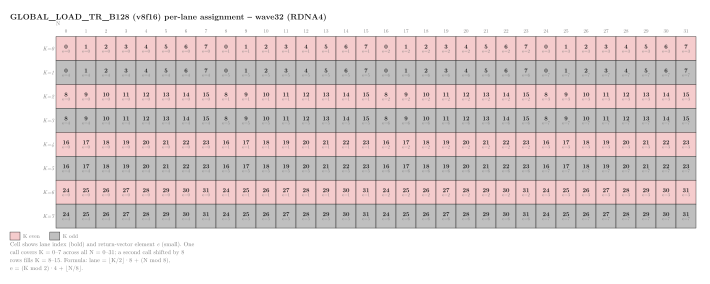

.. meta::
   :description: Reference for RDNA4 global memory transpose-load builtins
      that feed WMMA operands directly, covering all global_load_tr_b64
      and global_load_tr_b128 variants.
   :keywords: RDNA4, gfx1200, gfx1201, WMMA, transpose load, global_load_tr,
      matrix cores, builtins, HIP intrinsics,
      __builtin_amdgcn_global_load_tr

.. _rdna4-wmma-transpose-builtins:

********************************************************************************
RDNA4 WMMA transpose load builtins
********************************************************************************

RDNA4 (``gfx1200``, ``gfx1201``) provides hardware instructions that load a
matrix sub-tile into per-lane VGPRs while transposing row-major and
column-major storage order in the same operation. When a matrix's storage
order in memory doesn't match the fragment layout the
:doc:`RDNA4 dense WMMA builtins <rdna4-dense-wmma-builtins>` expect, these
builtins remove the need for a scalar transpose loop.

.. note::

   Like the WMMA builtins they feed, these load-transpose instructions are
   supported only for **wave32** on RDNA4. RDNA4 also has ``wavefrontsize64``
   transpose-load variants, but since RDNA4 WMMA itself is wave32-only,
   those aren't tied to feeding WMMA and aren't covered on this page.

Architecture availability
=========================

The builtins on this page target RDNA4 GPUs. To automatically enable them,
pass the Low Level Virtual Machine (LLVM) target architecture flag at compile time:

.. code-block:: bash

   amdclang++ --offload-arch=gfx1200 ...
   amdclang++ --offload-arch=gfx1201 ...

Naming convention
==================

All transpose-load builtins on this page follow the pattern:

.. code-block:: text

   __builtin_amdgcn_global_load_tr_b<M>_v<K><type>

Unlike CDNA5's transpose-load builtins, RDNA4 names carry no bit-width
digit (no ``tr16``/``tr8``) -- RDNA4 has only one transpose-load
instruction family per load size, so no extra digit is needed to
disambiguate it.

``M``
    Bits loaded per lane (``128`` or ``64``).

``K``
    Number of elements in the return vector.

``type``
    Element type of the return vector: ``i32``, ``i16``, ``f16``, or
    ``bf16``.

Register types used in this reference
========================================

The signatures below use the following type aliases, which you can declare
with Clang vector attributes in any HIP translation unit:

.. code-block:: cpp

   using v2int   = int      [[clang::ext_vector_type(2)]];
   using v8short = short    [[clang::ext_vector_type(8)]];
   using v8half  = _Float16 [[clang::ext_vector_type(8)]];
   using v8bf16  = __bf16   [[clang::ext_vector_type(8)]];

.. note::

   The ``f16`` builtin requires the ``__fp16`` type (GCC-style
   half-precision), not ``_Float16`` (ISO C half-precision). Cast pointers
   and vector types to ``__fp16``-based variants at the call site only --
   the standard WMMA builtins accept ``_Float16`` as usual. The worked
   example below does exactly this with its own ``half8`` alias.

Hardware constraints
======================

* **Sub-tile per call, not a full 16x16 tile.** ``global_load_tr_b128``
  covers an 8-row x 32-column sub-tile per call (see
  :ref:`rdna4-wmma-transpose-fragment-layout` below) -- two calls, the
  second offset by 8 rows, are needed to fill a full 16-row K-strip. This
  differs from CDNA5's ``tr16_b128``/``tr8_b64``, which each load a
  complete :math:`16 \times 16` tile in a single call.
* **Wave32 only.**
* All builtins are ``const`` and have no side effects.

.. _rdna4-wmma-transpose-fragment-layout:

Per-lane fragment layout
==========================

         GLOBAL_LOAD_TR_B128 (v8f16), colored by even/odd K row.
   :align: center
   :width: 90%

   Per-lane assignment for ``global_load_tr_b128_v8f16``. Each cell shows
   the lane index (bold) and the return-vector element index :math:`e`
   (small) that produced it.

Given a call whose base K-row is ``k_tile`` and base N-column is
``block_n``, lane ``tx`` (0--31) reads from:

.. code-block:: text

   ptr(tx) = &input[(k_tile + tx/4) * cols + block_n + (tx%4)*8]

and the returned vector's element ``e`` (0--7) lands at:

.. math::

   \text{row} &= k\_tile + \lfloor tx/8 \rfloor \cdot 2 + \lfloor e/4 \rfloor \\
   \text{col} &= block\_n + (e \bmod 4) \cdot 8 + (tx \bmod 8)

A second call with ``ptr`` shifted by 8 rows (``k_tile + 8``) fills the
upper half of a 16-row K-strip; together the two calls cover
:math:`16 \times 32` elements -- exactly the B operand a
``wmma_f32_16x16x16_f16_w32_gfx12`` K-step needs from two adjacent
wave32 blocks. ``global_load_tr_b128_v8i16`` and ``_v8bf16`` use the same
128-bit data path with a different element-type interpretation, so they
follow this same mapping. ``global_load_tr_b64_v2i32`` uses a different
(64-bit) data path; no per-lane mapping is documented for it below.

Builtin reference
====================

``__builtin_amdgcn_global_load_tr_b64_v2i32``
-------------------------------------------------

.. code-block:: cpp

   v2int __builtin_amdgcn_global_load_tr_b64_v2i32(v2int* ptr);

Loads and transposes 64 bits per lane of 8-bit data (INT8, FP8, or BF8),
returning two packed 32-bit words rather than eight discrete 8-bit
elements. This builtin uses a different data path from
``global_load_tr_b128``; see :ref:`rdna4-wmma-transpose-fragment-layout`.

.. list-table::
   :header-rows: 1
   :widths: auto

   * - Parameter
     - Type
     - Description
   * - ``ptr``
     - ``v2int*``
     - Pointer to global address space.

**Returns** ``v2int`` -- two 32-bit words holding the lane's 8-bit
fragment after transposition.

``__builtin_amdgcn_global_load_tr_b128_v8i16``
-------------------------------------------------

.. code-block:: cpp

   v8short __builtin_amdgcn_global_load_tr_b128_v8i16(v8short* ptr);

Loads and transposes 128 bits per lane of INT16 data. Expected to share
``v8f16``'s permutation -- see :ref:`rdna4-wmma-transpose-fragment-layout`.

.. list-table::
   :header-rows: 1
   :widths: auto

   * - Parameter
     - Type
     - Description
   * - ``ptr``
     - ``v8short*``
     - Pointer to global address space.

**Returns** ``v8short`` -- eight INT16 elements holding the lane's
fragment after transposition.

``__builtin_amdgcn_global_load_tr_b128_v8f16``
-------------------------------------------------

.. code-block:: cpp

   v8half __builtin_amdgcn_global_load_tr_b128_v8f16(v8half* ptr);

Loads and transposes 128 bits per lane of FP16 data. See the ``__fp16``
note above -- cast ``ptr`` and the return value to a ``__fp16``-based
``v8half`` at the call site. Its per-lane mapping is detailed in
:ref:`rdna4-wmma-transpose-fragment-layout`.

.. list-table::
   :header-rows: 1
   :widths: auto

   * - Parameter
     - Type
     - Description
   * - ``ptr``
     - ``v8half*``
     - Pointer to global address space.

**Returns** ``v8half`` -- eight FP16 elements holding the lane's fragment
after transposition.

``__builtin_amdgcn_global_load_tr_b128_v8bf16``
-------------------------------------------------

.. code-block:: cpp

   v8bf16 __builtin_amdgcn_global_load_tr_b128_v8bf16(v8bf16* ptr);

Loads and transposes 128 bits per lane of BF16 data. Expected to share
``v8f16``'s permutation -- see :ref:`rdna4-wmma-transpose-fragment-layout`.

.. list-table::
   :header-rows: 1
   :widths: auto

   * - Parameter
     - Type
     - Description
   * - ``ptr``
     - ``v8bf16*``
     - Pointer to global address space.

**Returns** ``v8bf16`` -- eight BF16 elements holding the lane's fragment
after transposition.

.. _rdna4-wmma-transpose-example:

Using a transpose load as a compute policy
=============================================

:ref:`mfma-compute-policy` explains the ``ComputePolicy``/``TilePolicy``
pattern used to separate tile staging from the compute loop. This section
extends the RDNA4 WMMA FP16 example from
:ref:`rdna4-dense-wmma-builtins-example` with a transpose-load tile policy.

The complete source file is available for download:

* :download:`matrix_multiply_rdna4_wmma.hip <../../tools/example_codes/matrix_multiply_rdna4_wmma.hip>`

``WmmaRdna4F16TrPolicy`` replaces the scalar B transpose with a hardware-
accelerated ``GLOBAL_LOAD_TR_B128`` instruction
(``__builtin_amdgcn_global_load_tr_b128_v8f16``). This intrinsic loads 128
bits per lane from global memory and transposes the data into LDS in a
single operation, avoiding the per-element scalar transpose loop. The
per-lane addressing follows exactly the formula in
:ref:`rdna4-wmma-transpose-fragment-layout`.

``SingleBufferTilePolicyF16TrB`` fills B's shared-memory tile using this
instruction instead of a scalar loop:

.. literalinclude:: ../../tools/example_codes/matrix_multiply_rdna4_wmma.hip
   :language: cpp
   :start-after: [Sphinx tile policy f16 tr start]
   :end-before: [Sphinx tile policy f16 tr end]
   :caption: SingleBufferTilePolicyF16TrB (matrix_multiply_rdna4_wmma.hip)

The compute path (``load_a``, ``load_b``, ``mma``, ``store_c``) is
identical to the baseline ``WmmaRdna4F16Policy`` -- only the tile policy's
``prefetch()`` stage changes:

.. literalinclude:: ../../tools/example_codes/matrix_multiply_rdna4_wmma.hip
   :language: cpp
   :start-after: [Sphinx wmma rdna4 tr policy start]
   :end-before: [Sphinx wmma rdna4 tr policy end]
   :caption: WmmaRdna4F16TrPolicy (matrix_multiply_rdna4_wmma.hip)

.. rubric:: Instantiating the kernel

With either policy, plug it into the generic kernel alongside any
``TilePolicy`` whose ``block_tile_m`` and ``block_tile_n`` are multiples
of 16 and whose ``k_tile_size`` is a multiple of ``k_step = 16``. See
:ref:`rdna4-dense-wmma-builtins-example` for the shared policy aliases,
launch configuration, and kernel launch code -- the same
``matrix_multiply_rdna4_wmma.hip`` file wires up both ``WmmaTilePolicy``
(baseline) and ``WmmaTilePolicyTrB`` (this page) and runs both back to
back for comparison.

Compiling and running
========================

.. code-block:: bash

   amdclang++ -O3 --offload-arch=gfx1200 \
       matrix_multiply_rdna4_wmma.hip -o mm_rdna4_wmma
   ./mm_rdna4_wmma

   amdclang++ -O3 --offload-arch=gfx1201 \
       matrix_multiply_rdna4_wmma.hip -o mm_rdna4_wmma
   ./mm_rdna4_wmma

.. note::

   ``WmmaRdna4F16TrPolicy`` requires an RDNA4 GPU (``gfx1200`` or
   ``gfx1201``). The ``#if defined(__gfx1200__) || defined(__gfx1201__)``
   guard in the example file falls back to ``ScalarFMAPolicy`` on other
   targets, so the file compiles without modification.
