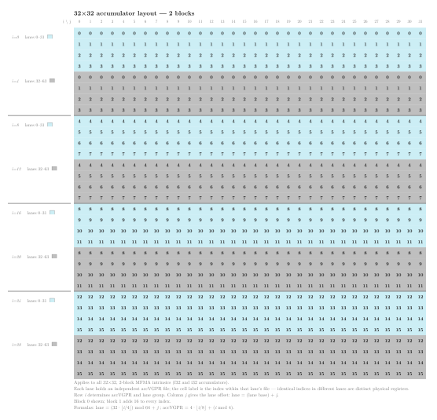
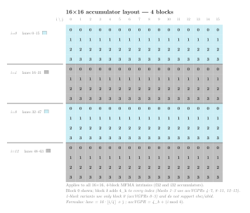
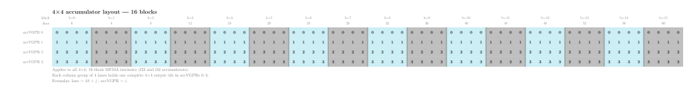

.. meta::
   :description: Reference for CDNA (gfx908, MI100) matrix fused multiply-add intrinsics, covering all __builtin_amdgcn_mfma_* variants, parameters, and output layouts.
   :keywords: AMD, ROCm, HIP, CDNA, MI100, gfx908, MFMA, matrix cores, intrinsics, __builtin_amdgcn_mfma, matrix multiply-accumulate

.. _cdna-mfma-intrinsics:

********************************************************************************
CDNA MFMA intrinsics
********************************************************************************

Matrix Fused Multiply-Add (MFMA) intrinsics let you issue hardware
matrix multiply-accumulate operations directly from HIP device code on
first-generation CDNA GPUs (``gfx908``, MI100).  Each MFMA instruction
multiplies a small :math:`\pmb{A}` fragment by a small :math:`\pmb{B}` fragment
and accumulates the result into a :math:`\pmb{C}` fragment, all within a single
wavefront of 64 lanes. The hardware delivers significantly higher throughput
than an equivalent sequence of scalar fused multiply-add (FMA) instructions.

Architecture availability
=========================

The intrinsics on this page target CDNA (``gfx908``, MI100) exclusively.
Equivalent intrinsics for later CDNA generations are documented on their own
reference pages:

* :ref:`cdna2-mfma-intrinsics` -- CDNA2 (``gfx90a``, MI200 series)
* :ref:`cdna3-dense-mfma-intrinsics` -- CDNA3 (``gfx942``, MI300 series)

.. _cdna-mfma-accumulator-layout:

Accumulator layout
==================

Each MFMA instruction computes one or more independent :math:`M \times N`
output tiles simultaneously across the 64 lanes of a wavefront.  The number
of independent tiles is called the *block count*.  It depends on how the
:math:`\pmb{A}` matrix rows are distributed across lane groups:

* **Scalar-input variants** (FP32 :math:`\pmb{A}` and :math:`\pmb{B}`):
  each K position occupies a separate group of :math:`M` lanes, so
  :math:`\text{blocks} = \frac{\text{wavefront size}}{M \times K}`.
* **Packed-input variants** (FP16, BF16, INT8 :math:`\pmb{A}` and
  :math:`\pmb{B}`): all K positions are packed into the register bits of
  the *same* lane group, so
  :math:`\text{blocks} = \frac{\text{wavefront size}}{M}` regardless of
  :math:`K`.

Each block is independent: the :math:`\pmb{A}`, :math:`\pmb{B}`, and
:math:`\pmb{C}`/:math:`\pmb{D}` operands of different blocks
occupy distinct lane and accVGPR positions and compute separate outer products.

The total number of accVGPRs per lane scales with the block count:

.. math::

   \text{accVGPRs per lane} = \text{blocks} \times \frac{M \times N}{\text{wavefront size}}

.. note::

   On CDNA GPUs, the :math:`\pmb{C}` and :math:`\pmb{D}` matrix operands must
   reside in *accumulation VGPRs* (accVGPRs).  Unlike :math:`\pmb{A}` and
   :math:`\pmb{B}`, they cannot use standard architecture VGPRs (archVGPRs).
   In HIP device code the transfer to archVGPRs happens automatically when 
   assigning the intrinsic return value to a local variable of the appropriate
   vector type.

   Each of the 64 wavefront lanes maintains its own private accVGPR file.
   An accVGPR index always refers to a register within one specific lane's
   file; the same index in two different lanes denotes two distinct physical
   registers.

The formulas in the subsections below use the following notation:

* :math:`i` -- zero-based row index within the tile, :math:`0 \le i < M`
* :math:`j` -- zero-based column index within the tile, :math:`0 \le j < N`
* :math:`b` -- block index, :math:`0 \le b < \text{blocks}`
* **lane** -- wavefront lane that holds the element,
  :math:`0 \le \text{lane} < 64`
* **accVGPR** -- zero-based index into that lane's *private* accumulator
  register file; the same index in two different lanes refers to two distinct
  physical registers

:math:`32 \times 32` layout
---------------------------

The :math:`32 \times 32` tile shape uses two blocks.  All 32 accVGPRs per
lane are active: accVGPRs 0---15 belong to block 0, accVGPRs 16---31 to block 1.

         output element, with lane groups colour-coded.
   :align: center
   :width: 100%

   :math:`32 \times 32` **accumulator layout -- 2 blocks.**  Each cell shows the
   accVGPR index that holds output element :math:`(i, j)` of block 0; block 1
   adds 16.  Teal cells (rows where :math:`\lfloor \frac{i}{4} \rfloor` is even)
   belong to lanes 0---31; grey cells to lanes 32---63.  Column :math:`j` gives
   the lane offset within the group.  Applies to all :math:`32 \times 32` FP32
   and INT32 MFMA intrinsics.  See the formulas and row-to-lane table below.

Given output element :math:`(i, j)` in block :math:`b`:

.. math::

   \text{lane}   &= \bigl(32 \cdot \lfloor \frac{i}{4} \rfloor\bigr) \bmod 64 + j \\
   \text{accVGPR} &= 16 b + 4 \lfloor \frac{i}{8} \rfloor + (i \bmod 4)

Conversely, given a lane :math:`L` and accVGPR index :math:`G`:

.. math::

   i &= \bigl(8 \cdot \lfloor \frac{G}{4} \rfloor\bigr) \bmod 32
       + 4 \lfloor \frac{L}{32} \rfloor + (G \bmod 4) \\
   j &= L \bmod 32 \\
   b &= \lfloor \frac{G}{16} \rfloor

The row-to-lane mapping groups rows in bands of four.  Within block 0:

.. list-table::
   :header-rows: 1
   :widths: auto

   * - Rows
     - Lanes
     - accVGPRs
   * - 0---3
     - 0---31
     - 0---3
   * - 4---7
     - 32---63
     - 0---3
   * - 8---11
     - 0---31
     - 4---7
   * - 12---15
     - 32---63
     - 4---7
   * - 16---19
     - 0---31
     - 8---11
   * - 20---23
     - 32---63
     - 8---11
   * - 24---27
     - 0---31
     - 12---15
   * - 28---31
     - 32---63
     - 12---15

Block 1 uses the same lane pattern with accVGPRs 16---31.

Intrinsics with a **1-block** :math:`32 \times 32` result (``v16float`` /
``v16int``, 16 accVGPRs per lane) use only block 0 of the layout above.
These variants do not support the ``cbsz`` and ``abid`` modifiers.

:math:`16 \times 16` layout
---------------------------

The :math:`16 \times 16` tile shape uses four blocks.  The 16 accVGPRs per
lane are partitioned by block: accVGPRs 0---3 for block 0, 4---7 for block 1,
8---11 for block 2, and 12---15 for block 3.

         output element, with lane groups colour-coded by block assignment.
   :align: center
   :width: 100%

   :math:`16 \times 16` **accumulator layout -- 4 blocks.**  Each cell shows
   the accVGPR index for block 0; block :math:`k` adds :math:`4k`.  Rows
   0---3 (teal, lanes 0---15), rows 4---7 (grey, lanes 16---31), rows 8---11
   (teal, lanes 32---47), rows 12---15 (grey, lanes 48---63).  Column
   :math:`j` gives the lane offset within the group.  Applies to all
   :math:`16 \times 16` FP32 and INT32 MFMA intrinsics.  1-block variants use
   only block 0. See the formulas and row-to-lane table below.

Given output element :math:`(i, j)` in block :math:`b`:

.. math::

   \text{lane}    &= 16 \lfloor \frac{i}{4} \rfloor + j \\
   \text{accVGPR} &= 4 b + (i \bmod 4)

Conversely, given lane :math:`L` and accVGPR index :math:`G`:

.. math::

   i &= 4 \lfloor \frac{L}{16} \rfloor + (G \bmod 4) \\
   j &= L \bmod 16 \\
   b &= \lfloor \frac{G}{4} \rfloor

The row-to-lane mapping (identical for every block):

.. list-table::
   :header-rows: 1
   :widths: auto

   * - Rows
     - Lanes
   * - 0---3
     - 0---15
   * - 4---7
     - 16---31
   * - 8---11
     - 32---47
   * - 12---15
     - 48---63

Intrinsics with a **1-block** :math:`16 \times 16` result (``v4float`` /
``v4int``, 4 accVGPRs per lane) use only block 0 of the layout above.
These variants do not support the ``cbsz`` and ``abid`` modifiers.

:math:`4 \times 4` layout
-------------------------

The :math:`4 \times 4` tile shape uses 16 blocks.  A single wavefront
simultaneously computes 16 independent :math:`4 \times 4` outer products.
Each group of 4 consecutive lanes (lanes :math:`4b` through :math:`4b + 3`)
holds all 16 output elements of block :math:`b` across 4 accVGPRs.

         consecutive groups of 4 lanes across the full wavefront.
   :align: center
   :width: 100%

   :math:`4 \times 4` **accumulator layout -- 16 blocks.**  Columns are lanes
   0---63; each group of 4 consecutive lanes holds one complete
   :math:`4 \times 4` output tile in accVGPRs 0---3 (rows).  Teal groups are
   even-numbered blocks, grey groups odd-numbered blocks.  Applies to all
   :math:`4 \times 4` FP32 and INT32 MFMA intrinsics.  See the formulas below.

Given output element :math:`(i, j)` in block :math:`b`:

.. math::

   \text{lane}    &= 4 b + j \\
   \text{accVGPR} &= i

Conversely, given lane :math:`L` and accVGPR index :math:`G`:

.. math::

   i &= G \bmod 4 \\
   j &= L \bmod 4 \\
   b &= \lfloor \frac{L}{4} \rfloor

.. _mfma-compute-policy:

Using MFMA intrinsics as a compute policy
==========================================

The matrix multiplication tutorial in
:ref:`matrix-multiply-optimization` uses a ``ComputePolicy`` type
parameter to separate the multiply-accumulate logic from the rest of the
kernel.  You can drop an MFMA-based policy into that framework without
changing the outer kernel.

The example below implements ``MfmaCdnaPolicy`` using
``v_mfma_f32_32x32x1f32`` -- a :math:`32 \times 32` FP32 intrinsic available
on all CDNA generations.  Each wavefront computes a single
:math:`32 \times 32` output tile per ``mma()`` call; two blocks are active,
giving 32 accVGPRs per lane.

.. rubric:: Policy constants

``v_mfma_f32_32x32x1f32`` takes one FP32 scalar from A and one from B per
call (K=1), so ``k_step = 1``.  The entire :math:`32 \times 32` tile is owned
by a single wavefront, so ``thread_tile_m = thread_tile_n = 32`` and
``effective_lanes = 64``.

.. rubric:: Accumulator layout

The intrinsic returns a ``v32float`` holding 32 accVGPR values --
16 for block 0 and 16 for block 1.  The ``Accumulator`` struct wraps this
directly.  The layout formulas from the :ref:`cdna-mfma-accumulator-layout`
section translate ``(lane, accVGPR)`` back to :math:`(i, j)` coordinates
during the ``store_c()`` pass.

.. rubric:: Fragment loading

Because K=1, each ``load_a`` call reads a single scalar: the element at
row ``tile_a_row + (lane mod 32)`` (since 32 :math:`\pmb{A}`-rows map to the
lower 32 lanes).  In practice the kernel inner loop increments ``ki`` in
steps of ``k_step = 1``, so each ``load_a``/``load_b`` call loads one element.

.. literalinclude:: ../../tools/example_codes/matrix_multiply_cdna_mfma.hip
   :language: cuda
   :start-after: [Sphinx mfma cdna policy start]
   :end-before: [Sphinx mfma cdna policy end]

.. rubric:: Instantiating the kernel

With ``MfmaCdnaPolicy`` in hand, plug it into the generic kernel alongside
any ``TilePolicy`` whose ``block_tile_m`` and ``block_tile_n`` are multiples
of 32 and whose ``k_tile_size`` is a multiple of ``k_step = 1``.  The policy
aliases and launch configuration from the example file are:

.. literalinclude:: ../../tools/example_codes/matrix_multiply_cdna_mfma.hip
   :language: cuda
   :start-after: [Sphinx mfma policy aliases start]
   :end-before: [Sphinx mfma policy aliases end]

.. literalinclude:: ../../tools/example_codes/matrix_multiply_cdna_mfma.hip
   :language: cuda
   :start-after: [Sphinx mfma launch config start]
   :end-before: [Sphinx mfma launch config end]

.. literalinclude:: ../../tools/example_codes/matrix_multiply_cdna_mfma.hip
   :language: cuda
   :start-after: [Sphinx mfma kernel launch start]
   :end-before: [Sphinx mfma kernel launch end]

**Compile and run:**

.. code-block:: bash

   amdclang++ -O3 -std=c++17 --offload-arch=gfx908 \
       matrix_multiply_cdna_mfma.hip -o mm_cdna_mfma
   ./mm_cdna_mfma

.. note::

   ``MfmaCdnaPolicy`` requires a CDNA GPU (``gfx908``).  Compile with
   ``--offload-arch=gfx908`` to select the correct architecture.  On other
   targets the ``#if defined(__gfx908__)`` guard selects ``ScalarFMAPolicy``
   automatically, so the file compiles without modification.

Naming convention
=================

All MFMA intrinsics follow the pattern:

.. code-block:: text

   __builtin_amdgcn_mfma_<out_type>_<M>x<N>x<K><in_type>

``out_type``
    Accumulator element type (``f32`` or ``i32``).

``M``, ``N``, ``K``
    Tile dimensions in elements.  The instruction computes the
    contribution of a K-wide panel of :math:`\pmb{A}` (:math:`M \times K`) and
    a K-wide panel of :math:`\pmb{B}` (:math:`K \times N`) to an
    :math:`M \times N` output tile.  Each instruction processes one K step;
    the caller loops over K to accumulate a full matrix product.

``in_type``
    Input element type (``f32``, ``f16``, ``bf16``, or ``i8``).

Register types used in this reference
======================================

The signatures below use the following type aliases, which you can declare with
C++ attributes in any HIP translation unit:

.. code-block:: cpp

   using v4float   = float [[clang::ext_vector_type(4)]];
   using v16float  = float [[clang::ext_vector_type(16)]];
   using v32float  = float [[clang::ext_vector_type(32)]];
   using v4half    = _Float16 [[clang::ext_vector_type(4)]];
   using v4int     = int [[clang::ext_vector_type(4)]];
   using v16int    = int [[clang::ext_vector_type(16)]];
   using v32int    = int [[clang::ext_vector_type(32)]];
   using v2bfloat  = short [[clang::ext_vector_type(2)]]; // bf16 storage

Each type alias maps one-to-one to the corresponding LLVM vector type used in
the intrinsic definition.  The number in the name is the element count per
lane; the total VGPR count equals the element count multiplied by the element
size in 32-bit words.

Common parameters
=================

See :doc:`mfma-common-parameters` for a complete description of the ``cbsz``,
``abid``, and ``blgp`` modifiers shared by all MFMA intrinsics.

.. _cdna-mfma-instruction-throughput:

Instruction throughput
======================

The cycle count below is the value used to compute theoretical peak
throughput: :math:`\text{peak throughput} =
\frac{\text{ops per instruction}}{\text{cycle count}} \times
\text{clock frequency}`.  Instructions that support VALU co-execution allow
the compiler to overlap matrix and vector work; the VALU co-execution cycle
count gives the number of VALU cycles available during the MFMA latency
window.  A value of 0 means VALU co-execution is not supported.

.. list-table::
   :header-rows: 1
   :widths: auto

   * - Intrinsic
     - Ops
     - Cycle count
     - VALU co-execution cycles
   * - ``__builtin_amdgcn_mfma_f32_32x32x1f32``
     - 4096
     - 64
     - 56
   * - ``__builtin_amdgcn_mfma_f32_16x16x1f32``
     - 2048
     - 32
     - 24
   * - ``__builtin_amdgcn_mfma_f32_4x4x1f32``
     - 512
     - 8
     - 0
   * - ``__builtin_amdgcn_mfma_f32_32x32x2f32``
     - 4096
     - 64
     - 56
   * - ``__builtin_amdgcn_mfma_f32_16x16x4f32``
     - 2048
     - 32
     - 24
   * - ``__builtin_amdgcn_mfma_f32_32x32x4f16``
     - 16384
     - 64
     - 56
   * - ``__builtin_amdgcn_mfma_f32_16x16x4f16``
     - 8192
     - 32
     - 24
   * - ``__builtin_amdgcn_mfma_f32_4x4x4f16``
     - 2048
     - 8
     - 0
   * - ``__builtin_amdgcn_mfma_f32_32x32x8f16``
     - 16384
     - 64
     - 56
   * - ``__builtin_amdgcn_mfma_f32_16x16x16f16``
     - 8192
     - 32
     - 24
   * - ``__builtin_amdgcn_mfma_f32_32x32x2bf16``
     - 8192
     - 64
     - 56
   * - ``__builtin_amdgcn_mfma_f32_16x16x2bf16``
     - 4096
     - 32
     - 24
   * - ``__builtin_amdgcn_mfma_f32_4x4x2bf16``
     - 1024
     - 8
     - 0
   * - ``__builtin_amdgcn_mfma_f32_32x32x4bf16``
     - 8192
     - 64
     - 56
   * - ``__builtin_amdgcn_mfma_f32_16x16x8bf16``
     - 4096
     - 32
     - 24
   * - ``__builtin_amdgcn_mfma_i32_32x32x4i8``
     - 16384
     - 64
     - 56
   * - ``__builtin_amdgcn_mfma_i32_16x16x4i8``
     - 8192
     - 32
     - 24
   * - ``__builtin_amdgcn_mfma_i32_4x4x4i8``
     - 2048
     - 8
     - 0
   * - ``__builtin_amdgcn_mfma_i32_32x32x8i8``
     - 16384
     - 64
     - 56
   * - ``__builtin_amdgcn_mfma_i32_16x16x16i8``
     - 8192
     - 32
     - 24

.. _cdna-mfma-intrinsic-reference:

Intrinsic reference
===================

FP32-accumulate intrinsics
--------------------------

These intrinsics accumulate into single-precision (FP32) output
fragments.  They differ in the data type of the :math:`\pmb{A}` and
:math:`\pmb{B}` matrix inputs.

FP32 matrix inputs
^^^^^^^^^^^^^^^^^^

The following intrinsics accept one FP32 element per lane for both
:math:`\pmb{A}` and :math:`\pmb{B}` inputs and accumulate into FP32 output
fragments.

.. include:: mfma-ref/f32-32x32x1f32.rst
.. include:: mfma-ref/f32-16x16x1f32.rst
.. include:: mfma-ref/f32-4x4x1f32.rst
.. include:: mfma-ref/f32-32x32x2f32.rst
.. include:: mfma-ref/f32-16x16x4f32.rst

FP16 matrix inputs
^^^^^^^^^^^^^^^^^^

The following intrinsics accept four FP16 elements per lane packed into a
``v4half`` register for both :math:`\pmb{A}` and :math:`\pmb{B}` inputs,
and accumulate into FP32 output fragments.

.. include:: mfma-ref/f32-32x32x4f16.rst
.. include:: mfma-ref/f32-16x16x4f16.rst
.. include:: mfma-ref/f32-4x4x4f16.rst
.. include:: mfma-ref/f32-32x32x8f16.rst
.. include:: mfma-ref/f32-16x16x16f16.rst

BF16 matrix inputs
^^^^^^^^^^^^^^^^^^

The following intrinsics accept two BF16 elements per lane packed into a
``v2bfloat`` register for both :math:`\pmb{A}` and :math:`\pmb{B}` inputs,
and accumulate into FP32 output fragments.

.. include:: mfma-ref/f32-32x32x2bf16.rst
.. include:: mfma-ref/f32-16x16x2bf16.rst
.. include:: mfma-ref/f32-4x4x2bf16.rst
.. include:: mfma-ref/f32-32x32x4bf16.rst
.. include:: mfma-ref/f32-16x16x8bf16.rst

INT32-accumulate intrinsics
---------------------------

These intrinsics accept four signed 8-bit integer elements per lane packed
into a single ``int`` register for both :math:`\pmb{A}` and :math:`\pmb{B}`
inputs, and accumulate into INT32 output fragments.

INT8 matrix inputs
^^^^^^^^^^^^^^^^^^

.. include:: mfma-ref/i32-32x32x4i8.rst
.. include:: mfma-ref/i32-16x16x4i8.rst
.. include:: mfma-ref/i32-4x4x4i8.rst
.. include:: mfma-ref/i32-32x32x8i8.rst
.. include:: mfma-ref/i32-16x16x16i8.rst
