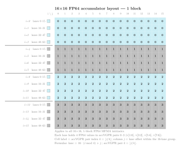
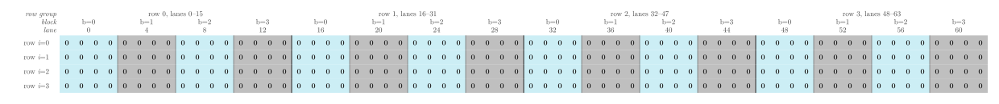

.. meta::
   :description: Reference for CDNA2 (gfx90a, MI200) matrix fused multiply-add intrinsics, covering all supported __builtin_amdgcn_mfma_* variants, parameters, and output layouts.
   :keywords: CDNA2, gfx90a, MI200, MFMA, matrix core, HIP intrinsics, FP32, FP64, BF16, INT8, accumulator, __builtin_amdgcn_mfma

.. _cdna2-mfma-intrinsics:

********************************************************************************
CDNA2 MFMA intrinsics
********************************************************************************

Matrix Fused Multiply-Add (MFMA) intrinsics let you issue hardware
matrix multiply-accumulate operations directly from HIP device code on
CDNA2 GPUs (``gfx90a``, MI200 series).  Each MFMA instruction
multiplies a small :math:`\pmb{A}` fragment by a small :math:`\pmb{B}` fragment
and accumulates the result into a :math:`\pmb{C}` fragment, all within a single
wavefront of 64 lanes.  The hardware delivers significantly higher throughput
than an equivalent sequence of scalar fused multiply-add (FMA) instructions.

CDNA2 supports the same FP32, FP16, BF16, and INT8 shapes as the first CDNA
generation and adds native FP64 accumulation and high-precision BF16 variants.

Architecture availability
=========================

The intrinsics on this page target CDNA2 (``gfx90a``, MI200 series) exclusively.
Equivalent intrinsics for other CDNA generations are documented on their own
reference pages:

* :ref:`cdna-mfma-intrinsics` -- CDNA (``gfx908``, MI100 series)

.. _cdna2-mfma-accumulator-layout:

Accumulator layout
==================

Each MFMA instruction computes one or more independent :math:`M \times N`
output tiles simultaneously across the 64 lanes of a wavefront.  The number
of independent tiles is called the *block count*.  It depends on how the
:math:`\pmb{A}` matrix rows are distributed across lane groups:

* **Scalar-input variants** (FP32 or FP64 :math:`\pmb{A}` and
  :math:`\pmb{B}`): each K position occupies a separate group of :math:`M`
  lanes, so
  :math:`\text{blocks} = \text{wavefront_size} / (M \times K)`.
* **Packed-input variants** (FP16, BF16, INT8 :math:`\pmb{A}` and
  :math:`\pmb{B}`): all K positions are packed into the register bits of
  the *same* lane group, so
  :math:`\text{blocks} = \text{wavefront_size} / M` regardless of
  :math:`K`.

Each block is independent: the :math:`\pmb{A}`, :math:`\pmb{B}`, and
:math:`\pmb{C}`/:math:`\pmb{D}` operands of different blocks
occupy distinct lane and accVGPR positions and compute separate outer products.

The total number of accVGPRs per lane scales with the block count:

.. math::

   \text{accVGPRs per lane} = \text{blocks} \times \frac{M \times N}{\text{wavefront_size}}

.. note::

   On CDNA2, all four operands (:math:`\pmb{A}`, :math:`\pmb{B}`,
   :math:`\pmb{C}`, and :math:`\pmb{D}`) can reside in either accumulation
   VGPRs (accVGPRs) or standard architecture VGPRs (ArchVGPRs).  In HIP
   device code the compiler selects the appropriate register class
   automatically.

   Each of the 64 wavefront lanes maintains its own private accVGPR file.
   An accVGPR index always refers to a register within one specific lane's
   file; the same index in two different lanes denotes two distinct physical
   registers.  The layout tables and formulas in the following sections use
   *accVGPR index* as a logical position label; the actual register class
   (accVGPR or ArchVGPR) is chosen by the compiler and does not affect the
   layout.

The formulas in the subsections below use the following notation:

* :math:`i` -- zero-based row index within the tile, :math:`0 \le i < M`
* :math:`j` -- zero-based column index within the tile, :math:`0 \le j < N`
* :math:`b` -- block index, :math:`0 \le b < \text{blocks}`
* **lane** -- wavefront lane that holds the element,
  :math:`0 \le \text{lane} < 64`
* **accVGPR** -- zero-based index into that lane's *private* accumulator
  register file; the same index in two different lanes refers to two distinct
  physical registers

:math:`32 \times 32` layout
---------------------------

The :math:`32 \times 32` tile shape uses two blocks.  All 32 accVGPRs per
lane are active: accVGPRs 0--15 belong to block 0, accVGPRs 16--31 to block 1.

.. figure:: ../../data/hardware-intrinsics/cdna/mfma-intrinsics/mfma-layout-32x32.svg
   :alt: :math:`32 \times 32` MFMA accumulator layout -- accVGPR index
         per output element, with lane groups colour-coded.
   :align: center
   :width: 100%

   :math:`32 \times 32` **accumulator layout -- 2 blocks.**  Each cell shows the
   accVGPR index that holds output element :math:`(i, j)` of block 0; block 1
   adds 16.  Teal cells (rows where :math:`\lfloor i/4 \rfloor` is even) belong
   to lanes 0--31; grey cells to lanes 32--63.  Column :math:`j` gives the
   lane offset within the group.

Given output element :math:`(i, j)` in block :math:`b`:

.. math::

   \text{lane}   &= \bigl(32 \cdot \lfloor \frac{i}{4} \rfloor\bigr) \bmod 64 + j \\
   \text{accVGPR} &= 16 b + 4 \lfloor \frac{i}{8} \rfloor + (i \bmod 4)

Conversely, given a lane :math:`L` and accVGPR index :math:`G`:

.. math::

   i &= \bigl(8 \cdot \lfloor \frac{G}{4} \rfloor\bigr) \bmod 32
       + 4 \lfloor \frac{L}{32} \rfloor + (G \bmod 4) \\
   j &= L \bmod 32 \\
   b &= \lfloor \frac{G}{16} \rfloor

The row-to-lane mapping groups rows in bands of four.  Within block 0:

.. list-table::
   :header-rows: 1
   :widths: auto

   * - Rows
     - Lanes
     - accVGPRs
   * - 0---3
     - 0---31
     - 0---3
   * - 4---7
     - 32---63
     - 0---3
   * - 8---11
     - 0---31
     - 4---7
   * - 12---15
     - 32---63
     - 4---7
   * - 16---19
     - 0---31
     - 8---11
   * - 20---23
     - 32---63
     - 8---11
   * - 24---27
     - 0---31
     - 12---15
   * - 28---31
     - 32---63
     - 12---15

Block 1 uses the same lane pattern with accVGPRs 16--31.

Intrinsics with a **1-block** :math:`32 \times 32` result (``v16float`` /
``v16int``, 16 accVGPRs per lane) use only block 0 of the layout above.
These variants do not support the ``cbsz`` and ``abid`` modifiers.

:math:`16 \times 16` layout
---------------------------

The :math:`16 \times 16` tile shape uses four blocks.  The 16 accVGPRs per
lane are partitioned by block: accVGPRs 0---3 for block 0, 4---7 for block 1,
8---11 for block 2, and 12---15 for block 3.

.. figure:: ../../data/hardware-intrinsics/cdna/mfma-intrinsics/mfma-layout-16x16.svg
   :alt: :math:`16 \times 16` MFMA accumulator layout -- accVGPR index
         per output element, with lane groups colour-coded by block
         assignment.
   :align: center
   :width: 70%

   :math:`16 \times 16` **accumulator layout -- 4 blocks.**  Each cell shows
   the accVGPR index for block 0; block :math:`k` adds :math:`4k`.  Rows
   0---3 (teal, lanes 0---15), rows 4---7 (grey, lanes 16---31), rows 8---11
   (teal, lanes 32---47), rows 12---15 (grey, lanes 48---63).  Column
   :math:`j` gives the lane offset within the group.

Given output element :math:`(i, j)` in block :math:`b`:

.. math::

   \text{lane}    &= 16 \lfloor \frac{i}{4} \rfloor + j \\
   \text{accVGPR} &= 4 b + (i \bmod 4)

Conversely, given lane :math:`L` and accVGPR index :math:`G`:

.. math::

   i &= 4 \lfloor \frac{L}{16} \rfloor + (G \bmod 4) \\
   j &= L \bmod 16 \\
   b &= \lfloor \frac{G}{4} \rfloor

The row-to-lane mapping (identical for every block):

.. list-table::
   :header-rows: 1
   :widths: auto

   * - Rows
     - Lanes
   * - 0---3
     - 0---15
   * - 4---7
     - 16---31
   * - 8---11
     - 32---47
   * - 12---15
     - 48---63

Intrinsics with a **1-block** :math:`16 \times 16` result (``v4float`` /
``v4int``, 4 accVGPRs per lane) use only block 0 of the layout above.
These variants do not support the ``cbsz`` and ``abid`` modifiers.

:math:`4 \times 4` layout
-------------------------

The :math:`4 \times 4` tile shape uses 16 blocks.  A single wavefront
simultaneously computes 16 independent :math:`4 \times 4` outer products.
Each group of 4 consecutive lanes (lanes :math:`4b` through :math:`4b + 3`)
holds all 16 output elements of block :math:`b` across 4 accVGPRs.

.. figure:: ../../data/hardware-intrinsics/cdna/mfma-intrinsics/mfma-layout-4x4.svg
   :alt: :math:`4 \times 4` MFMA accumulator layout -- all 16 blocks shown as
         consecutive groups of 4 lanes across the full wavefront.
   :align: center
   :width: 100%

   :math:`4 \times 4` **accumulator layout -- 16 blocks.**  Columns are lanes
   0--63; each group of 4 consecutive lanes holds one complete
   :math:`4 \times 4` output tile in accVGPRs 0--3 (rows).  Teal groups are
   even-numbered blocks, grey groups odd-numbered blocks.

Given output element :math:`(i, j)` in block :math:`b`:

.. math::

   \text{lane}    &= 4 b + j \\
   \text{accVGPR} &= i

Conversely, given lane :math:`L` and accVGPR index :math:`G`:

.. math::

   i &= G \bmod 4 \\
   j &= L \bmod 4 \\
   b &= \lfloor \frac{L}{4} \rfloor

:math:`16 \times 16` FP64 layout
----------------------------------

The :math:`16 \times 16` FP64 tile shape uses one block.  Each lane holds
four FP64 output elements across 4 accVGPR pairs (8 physical accVGPRs, since
each FP64 value occupies two 32-bit registers).

.. note::

   FP64 accVGPR indices count *pairs* of physical registers.  accVGPR pair
   :math:`k` corresponds to physical registers ``v[2k+1:2k]``.

         per output element, with lane groups colour-coded.
   :align: center
   :width: 70%

   :math:`16 \times 16` **FP64 accumulator layout -- 1 block.**  Each cell shows
   the accVGPR pair index :math:`k` that holds output element :math:`(i, j)`;
   physical registers are ``v[2k+1:2k]``.  Each group of 16 consecutive lanes
   (column offset :math:`j`) covers all four rows within one row-modulo-4 band.

Given output element :math:`(i, j)`:

.. math::

   \text{lane}            &= 16 \cdot (i \bmod 4) + j \\
   \text{accVGPR pair}\ k &= \lfloor \frac{i}{4} \rfloor

Conversely, given lane :math:`L` and accVGPR pair index :math:`k`:

.. math::

   i &= 4 k + \lfloor \frac{L}{16} \rfloor \\
   j &= L \bmod 16

The row-to-lane mapping.  Each group of 16 consecutive lanes covers one row
modulo 4; the accVGPR pair selects the row group:

.. list-table::
   :header-rows: 1
   :widths: auto

   * - Rows
     - Lanes
     - accVGPR pair (physical regs)
   * - 0, 4, 8, 12
     - 0---15
     - 0, 1, 2, 3 (``v[1:0]``, ``v[3:2]``, ``v[5:4]``, ``v[7:6]``)
   * - 1, 5, 9, 13
     - 16---31
     - 0, 1, 2, 3
   * - 2, 6, 10, 14
     - 32---47
     - 0, 1, 2, 3
   * - 3, 7, 11, 15
     - 48---63
     - 0, 1, 2, 3

:math:`4 \times 4` FP64 layout
--------------------------------

The :math:`4 \times 4` FP64 tile shape uses four blocks.  Each lane holds one
FP64 output element in a single accVGPR pair (2 physical accVGPRs, ``v[1:0]``).

         across the full 64-lane wavefront, grouped into four 16-lane row groups.
   :align: center
   :width: 100%

   :math:`4 \times 4` **FP64 accumulator layout -- 4 blocks.**  Columns are lanes
   0--63; rows are matrix rows 0--3.  Within each 16-lane row group, four
   sub-groups of 4 lanes hold blocks 0--3.  Every cell holds one FP64 value in
   accVGPR pair 0 (``v[1:0]``).  Teal sub-groups are even-numbered blocks, grey
   sub-groups are odd-numbered blocks.

Given output element :math:`(i, j)` in block :math:`b`:

.. math::

   \text{lane} &= 16 i + 4 b + j

Conversely, given lane :math:`L`:

.. math::

   i &= \lfloor \frac{L}{16} \rfloor \\
   j &= L \bmod 4 \\
   b &= \lfloor \frac{L \bmod 16}{4} \rfloor

The row-to-lane mapping.  Lanes 0---15 hold all four blocks of row 0; the
pattern repeats for rows 1---3 at lane offsets of 16, 32, and 48:

.. list-table::
   :header-rows: 1
   :widths: auto

   * - Row
     - Block
     - Lanes
     - accVGPR pair
   * - 0
     - 0
     - 0---3
     - 0 (``v[1:0]``)
   * - 0
     - 1
     - 4---7
     - 0 (``v[1:0]``)
   * - 0
     - 2
     - 8---11
     - 0 (``v[1:0]``)
   * - 0
     - 3
     - 12---15
     - 0 (``v[1:0]``)
   * - 1
     - 0---3
     - 16---31
     - 0 (``v[1:0]``)
   * - 2
     - 0---3
     - 32---47
     - 0 (``v[1:0]``)
   * - 3
     - 0---3
     - 48---63
     - 0 (``v[1:0]``)

Using MFMA intrinsics as a compute policy
==========================================

The matrix multiplication tutorial in
:ref:`matrix-multiply-optimization` uses a ``ComputePolicy`` type
parameter to separate the multiply-accumulate logic from the rest of the
kernel.  You can drop an MFMA-based policy into that framework without
changing the outer kernel.

The example below implements ``MfmaCdna2F64Policy`` using
``v_mfma_f64_16x16x4f64`` -- a :math:`16 \times 16` FP64 intrinsic
available on CDNA2 (``gfx90a``, MI200 series).  Each wavefront computes a
single :math:`16 \times 16` output tile; one block is active, giving 4
FP64 accVGPR pairs (8 physical accVGPRs) per lane.

.. rubric:: Policy constants

``v_mfma_f64_16x16x4f64`` consumes four K-positions per call (K=4), so
``k_step = 4``.  The 64 lanes are partitioned into four groups of 16, each
group providing one of the four K-position inputs for both :math:`\pmb{A}`
and :math:`\pmb{B}`.  The entire :math:`16 \times 16` tile belongs to one
wavefront, so ``thread_tile_m = thread_tile_n = 16`` and
``effective_lanes = 64``.

.. rubric:: Accumulator layout

The intrinsic returns a ``v4double`` holding 4 FP64 values -- one for each
accVGPR pair.  The ``Accumulator`` struct wraps this directly.  The layout
formulas from the :ref:`cdna2-mfma-accumulator-layout` section translate
``(lane, accVGPR pair)`` back to :math:`(i, j)` coordinates during the
``store_c()`` pass.

.. rubric:: Fragment loading

Because K=4, each ``load_a`` call reads a single scalar double.  The 64
lanes split into four groups of 16 by ``lane_id / 16``; group :math:`g`
provides data for K-position ``ki + g``.  Within each group, the lane
offset ``lane_id mod 16`` selects one of the 16 :math:`\pmb{A}`-rows (or
:math:`\pmb{B}`-columns).

.. note::

   The all-modifier-zero constraint means ``cbsz``, ``abid``, and ``blgp``
   must all be passed as ``0``.  ``v_mfma_f64_16x16x4f64`` does not support
   the ``cbsz``/``abid`` broadcast mechanism or the ``blgp`` lane-group
   pattern modifier.  Additionally, the instruction cannot co-execute with
   VALU instructions in the same wavefront.

.. literalinclude:: ../../tools/example_codes/matrix_multiply_cdna2_mfma.hip
   :language: cuda
   :start-after: [Sphinx mfma cdna2 policy start]
   :end-before: [Sphinx mfma cdna2 policy end]

.. rubric:: Instantiating the kernel

With ``MfmaCdna2F64Policy`` in hand, plug it into the generic kernel
alongside a ``TilePolicy`` whose ``block_tile_m`` and ``block_tile_n`` are
multiples of 16 and whose ``k_tile_size`` is a multiple of ``k_step = 4``.
The policy aliases and launch configuration from the example file are:

.. literalinclude:: ../../tools/example_codes/matrix_multiply_cdna2_mfma.hip
   :language: cuda
   :start-after: [Sphinx mfma policy aliases start]
   :end-before: [Sphinx mfma policy aliases end]

.. literalinclude:: ../../tools/example_codes/matrix_multiply_cdna2_mfma.hip
   :language: cuda
   :start-after: [Sphinx mfma launch config start]
   :end-before: [Sphinx mfma launch config end]

.. literalinclude:: ../../tools/example_codes/matrix_multiply_cdna2_mfma.hip
   :language: cuda
   :start-after: [Sphinx mfma kernel launch start]
   :end-before: [Sphinx mfma kernel launch end]

**Compile and run:**

.. code-block:: bash

   amdclang++ -O3 -std=c++17 --offload-arch=gfx90a \
       matrix_multiply_cdna2_mfma.hip -o mm_cdna2_mfma
   ./mm_cdna2_mfma

.. note::

   ``MfmaCdna2F64Policy`` requires a CDNA2 GPU (``gfx90a``).  Compile with
   ``--offload-arch=gfx90a`` to select the correct architecture.  On other
   targets the ``#if defined(__gfx90a__)`` guard selects ``ScalarFMADPolicy``
   automatically, so the file compiles without modification.

Naming convention
=================

All MFMA intrinsics follow the pattern:

.. code-block:: text

   __builtin_amdgcn_mfma_<out_type>_<M>x<N>x<K><in_type>[_1k]

``out_type``
    Accumulator element type (``f32``, ``f64``, or ``i32``).

``M``, ``N``, ``K``
    Tile dimensions in elements.  The instruction computes the
    contribution of a K-wide panel of :math:`\pmb{A}` (:math:`M \times K`) and
    a K-wide panel of :math:`\pmb{B}` (:math:`K \times N`) to an
    :math:`M \times N` output tile.  Each instruction processes one K step;
    the caller loops over K to accumulate a full matrix product.

``in_type``
    Input element type (``f32``, ``f64``, ``f16``, ``bf16``, or ``i8``).

``_1k`` (optional)
    Suffix present on BF16 variants that deliver 1024 Flops/cycle/CU peak
    throughput, twice the 512 Flops/cycle/CU of the non-``_1k`` BF16 variants.

Register types used in this reference
======================================

The signatures below use the following type aliases, which you can declare with
C++ attributes in any HIP translation unit:

.. code-block:: cpp

   using v4float   = float [[clang::ext_vector_type(4)]];
   using v16float  = float [[clang::ext_vector_type(16)]];
   using v32float  = float [[clang::ext_vector_type(32)]];
   using v4half    = _Float16 [[clang::ext_vector_type(4)]];
   using v4int     = int [[clang::ext_vector_type(4)]];
   using v16int    = int [[clang::ext_vector_type(16)]];
   using v32int    = int [[clang::ext_vector_type(32)]];
   using v2bfloat  = short [[clang::ext_vector_type(2)]];  // bf16 storage
   using v4bfloat  = short [[clang::ext_vector_type(4)]];  // bf16 storage
   using v4double  = double [[clang::ext_vector_type(4)]];

Each type alias maps one-to-one to the corresponding LLVM vector type used in
the intrinsic definition.  The number in the name is the element count per
lane; the total VGPR count equals the element count multiplied by the element
size in 32-bit words.

.. _cdna2-mfma-common-parameters:

Common parameters
=================

Every MFMA intrinsic on this page shares the same trailing three parameters.
These must be compile-time integer constants.

.. list-table::
   :header-rows: 1
   :widths: auto

   * - Parameter
     - Type
     - Description
   * - ``cbsz``
     - int
     - Control Broadcast Size modifier. Supported by MFMA intrinsics
       operating on multiple input blocks for :math:`\pmb{A}`. Legal
       range 0..4, but must not exceed
       :math:`\log_{2}(\text{input blocks})`. Setting ``cbsz`` informs
       the instruction to broadcast values of one chosen input block to
       :math:`2^{cbsz} - 1` neighboring blocks in :math:`\pmb{A}`. The
       input block is chosen by setting ``abid``. For example, for a
       16-block :math:`\pmb{A}` matrix, setting ``cbsz`` to ``1``
       results in blocks 0 and 1 receiving the same input values, blocks
       2 and 3 receiving the same input values, blocks 4 and 5 receiving
       the same input values, etc. Setting ``cbsz`` to ``0`` results in
       no broadcast.
   * - ``abid``
     - int
     - :math:`\pmb{A}`-matrix Broadcast Identifier. Supported by MFMA intrinsics
       operating on multiple input blocks for :math:`\pmb{A}`. Used
       together with ``cbsz``; indicates which input block is selected
       for broadcast to neighboring blocks in :math:`\pmb{A}`. For
       example, for a 16-block :math:`\pmb{A}` matrix, setting ``cbsz``
       to ``2`` and ``abid`` to ``1`` broadcasts block 1's values to
       blocks 0, 2, and 3; block 5's values to blocks 4, 6, and 7; etc.
   * - ``blgp``
     - int
     - :math:`\pmb{B}`-matrix Lane Group Pattern modifier. Allows a
       constrained set of
       swizzling operations on :math:`\pmb{B}` data between lanes.
       Supported values:

       * ``0``: No swizzling; normal matrix layout for :math:`\pmb{B}`.
       * ``1``: Data from lanes 0---31 is broadcast into lanes 32---63.
       * ``2``: Data from lanes 32---63 is broadcast into lanes 0---31.
       * ``3``: Data from all lanes is rotated down by 16 positions:
         lane 0's data goes to lane 48, lane 16's data goes to lane 0,
         etc.
       * ``4``: Data from lanes 0---15 is broadcast into lanes 16---31,
         32---47, and 48---63.
       * ``5``: Data from lanes 16---31 is broadcast into lanes 0---15,
         32---47, and 48---63.
       * ``6``: Data from lanes 32---47 is broadcast into lanes 0---15,
         16---31, and 48---63.
       * ``7``: Data from lanes 48---63 is broadcast into lanes 0---15,
         16---31, and 32---47.

.. _cdna2-mfma-instruction-throughput:

Instruction throughput
======================

The cycle count below is the value used to compute theoretical peak
throughput: :math:`\text{peak throughput} =
\frac{\text{ops per instruction}}{\text{cycle count}} \times
\text{clock frequency}`.  Instructions that support VALU co-execution allow the
compiler to overlap matrix and vector work; the VALU co-execution cycle count
gives the number of VALU cycles available during the MFMA latency window.  A
value of 0 means VALU co-execution is not supported.

.. list-table::
   :header-rows: 1
   :widths: auto

   * - Intrinsic
     - Ops
     - Cycle count
     - VALU co-execution cycles
   * - ``__builtin_amdgcn_mfma_f32_32x32x1f32``
     - 4096
     - 64
     - 60
   * - ``__builtin_amdgcn_mfma_f32_16x16x1f32``
     - 2048
     - 32
     - 28
   * - ``__builtin_amdgcn_mfma_f32_4x4x1f32``
     - 512
     - 8
     - 4
   * - ``__builtin_amdgcn_mfma_f32_32x32x2f32``
     - 4096
     - 64
     - 60
   * - ``__builtin_amdgcn_mfma_f32_16x16x4f32``
     - 2048
     - 32
     - 28
   * - ``__builtin_amdgcn_mfma_f32_32x32x4f16``
     - 16384
     - 64
     - 60
   * - ``__builtin_amdgcn_mfma_f32_16x16x4f16``
     - 8192
     - 32
     - 28
   * - ``__builtin_amdgcn_mfma_f32_4x4x4f16``
     - 2048
     - 8
     - 4
   * - ``__builtin_amdgcn_mfma_f32_32x32x8f16``
     - 16384
     - 64
     - 60
   * - ``__builtin_amdgcn_mfma_f32_16x16x16f16``
     - 8192
     - 32
     - 28
   * - ``__builtin_amdgcn_mfma_f32_32x32x2bf16``
     - 8192
     - 64
     - 60
   * - ``__builtin_amdgcn_mfma_f32_16x16x2bf16``
     - 4096
     - 32
     - 28
   * - ``__builtin_amdgcn_mfma_f32_4x4x2bf16``
     - 1024
     - 8
     - 4
   * - ``__builtin_amdgcn_mfma_f32_32x32x4bf16``
     - 8192
     - 64
     - 60
   * - ``__builtin_amdgcn_mfma_f32_16x16x8bf16``
     - 4096
     - 32
     - 28
   * - ``__builtin_amdgcn_mfma_f32_32x32x4bf16_1k``
     - 16384
     - 64
     - 60
   * - ``__builtin_amdgcn_mfma_f32_16x16x4bf16_1k``
     - 8192
     - 32
     - 28
   * - ``__builtin_amdgcn_mfma_f32_4x4x4bf16_1k``
     - 2048
     - 8
     - 4
   * - ``__builtin_amdgcn_mfma_f32_32x32x8bf16_1k``
     - 16384
     - 64
     - 60
   * - ``__builtin_amdgcn_mfma_f32_16x16x16bf16_1k``
     - 8192
     - 32
     - 28
   * - ``__builtin_amdgcn_mfma_f64_16x16x4f64``
     - 2048
     - 32
     - 0
   * - ``__builtin_amdgcn_mfma_f64_4x4x4f64``
     - 512
     - 16
     - 0
   * - ``__builtin_amdgcn_mfma_i32_32x32x4i8``
     - 16384
     - 64
     - 60
   * - ``__builtin_amdgcn_mfma_i32_16x16x4i8``
     - 8192
     - 32
     - 28
   * - ``__builtin_amdgcn_mfma_i32_4x4x4i8``
     - 2048
     - 8
     - 4
   * - ``__builtin_amdgcn_mfma_i32_32x32x8i8``
     - 16384
     - 64
     - 60
   * - ``__builtin_amdgcn_mfma_i32_16x16x16i8``
     - 8192
     - 32
     - 28

.. _cdna2-mfma-intrinsic-reference:

Intrinsic reference
===================

FP32-accumulate intrinsics
--------------------------

These intrinsics accumulate into single-precision (FP32) output
fragments. They differ in the data type of the :math:`\pmb{A}` and
:math:`\pmb{B}` matrix inputs.

FP32 matrix inputs
^^^^^^^^^^^^^^^^^^

The following intrinsics accept one FP32 element per lane for both
:math:`\pmb{A}` and :math:`\pmb{B}` inputs and accumulate into FP32 output
fragments.

.. include:: mfma-ref/f32-32x32x1f32.rst
.. include:: mfma-ref/f32-16x16x1f32.rst
.. include:: mfma-ref/f32-4x4x1f32.rst
.. include:: mfma-ref/f32-32x32x2f32.rst
.. include:: mfma-ref/f32-16x16x4f32.rst

FP16 matrix inputs
^^^^^^^^^^^^^^^^^^

The following intrinsics accept four FP16 elements per lane packed into a
``v4half`` register for both :math:`\pmb{A}` and :math:`\pmb{B}` inputs,
and accumulate into FP32 output fragments.

.. include:: mfma-ref/f32-32x32x4f16.rst
.. include:: mfma-ref/f32-16x16x4f16.rst
.. include:: mfma-ref/f32-4x4x4f16.rst
.. include:: mfma-ref/f32-32x32x8f16.rst
.. include:: mfma-ref/f32-16x16x16f16.rst

BF16 matrix inputs
^^^^^^^^^^^^^^^^^^

The following intrinsics accept two BF16 elements per lane packed into a
``v2bfloat`` register for both :math:`\pmb{A}` and :math:`\pmb{B}` inputs,
and accumulate into FP32 output fragments.

.. include:: mfma-ref/f32-32x32x2bf16.rst
.. include:: mfma-ref/f32-16x16x2bf16.rst
.. include:: mfma-ref/f32-4x4x2bf16.rst
.. include:: mfma-ref/f32-32x32x4bf16.rst
.. include:: mfma-ref/f32-16x16x8bf16.rst

The following variants carry the ``_1k`` suffix.

.. include:: mfma-ref/f32-32x32x4bf16-1k.rst
.. include:: mfma-ref/f32-16x16x4bf16-1k.rst
.. include:: mfma-ref/f32-4x4x4bf16-1k.rst
.. include:: mfma-ref/f32-32x32x8bf16-1k.rst
.. include:: mfma-ref/f32-16x16x16bf16-1k.rst

FP64-accumulate intrinsics
--------------------------

CDNA2 introduces native double-precision (FP64) matrix accumulation.
These intrinsics accept one FP64 element per lane for both :math:`\pmb{A}`
and :math:`\pmb{B}` inputs and accumulate into FP64 output fragments held
in ``v4double`` registers. FP64 MFMA operations use IEEE round-to-nearest-even
rather than round-to-zero for partial products.

FP64 matrix inputs
^^^^^^^^^^^^^^^^^^

The following intrinsics accept one FP64 element per lane for both
:math:`\pmb{A}` and :math:`\pmb{B}` inputs and accumulate into FP64 output
fragments.

.. include:: mfma-ref/f64-16x16x4f64-cdna2.rst
.. include:: mfma-ref/f64-4x4x4f64-cdna2.rst

INT32-accumulate intrinsics
---------------------------

These intrinsics accept four signed 8-bit integer elements per lane packed
into a single ``int`` register for both :math:`\pmb{A}` and :math:`\pmb{B}`
inputs, and accumulate into INT32 output fragments.

INT8 matrix inputs
^^^^^^^^^^^^^^^^^^

.. include:: mfma-ref/i32-32x32x4i8.rst
.. include:: mfma-ref/i32-16x16x4i8.rst
.. include:: mfma-ref/i32-4x4x4i8.rst
.. include:: mfma-ref/i32-32x32x8i8.rst
.. include:: mfma-ref/i32-16x16x16i8.rst
