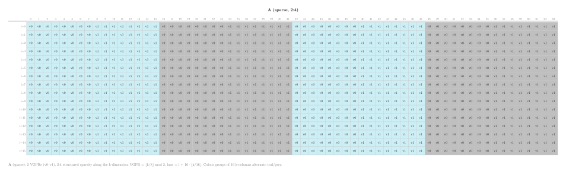
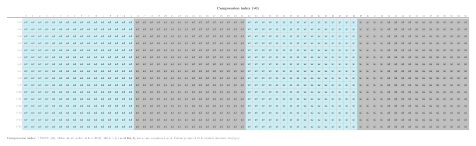
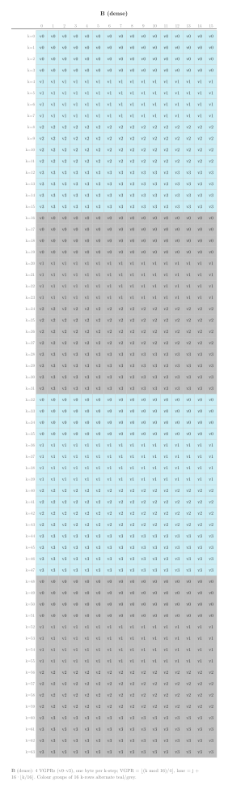
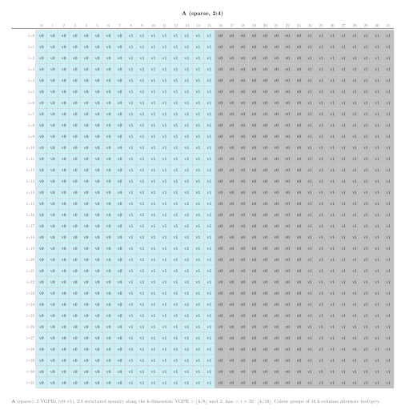
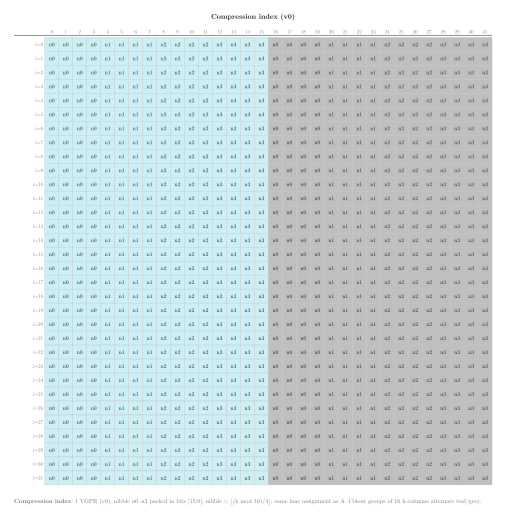
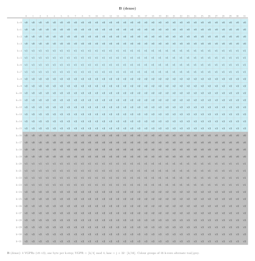

.. meta::
   :description: Reference for CDNA3 (gfx942, MI300 series) sparse MFMA (SMFMAC) intrinsics, covering FP16, BF16, INT8, FP8, and BF8 variants with 4:2 structured sparsity.
   :keywords: AMD, ROCm, HIP, intrinsics, sparse, MFMA, SMFMAC, structured sparsity, matrix multiply, CDNA3, gfx942, MI300, FP8, BF8

.. _cdna3-sparse-mfma-intrinsics:

********************************************************************************
CDNA3 sparse MFMA intrinsics
********************************************************************************

Sparse Matrix Fused Multiply-Accumulate (SMFMAC) intrinsics let you issue
hardware matrix multiply-accumulate operations that exploit 4:2 structured
sparsity directly from HIP device code on CDNA3 GPUs (``gfx942``,
MI300 series).  Each SMFMAC instruction multiplies a compressed
:math:`\pmb{A}` fragment by a dense :math:`\pmb{B}` fragment and accumulates
the result into a :math:`\pmb{C}` fragment, all within a single wavefront of
64 lanes.  Because the :math:`\pmb{A}` operand is stored in compressed form,
these intrinsics halve the storage and memory bandwidth required for
:math:`\pmb{A}` compared to their dense MFMA counterparts, while the hardware
uses a sparsity index to reconstruct the original element positions during
the multiply.

CDNA3 adds SMFMAC intrinsics with FP8 (E4M3) and BF8 (E5M2) inputs in all
four A×B type combinations.

Architecture availability
=========================

The intrinsics on this page target CDNA3 (``gfx942``, MI300 series).
Equivalent intrinsics for other CDNA generations are documented on their own
reference pages:

* :ref:`cdna-sparse-mfma-intrinsics` -- CDNA (``gfx908``, MI100) and CDNA2 (``gfx90a``, MI200 series)
* :ref:`cdna4-sparse-mfma-intrinsics` -- CDNA4 (``gfx950``, MI350 series)

.. note::

   On CDNA3, all four operands (:math:`\pmb{A}`, :math:`\pmb{B}`,
   :math:`\pmb{C}`, and :math:`\pmb{D}`) can reside in either accumulation
   VGPRs (accVGPRs) or standard architecture VGPRs (archVGPRs).  In HIP
   device code the compiler selects the appropriate register class
   automatically.

Naming convention
=================

All SMFMAC intrinsics follow the pattern:

.. code-block:: text

   __builtin_amdgcn_smfmac_<out_type>_<M>x<N>x<K>_<in_type_a>[_<in_type_b>]

``out_type``
    Accumulator element type (``f32`` or ``i32``).

``M``, ``N``, ``K``
    Tile dimensions in elements.  The instruction computes the contribution
    of a K-wide compressed panel of :math:`\pmb{A}` and a K-wide dense panel
    of :math:`\pmb{B}` to an :math:`M \times N` output tile.  Each
    instruction processes one K step; the caller loops over K to accumulate
    a full matrix product.

``in_type_a``
    Input element type of the :math:`\pmb{A}` matrix (``fp8`` or ``bf8``).

``in_type_b``
    Input element type of the :math:`\pmb{B}` matrix.  Always present for
    FP8 and BF8 variants to disambiguate the four possible A×B type
    combinations (``fp8_fp8``, ``fp8_bf8``, ``bf8_fp8``, ``bf8_bf8``).

For example:

* ``__builtin_amdgcn_smfmac_f32_16x16x64_fp8_bf8`` -- a :math:`16 \times 16`
  sparse MMA with :math:`K=64` that multiplies FP8 :math:`\pmb{A}` by
  BF8 :math:`\pmb{B}` and accumulates into FP32.

Structured sparsity (4:2 pattern)
=================================

The SMFMAC instructions require the :math:`\pmb{A}` matrix to obey 4:2
structured sparsity: in every contiguous group of four elements along the K
dimension, exactly two are non-zero and the other two are zero.  This
constraint allows the :math:`\pmb{A}` operand to be stored in a compressed
representation that contains only the non-zero values, reducing the storage
to half the original K dimension.

Along with the compressed non-zero values, the hardware requires a sparsity
index that encodes which two of the four positions in each group hold the
non-zeros.  This index is passed as the ``idx`` argument to every SMFMAC
intrinsic.  The hardware uses it at execution time to align the compressed
:math:`\pmb{A}` elements against the correct rows of the :math:`\pmb{B}`
operand before accumulating the products.

Host-side compression is straightforward: walk the K dimension in groups of
four, extract the two non-zero positions, and pack them consecutively into
the output buffer.  The example kernels in this topic adopt a fixed pattern
that keeps positions 0 and 2 of every group, producing a compressed buffer
of half the original K length.

.. _cdna3-smfmac-accumulator-layout:

Accumulator layout
==================

Every SMFMAC instruction computes a single independent :math:`M \times N`
output tile (block count = 1).  The accumulator (:math:`\pmb{C}` /
:math:`\pmb{D}`) layout across wavefront lanes and VGPRs is identical to
the 1-block layout of the corresponding dense MFMA tile shape.

The formulas in the subsections below use the following notation:

* :math:`i` -- zero-based row index within the tile, :math:`0 \le i < M`
* :math:`j` -- zero-based column index within the tile, :math:`0 \le j < N`
* **lane** -- wavefront lane that holds the element,
  :math:`0 \le \text{lane} < 64`
* **VGPR** -- zero-based index into that lane's accumulator register file

:math:`16 \times 16` layout
---------------------------

The :math:`16 \times 16` output tile occupies 4 VGPRs per lane (``v4float``
or ``v4int``).

   :math:`16 \times 16`, **K=64 A (sparse, 2:4) operand layout.**

   :math:`16 \times 16`, **K=64 compression index layout.**

   :math:`16 \times 16`, **K=64 B (dense) operand layout.**

.. figure:: ../../data/hardware-intrinsics/cdna/sparse-mfma-intrinsics/smfmac-layout-16x16x64-cd.svg
   :alt: :math:`16 \times 16`, K=64 SMFMAC accumulator layout -- VGPR index
         per output element, with lane groups colour-coded.
   :align: center
   :width: 100%

   :math:`16 \times 16`, **K=64 accumulator layout.**  The output layout is
   identical to K=32; only the :math:`\pmb{A}` and :math:`\pmb{B}` input
   fragment sizes differ.

Given output element :math:`(i, j)`:

.. math::

   \text{lane}    &= 16 \lfloor \frac{i}{4} \rfloor + j \\
   \text{VGPR}    &= i \bmod 4

Conversely, given lane :math:`L` and VGPR index :math:`G`:

.. math::

   i &= 4 \lfloor \frac{L}{16} \rfloor + (G \bmod 4) \\
   j &= L \bmod 16

The row-to-lane mapping:

.. list-table::
   :header-rows: 1
   :widths: auto

   * - Rows
     - Lanes
     - VGPRs
   * - 0---3
     - 0---15
     - 0---3
   * - 4---7
     - 16---31
     - 0---3
   * - 8---11
     - 32---47
     - 0---3
   * - 12---15
     - 48---63
     - 0---3

:math:`32 \times 32` layout
---------------------------

The :math:`32 \times 32` output tile occupies 16 VGPRs per lane
(``v16float`` or ``v16int``).

   :math:`32 \times 32`, **K=32 A (sparse, 2:4) operand layout.**

   :math:`32 \times 32`, **K=32 compression index layout.**

   :math:`32 \times 32`, **K=32 B (dense) operand layout.**

.. figure:: ../../data/hardware-intrinsics/cdna/sparse-mfma-intrinsics/smfmac-layout-32x32x32-cd.svg
   :alt: :math:`32 \times 32`, K=32 SMFMAC accumulator layout -- VGPR index
         per output element, with lane groups colour-coded.
   :align: center
   :width: 100%

   :math:`32 \times 32`, **K=32 accumulator layout.**  The output layout is
   identical to K=16; only the :math:`\pmb{A}` and :math:`\pmb{B}` input
   fragment sizes differ.

Given output element :math:`(i, j)`:

.. math::

   \text{lane}   &= \bigl(32 \cdot \lfloor \frac{i}{4} \rfloor\bigr) \bmod 64 + j \\
   \text{VGPR}   &= 4 \lfloor \frac{i}{8} \rfloor + (i \bmod 4)

Conversely, given lane :math:`L` and VGPR index :math:`G`:

.. math::

   i &= \bigl(8 \cdot \lfloor \frac{G}{4} \rfloor\bigr) \bmod 32
       + 4 \lfloor \frac{L}{32} \rfloor + (G \bmod 4) \\
   j &= L \bmod 32

The row-to-lane mapping:

.. list-table::
   :header-rows: 1
   :widths: auto

   * - Rows
     - Lanes
     - VGPRs
   * - 0---3
     - 0---31
     - 0---3
   * - 4---7
     - 32---63
     - 0---3
   * - 8---11
     - 0---31
     - 4---7
   * - 12---15
     - 32---63
     - 4---7
   * - 16---19
     - 0---31
     - 8---11
   * - 20---23
     - 32---63
     - 8---11
   * - 24---27
     - 0---31
     - 12---15
   * - 28---31
     - 32---63
     - 12---15

Register types used in this reference
=====================================

The signatures below use the following type aliases, which you can declare
with C++ attributes in any HIP translation unit:

.. code-block:: cpp

   using v4float  = float    [[clang::ext_vector_type(4)]];
   using v16float = float    [[clang::ext_vector_type(16)]];
   using v2int    = int      [[clang::ext_vector_type(2)]];
   using v4int    = int      [[clang::ext_vector_type(4)]];
   using v8int    = int      [[clang::ext_vector_type(8)]];
   using v16int   = int      [[clang::ext_vector_type(16)]];

Each type alias maps one-to-one to the corresponding LLVM vector type used
in the intrinsic definition.  The number in the name is the element count
per lane; the total VGPR count equals the element count multiplied by the
element size in 32-bit words.

Common parameters
=================

The SMFMAC intrinsics do not use the ``cbsz``, ``abid``, or ``blgp``
modifiers from the dense MFMA family.  See :doc:`mfma-common-parameters`
for a description of those modifiers in the dense context.

Using sparse MFMA intrinsics as a compute policy
================================================

The following example kernel demonstrates the FP8 SMFMAC intrinsic in the
context of a tiled matrix multiplication.  The kernel loads tiles of the
compressed :math:`\pmb{A}` matrix and the dense :math:`\pmb{B}` matrix into
LDS, then calls the SMFMAC intrinsic to replace the inner-product loop of a
conventional scalar kernel.

The complete source file is available for download:

* :download:`matrix_multiply_cdna3_sparse_mfma.hip <../../tools/example_codes/matrix_multiply_cdna3_sparse_mfma.hip>`

FP8 16×16 sparse kernel
-----------------------

This kernel uses ``__builtin_amdgcn_smfmac_f32_16x16x64_fp8_fp8`` to
compute a :math:`16 \times 16` sparse matrix multiply-accumulate with
:math:`K=64` per instruction using FP8 (E4M3) inputs.  Each 32-bit
register lane packs four FP8 bytes; the kernel constructs the packed
``v2int`` and ``v4int`` operands from individual bytes loaded from LDS.

.. literalinclude:: ../../tools/example_codes/matrix_multiply_cdna3_sparse_mfma.hip
   :language: cpp
   :linenos:
   :start-after: [Sphinx smfmac_cdna3_fp8_policy start]
   :end-before: [Sphinx smfmac_cdna3_fp8_policy end]

The kernel packs four consecutive FP8 bytes into each 32-bit lane using
shifts and bitwise OR before passing the vectors to the intrinsic.  The
sparsity index is wider than the FP16 variant (``0x8888`` vs ``0x88``)
because the larger K dimension requires more index bits to cover all
element groups.

.. note::

   The FP8 encoding used by ``gfx942`` is FNUZ (Finite, No
   Unsigned Zero), while later architectures use the standard OCP (Open
   Compute Project) E4M3 encoding.  The example code selects the correct
   interpretation at runtime based on the device architecture.

**Compile and run:**

.. code-block:: bash

   amdclang++ -O3 -std=c++17 --offload-arch=gfx942 \
       matrix_multiply_cdna3_sparse_mfma.hip -o mm_cdna3_sparse_mfma
   ./mm_cdna3_sparse_mfma

.. note::

   This example requires a CDNA3 GPU (``gfx942``).
   Compile with ``--offload-arch=gfx942`` to select the correct architecture.

.. _cdna3-smfmac-instruction-throughput:

Instruction throughput
======================

The cycle count below is the value used to compute theoretical peak
throughput: :math:`\text{peak throughput} =
\frac{\text{ops per instruction}}{\text{cycle count}} \times
\text{clock frequency}`.  All SMFMAC instructions support vector ALU (VALU)
co-execution; the VALU co-execution cycle count gives the number of VALU
cycles available during the SMFMAC latency window.

.. list-table::
   :header-rows: 1
   :widths: auto

   * - Intrinsic
     - Ops
     - Cycle count
     - VALU co-execution cycles
   * - ``__builtin_amdgcn_smfmac_f32_16x16x64_fp8_fp8``
     - 32768
     - 16
     - 8
   * - ``__builtin_amdgcn_smfmac_f32_16x16x64_fp8_bf8``
     - 32768
     - 16
     - 8
   * - ``__builtin_amdgcn_smfmac_f32_16x16x64_bf8_fp8``
     - 32768
     - 16
     - 8
   * - ``__builtin_amdgcn_smfmac_f32_16x16x64_bf8_bf8``
     - 32768
     - 16
     - 8
   * - ``__builtin_amdgcn_smfmac_f32_32x32x32_fp8_fp8``
     - 65536
     - 32
     - 24
   * - ``__builtin_amdgcn_smfmac_f32_32x32x32_fp8_bf8``
     - 65536
     - 32
     - 24
   * - ``__builtin_amdgcn_smfmac_f32_32x32x32_bf8_fp8``
     - 65536
     - 32
     - 24
   * - ``__builtin_amdgcn_smfmac_f32_32x32x32_bf8_bf8``
     - 65536
     - 32
     - 24

.. _cdna3-smfmac-intrinsic-reference:

Intrinsic reference
===================

FP32-accumulate intrinsics
--------------------------

These intrinsics accumulate into single-precision (FP32) output fragments.

FP8 and BF8 matrix inputs
^^^^^^^^^^^^^^^^^^^^^^^^^

The following intrinsics accept compressed FP8 (E4M3) or BF8 (E5M2)
elements for :math:`\pmb{A}` and dense FP8 or BF8 elements for
:math:`\pmb{B}`, accumulating into FP32 output fragments.  All four
combinations of FP8 and BF8 input types are supported for each tile size.

.. include:: smfmac-ref/f32-16x16x64-fp8-fp8.rst
.. include:: smfmac-ref/f32-16x16x64-fp8-bf8.rst
.. include:: smfmac-ref/f32-16x16x64-bf8-fp8.rst
.. include:: smfmac-ref/f32-16x16x64-bf8-bf8.rst
.. include:: smfmac-ref/f32-32x32x32-fp8-fp8.rst
.. include:: smfmac-ref/f32-32x32x32-fp8-bf8.rst
.. include:: smfmac-ref/f32-32x32x32-bf8-fp8.rst
.. include:: smfmac-ref/f32-32x32x32-bf8-bf8.rst
