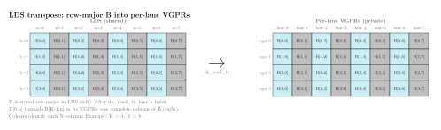
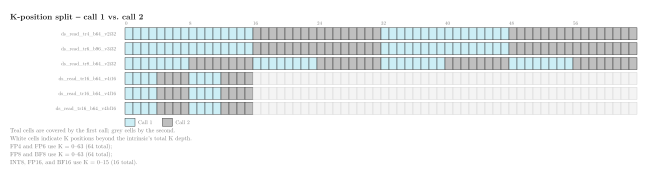

.. meta::
   :description: Reference for CDNA4 (gfx950, MI350) LDS transpose load intrinsics (__builtin_amdgcn_ds_read_tr*) that feed MFMA operands from shared memory.
   :keywords: CDNA4, gfx950, MI350, LDS, transpose load, ds_read_tr, MFMA operands, HIP intrinsics, shared memory, __builtin_amdgcn_ds_read_tr

.. _cdna4-mfma-lds-intrinsics:

CDNA4 MFMA transpose load intrinsics
=====================================

The CDNA4 (``gfx950``, MI350 series) architecture introduces a set of LDS
(Local Data Share) load intrinsics that perform a hardware-assisted transpose
as part of the load. These intrinsics let you store matrix :math:`\pmb{A}` tiles
in LDS in column-major order or matrix :math:`\pmb{B}` tiles in row-major order,
then load them directly into the per-lane fragment layout expected by the
:ref:`cdna4-dense-mfma-intrinsics`, without a software shuffle step.

         row-major in LDS on the left and the same data distributed into
         per-lane VGPRs on the right, with matching colours linking each
         :math:`N`-column to its lane.

   ``ds_read_tr`` loads B from LDS in row-major order and distributes each
   column to the corresponding lane's VGPRs. The simplified example uses
   :math:`K = 4` and :math:`N = 8`; colors identify each :math:`N`-column.

Architecture availability
=========================

The intrinsics on this page target CDNA4 (``gfx950``, MI350 series)
exclusively. For the MFMA compute intrinsics they are designed to feed, see
:ref:`cdna4-dense-mfma-intrinsics`.

Naming convention
=================

All transpose load intrinsics follow the pattern:

.. code-block:: text

   __builtin_amdgcn_ds_read_tr<N>_b<M>_v<K><type>

``N``
    Transpose group width: the number of elements exchanged between adjacent
    lanes during the transpose operation.

``M``
    Bits loaded per lane from LDS.

``K``
    Number of elements in the return vector.

``type``
    Element type of the return vector: ``i32``, ``i16``, ``f16``,
    or ``bf16``.

Register types used in this reference
======================================

The signatures below use the following type aliases, which you can declare
with Clang vector attributes in any HIP translation unit:

.. code-block:: cpp

   using v2int    = int   [[clang::ext_vector_type(2)]];     // FP4 / FP8 / BF8
   using v3int    = int   [[clang::ext_vector_type(3)]];     // FP6
   using v4short  = short [[clang::ext_vector_type(4)]];     // INT8 (2 × INT8 per short)
   using v4half   = _Float16 [[clang::ext_vector_type(4)]];  // FP16
   using v4bfloat = short [[clang::ext_vector_type(4)]];     // BF16 (1 × BF16 per short)

.. _cdna4-mfma-lds-intrinsic-reference:

Intrinsic reference
===================

The following intrinsics are available on CDNA4. Each takes a single
pointer argument in LDS address space (``__shared__``) and returns a vector
holding the lane's share of the transposed tile. All intrinsics are
``const`` and have no side effects.

Hardware constraints
--------------------

The following constraints apply to every intrinsic in this family:

- **Pair of calls required.** One call loads only half of the matrix
  tile's K positions. A second call with a different ``ptr`` value and a
  different destination register pair completes the tile. The K-position
  split varies by element size and is summarized in the table below.

- **LDS address alignment.** The ``ptr`` address must be aligned to the
  load data size: 8 bytes for ``b64`` loads and 12 bytes for ``b96``
  loads.

- **VGPR alignment.** All ``b64`` loads write to an even-aligned VGPR
  pair. The ``b96`` load (``ds_read_tr6_b96_v3i32``) does not require
  even-VGPR alignment.

.. list-table:: K-position split by intrinsic
   :header-rows: 1
   :widths: auto

   * - Intrinsic
     - Call 1 K positions
     - Call 2 K positions
   * - ``ds_read_tr4_b64_v2i32``
     - 0---15, 32---47
     - 16---31, 48---63
   * - ``ds_read_tr6_b96_v3i32``
     - 0---15, 32---47
     - 16---31, 48---63
   * - ``ds_read_tr8_b64_v2i32``
     - 0---7, 16---23, 32---39, 48---55
     - 8---15, 24---31, 40---47, 56---63
   * - ``ds_read_tr16_b64_v4i16``
     - 0---3, 8---11
     - 4---7, 12---15
   * - ``ds_read_tr16_b64_v4f16``
     - 0---3, 8---11
     - 4---7, 12---15
   * - ``ds_read_tr16_b64_v4bf16``
     - 0---3, 8---11
     - 4---7, 12---15

         (teal) and call 2 (grey) for each ds_read_tr intrinsic.

   K-position split for each ``ds_read_tr`` intrinsic. Teal cells are
   covered by the first call; grey cells by the second. White cells indicate
   K positions beyond the intrinsic's total K depth.

Sub-byte operand loads
----------------------

These intrinsics load and transpose operands for the scaled sub-byte MFMA
family (``__builtin_amdgcn_mfma_scale_f32_*``).

``__builtin_amdgcn_ds_read_tr4_b64_v2i32``
^^^^^^^^^^^^^^^^^^^^^^^^^^^^^^^^^^^^^^^^^^^

.. code-block:: cpp

   v2int __builtin_amdgcn_ds_read_tr4_b64_v2i32(__shared__ v2int* ptr);

Loads 64 bits per lane from LDS with a 4-bit element transpose and returns
the result as a ``v2int`` (two 32-bit words).

.. list-table::
   :header-rows: 1
   :widths: auto

   * - Parameter
     - Type
     - Description
   * - ``ptr``
     - ``__shared__ v2int*``
     - Pointer to the lane's portion of the FP4 tile in LDS.

**Returns** ``v2int`` -- two 32-bit words holding the lane's FP4 fragment
after transposition.

``__builtin_amdgcn_ds_read_tr6_b96_v3i32``
^^^^^^^^^^^^^^^^^^^^^^^^^^^^^^^^^^^^^^^^^^^

.. code-block:: cpp

   v3int __builtin_amdgcn_ds_read_tr6_b96_v3i32(__shared__ v3int* ptr);

Loads 96 bits per lane from LDS with a 6-bit element transpose and returns
the result as a ``v3int`` (three 32-bit words).

.. list-table::
   :header-rows: 1
   :widths: auto

   * - Parameter
     - Type
     - Description
   * - ``ptr``
     - ``__shared__ v3int*``
     - Pointer to the lane's portion of the FP6 tile in LDS.

**Returns** ``v3int`` -- three 32-bit words holding the lane's FP6 fragment
after transposition.

8-bit operand loads
-------------------

These intrinsics load and transpose operands for the FP8, BF8, and INT8
MFMA families.

``__builtin_amdgcn_ds_read_tr8_b64_v2i32``
^^^^^^^^^^^^^^^^^^^^^^^^^^^^^^^^^^^^^^^^^^^

.. code-block:: cpp

   v2int __builtin_amdgcn_ds_read_tr8_b64_v2i32(__shared__ v2int* ptr);

Loads 64 bits per lane from LDS with an 8-bit element transpose and returns
the result as a ``v2int`` (two 32-bit words).

.. list-table::
   :header-rows: 1
   :widths: auto

   * - Parameter
     - Type
     - Description
   * - ``ptr``
     - ``__shared__ v2int*``
     - Pointer to the lane's portion of the FP8 or BF8 tile in LDS.

**Returns** ``v2int`` -- two 32-bit words holding the lane's FP8 or BF8
fragment after transposition.

``__builtin_amdgcn_ds_read_tr16_b64_v4i16``
^^^^^^^^^^^^^^^^^^^^^^^^^^^^^^^^^^^^^^^^^^^^

.. code-block:: cpp

   v4short __builtin_amdgcn_ds_read_tr16_b64_v4i16(__shared__ v4short* ptr);

Loads 64 bits per lane from LDS with a 16-bit element transpose and returns
the result as a ``v4short`` (four 16-bit words, each holding two packed INT8
values). Each lane receives four consecutive values along the M or N
dimension of the matrix.

.. list-table::
   :header-rows: 1
   :widths: auto

   * - Parameter
     - Type
     - Description
   * - ``ptr``
     - ``__shared__ v4short*``
     - Pointer to the lane's portion of the INT8 tile in LDS.

**Returns** ``v4short`` -- four 16-bit words (eight packed INT8 values)
holding the lane's INT8 fragment after transposition.

16-bit operand loads
--------------------

These intrinsics load and transpose operands for the FP16 and BF16 MFMA
families.

``__builtin_amdgcn_ds_read_tr16_b64_v4f16``
^^^^^^^^^^^^^^^^^^^^^^^^^^^^^^^^^^^^^^^^^^^^

.. code-block:: cpp

   v4half __builtin_amdgcn_ds_read_tr16_b64_v4f16(__shared__ v4half* ptr);

Loads 64 bits per lane from LDS with a 16-bit element transpose and returns
the result as a ``v4half`` (four FP16 values). Each lane receives four
consecutive values along the M or N dimension of the matrix.

.. list-table::
   :header-rows: 1
   :widths: auto

   * - Parameter
     - Type
     - Description
   * - ``ptr``
     - ``__shared__ v4half*``
     - Pointer to the lane's portion of the FP16 tile in LDS.

**Returns** ``v4half`` -- four FP16 values holding the lane's FP16 fragment
after transposition.

``__builtin_amdgcn_ds_read_tr16_b64_v4bf16``
^^^^^^^^^^^^^^^^^^^^^^^^^^^^^^^^^^^^^^^^^^^^^

.. code-block:: cpp

   v4bfloat __builtin_amdgcn_ds_read_tr16_b64_v4bf16(__shared__ v4bfloat* ptr);

Loads 64 bits per lane from LDS with a 16-bit element transpose and returns
the result as a ``v4bfloat`` (four BF16 values). Each lane receives four
consecutive values along the M or N dimension of the matrix.

.. list-table::
   :header-rows: 1
   :widths: auto

   * - Parameter
     - Type
     - Description
   * - ``ptr``
     - ``__shared__ v4bfloat*``
     - Pointer to the lane's portion of the BF16 tile in LDS.

**Returns** ``v4bfloat`` -- four BF16 values holding the lane's BF16
fragment after transposition.
