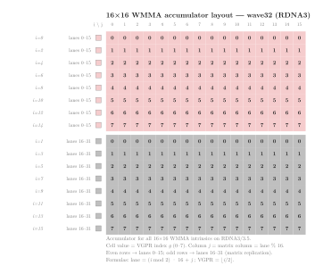

.. meta::
   :description: Reference for RDNA3/3.5 (gfx11, RX 7000 series) dense wave-matrix
      multiply-accumulate intrinsics, covering all supported
      __builtin_amdgcn_wmma_* variants, parameters, and output layouts.
   :keywords: RDNA3, gfx1100, gfx1101, gfx1102, gfx1103, gfx1150, gfx1151,
      WMMA, dense matrix, wave-matrix, HIP intrinsics, FP32, FP16, BF16, INT8,
      INT4, __builtin_amdgcn_wmma

.. _rdna3-wmma-intrinsics:

********************************************************************************
RDNA3 dense WMMA intrinsics
********************************************************************************

Wave-Matrix Multiply-Accumulate (WMMA) intrinsics let you issue hardware
dense matrix multiply-accumulate operations directly from HIP device code on
RDNA3/3.5 GPUs (``gfx1100``--``gfx1103``, ``gfx1150``--``gfx1153``).  Each
WMMA instruction multiplies a dense :math:`\pmb{A}` fragment by a dense
:math:`\pmb{B}` fragment and accumulates the result into a :math:`\pmb{C}`
fragment, all within a single 32-wide wavefront.

WMMA is the dense variant of the RDNA wave-matrix instruction family.  RDNA4
extends the family with SWMMAC (sparse) variants documented on the
:ref:`rdna4-swmmac-intrinsics` page.  CDNA (Instinct) GPUs provide a comparable
dense operation through :doc:`MFMA <../cdna/dense-mfma-intrinsics>`.  The two
differ in wavefront size (wave32 for WMMA, wave64 for MFMA), accumulator storage
(ordinary VGPRs for WMMA, dedicated accVGPRs for MFMA on CDNA/CDNA2), and tile
shapes.

.. note::

   RDNA3/3.5 GPUs run all shader programs in ``wave32`` mode by default.  The
   ``_w32`` suffix in each intrinsic name reflects this: all WMMA intrinsics on
   this page require ``wavefrontsize32``.

Architecture availability
=========================

The intrinsics on this page target RDNA3/3.5 GPUs.  To automatically enable
them, pass the LLVM target architecture flag at compile time:

.. code-block:: bash

   amdclang++ --offload-arch=gfx1100 ...
   amdclang++ --offload-arch=gfx1150 ...

Equivalent dense WMMA intrinsics for RDNA4 are documented on the
:ref:`rdna4-dense-wmma-intrinsics` page.

Naming convention
=================

All dense WMMA intrinsics on this page follow the pattern:

.. code-block:: text

   __builtin_amdgcn_wmma_<out_type>_<M>x<N>x<K>_<in_type>[_<in_type_b>]_w32

``out_type``
    Accumulator element type (``f32``, ``f16``, ``bf16``, or ``i32``).

``M``, ``N``, ``K``
    Tile dimensions in elements.  The instruction computes the contribution of
    a K-wide panel of :math:`\pmb{A}` (:math:`M \times K`) and a K-wide panel
    of :math:`\pmb{B}` (:math:`K \times N`) to an :math:`M \times N` output
    tile.

``in_type``
    Input element type of :math:`\pmb{A}` (and :math:`\pmb{B}` when both share
    the same type): ``f16``, ``bf16``, ``iu8``, or ``iu4``.  The ``iu`` prefix
    means the intrinsic accepts either signed or unsigned integers, controlled
    by the ``a_neg`` and ``b_neg`` parameters.

``_w32``
    Wavefront size suffix.  All RDNA3 WMMA intrinsics use wave32.

.. _rdna3-wmma-accumulator-layout:

Fragment layouts
================

All WMMA intrinsics on this page use a :math:`16 \times 16` output tile
computed by one wave32 wavefront.  The 32 lanes split into two groups of 16.
Unlike RDNA4's contiguous-block layout, RDNA3 interleaves the groups across
rows: even-numbered rows are held by lanes 0--15, odd-numbered rows by lanes
16--31.  This is the *matrix replication* pattern: lanes 0--15 and lanes
16--31 carry identical copies of the A and B input fragments, and the hardware
fuses their contributions into alternating output rows.  The diagrams below
show the mapping between matrix elements and lane or VGPR positions for each
operand.

Accumulator layout
---------------------------------

Each lane holds 8 output elements across VGPRs 0--7.

         are held by lanes 0-15 (rose); odd rows (1,3,...,15) by lanes 16-31
         (grey).  Each cell shows the VGPR index g (0-7).  Column j equals
         lane mod 16.
   :align: center
   :width: 80%

Given lane :math:`L` and VGPR index :math:`g`:

.. math::

   i &= g \cdot 2 + \lfloor \frac{L}{16} \rfloor \\
   j &= L \bmod 16

Conversely, given output element :math:`(i, j)`:

.. math::

   \text{lane} &= (i \bmod 2) \cdot 16 + j \\
   \text{VGPR} &= \lfloor \frac{i}{2} \rfloor

The row-to-lane mapping:

.. list-table::
   :header-rows: 1
   :widths: auto

   * - Row
     - Lanes
     - VGPR
   * - 0
     - 0--15
     - 0
   * - 1
     - 16--31
     - 0
   * - 2
     - 0--15
     - 1
   * - 3
     - 16--31
     - 1
   * - 4
     - 0--15
     - 2
   * - 5
     - 16--31
     - 2
   * - 6
     - 0--15
     - 3
   * - 7
     - 16--31
     - 3
   * - 8
     - 0--15
     - 4
   * - 9
     - 16--31
     - 4
   * - 10
     - 0--15
     - 5
   * - 11
     - 16--31
     - 5
   * - 12
     - 0--15
     - 6
   * - 13
     - 16--31
     - 6
   * - 14
     - 0--15
     - 7
   * - 15
     - 16--31
     - 7

srcA and srcB (FP16/BF16)
--------------------------

Each lane holds 16 input elements of :math:`\pmb{A}` (``v16half`` for FP16
or ``v16short`` for BF16; 8 VGPRs × 2 elements), covering one row of the A
fragment; similarly, each lane holds 16 elements of :math:`\pmb{B}` covering
one column of the B fragment.

Due to matrix replication, **lanes 0--15 and 16--31 must load identical
copies** of every row and column.  Only ``lane % 16`` determines which row
or column a lane covers -- the upper lane-group bit is ignored.  This means
your ``load_a`` and ``load_b`` code must supply the same data to both halves
of the wavefront.

Lane :math:`L` covers:

* srcA row :math:`= L \bmod 16`
* srcB column :math:`= L \bmod 16`

The row/column-to-lane mapping:

.. list-table::
   :header-rows: 1
   :widths: auto

   * - Row (srcA) / Column (srcB)
     - Lanes
     - VGPRs
   * - 0
     - 0, 16
     - 0--7
   * - 1
     - 1, 17
     - 0--7
   * - 2
     - 2, 18
     - 0--7
   * - 3
     - 3, 19
     - 0--7
   * - 4
     - 4, 20
     - 0--7
   * - 5
     - 5, 21
     - 0--7
   * - 6
     - 6, 22
     - 0--7
   * - 7
     - 7, 23
     - 0--7
   * - 8
     - 8, 24
     - 0--7
   * - 9
     - 9, 25
     - 0--7
   * - 10
     - 10, 26
     - 0--7
   * - 11
     - 11, 27
     - 0--7
   * - 12
     - 12, 28
     - 0--7
   * - 13
     - 13, 29
     - 0--7
   * - 14
     - 14, 30
     - 0--7
   * - 15
     - 15, 31
     - 0--7

The 16 FP16 elements are packed contiguously across 8 VGPRs (2 FP16 values
per VGPR):

.. list-table::
   :header-rows: 1
   :widths: auto

   * - VGPR
     - K positions
   * - 0
     - K {0, 1}
   * - 1
     - K {2, 3}
   * - 2
     - K {4, 5}
   * - 3
     - K {6, 7}
   * - 4
     - K {8, 9}
   * - 5
     - K {10, 11}
   * - 6
     - K {12, 13}
   * - 7
     - K {14, 15}

Example kernel
==============

:ref:`mfma-compute-policy` explains the ``ComputePolicy`` pattern used to
separate the multiply-accumulate logic from the rest of a kernel.  The example
below implements ``WmmaRdna3F16Policy`` using
``__builtin_amdgcn_wmma_f32_16x16x16_f16_w32``.

Each wavefront computes a single :math:`16 \times 16` output tile.  Due to
matrix replication, lanes 0--15 and 16--31 load identical A and B fragments
(``lane_id % 16`` selects the row/column), and each lane supplies 16 FP16
values for both operands.

.. rubric:: Policy constants

``v_wmma_f32_16x16x16_f16`` consumes 16 FP16 K positions per call, so
``k_step = 16``.  The wavefront holds the entire :math:`16 \times 16` tile:
``thread_tile_m = thread_tile_n = 16`` and ``effective_lanes = 32``.

.. rubric:: Accumulator layout

The intrinsic returns a ``v8float`` holding 8 VGPR values per lane.  The
``store_c()`` pass maps ``(lane, VGPR index)`` back to :math:`(i, j)`
coordinates using the RDNA3 interleaved accumulator layout.

.. literalinclude:: ../../tools/example_codes/matrix_multiply_rdna3_wmma.hip
   :language: cuda
   :start-after: [Sphinx wmma rdna3 policy start]
   :end-before: [Sphinx wmma rdna3 policy end]

.. rubric:: Instantiating the kernel

With ``WmmaRdna3F16Policy`` in hand, plug it into the generic kernel alongside
any ``TilePolicy`` whose ``block_tile_m`` and ``block_tile_n`` are multiples
of 16 and whose ``k_tile_size`` is a multiple of ``k_step = 16``.

.. literalinclude:: ../../tools/example_codes/matrix_multiply_rdna3_wmma.hip
   :language: cuda
   :start-after: [Sphinx wmma policy aliases start]
   :end-before: [Sphinx wmma policy aliases end]

.. literalinclude:: ../../tools/example_codes/matrix_multiply_rdna3_wmma.hip
   :language: cuda
   :start-after: [Sphinx wmma launch config start]
   :end-before: [Sphinx wmma launch config end]

.. literalinclude:: ../../tools/example_codes/matrix_multiply_rdna3_wmma.hip
   :language: cuda
   :start-after: [Sphinx wmma kernel launch start]
   :end-before: [Sphinx wmma kernel launch end]

**Compile and run:**

.. code-block:: bash

   amdclang++ -O3 -std=c++17 --offload-arch=gfx1100 \
       matrix_multiply_rdna3_wmma.hip -o mm_rdna3_wmma
   ./mm_rdna3_wmma

.. note::

   ``WmmaRdna3F16Policy`` requires an RDNA3/3.5 GPU (``gfx1100`` or later
   gfx11 target).  The ``#if defined(__gfx1100__) || ...`` guard in the
   example file falls back to ``ScalarFMAPolicy`` on other targets, so the
   file compiles without modification.

Register types used in this reference
=====================================

The signatures below use the following type aliases, which you can declare with
C++ attributes in any HIP translation unit:

.. code-block:: cpp

   using v16half  = _Float16 [[clang::ext_vector_type(16)]];
   using v16short = short [[clang::ext_vector_type(16)]];
   using v8float  = float [[clang::ext_vector_type(8)]];
   using v8half   = _Float16 [[clang::ext_vector_type(8)]];
   using v8short  = short [[clang::ext_vector_type(8)]];
   using v8int    = int [[clang::ext_vector_type(8)]];
   using v4int    = int [[clang::ext_vector_type(4)]];

.. _rdna3-wmma-common-parameters:

Common parameters
=================

.. list-table::
   :header-rows: 1
   :widths: auto

   * - Parameter
     - Type
     - Description
   * - ``opsel``
     - ``bool`` (compile-time constant)
     - FP16 and BF16 accumulate variants only.  Selects which half of the
       16-element accumulator register holds the result.  When ``false``,
       the 8 output elements occupy the low half of each VGPR pair
       (even-indexed elements); when ``true``, the high half (odd-indexed
       elements).  The ``_tied`` variants additionally constrain ``srcC``
       and the return value to the same physical register so that the
       non-selected half is preserved without an extra copy.
   * - ``a_neg``
     - ``bool`` (compile-time constant)
     - Integer variants only.  When ``true``, the :math:`\pmb{A}` elements are
       treated as signed integers; when ``false``, as unsigned.
   * - ``b_neg``
     - ``bool`` (compile-time constant)
     - Integer variants only.  Same as ``a_neg`` but for :math:`\pmb{B}`.
   * - ``clamp``
     - ``bool`` (compile-time constant)
     - Integer variants only.  When ``true``, the INT32 accumulator output is
       clamped to the representable range of the input type on overflow.

.. _rdna3-wmma-instruction-throughput:

Instruction throughput
======================

The cycle count below is the value used to compute theoretical peak
throughput: :math:`\text{peak throughput} =
\frac{\text{ops per instruction}}{\text{cycle count}} \times
\text{clock frequency}`.

.. list-table::
   :header-rows: 1
   :widths: auto

   * - Intrinsic
     - Ops
     - Cycle count
   * - ``__builtin_amdgcn_wmma_f32_16x16x16_f16_w32``
     - 8192
     - 32
   * - ``__builtin_amdgcn_wmma_f32_16x16x16_bf16_w32``
     - 8192
     - 32
   * - ``__builtin_amdgcn_wmma_f16_16x16x16_f16_w32``
     - 8192
     - 32
   * - ``__builtin_amdgcn_wmma_bf16_16x16x16_bf16_w32``
     - 8192
     - 32
   * - ``__builtin_amdgcn_wmma_i32_16x16x16_iu8_w32``
     - 8192
     - 32
   * - ``__builtin_amdgcn_wmma_i32_16x16x16_iu4_w32``
     - 8192
     - 16

.. _rdna3-wmma-intrinsic-reference:

Intrinsic reference
===================

The following sections list every dense WMMA intrinsic available on RDNA3/3.5,
grouped by accumulator type.

FP32-accumulate intrinsics
--------------------------

These intrinsics accumulate into FP32 and accept FP16 or BF16 matrix inputs.

FP16 inputs
^^^^^^^^^^^

.. include:: wmma-ref/f32-16x16x16f16-rdna3.rst

BF16 inputs
^^^^^^^^^^^

.. include:: wmma-ref/f32-16x16x16bf16-rdna3.rst

FP16-accumulate intrinsics
--------------------------

These intrinsics accumulate into FP16 with FP16 inputs.  Both accept an
``opsel`` parameter that selects which half of the 16-element accumulator
register is written (see :ref:`rdna3-wmma-common-parameters`).  The
``_tied`` variant constrains ``srcC`` and the return value to the same
physical register, preserving the non-selected half in place.

.. include:: wmma-ref/f16-16x16x16f16-rdna3.rst

.. include:: wmma-ref/f16-16x16x16f16-tied-rdna3.rst

BF16-accumulate intrinsics
--------------------------

These intrinsics accumulate into BF16 with BF16 inputs.  Both accept an
``opsel`` parameter and the ``_tied`` variant provides register tying, as
described in the FP16 section above.

.. include:: wmma-ref/bf16-16x16x16bf16-rdna3.rst

.. include:: wmma-ref/bf16-16x16x16bf16-tied-rdna3.rst

INT32-accumulate intrinsics
---------------------------

Integer WMMA intrinsics accept either signed or unsigned 8-bit or 4-bit
integer inputs, controlled by the ``a_neg`` and ``b_neg`` compile-time
constants.

INT8 and UINT8 inputs
^^^^^^^^^^^^^^^^^^^^^

.. include:: wmma-ref/i32-16x16x16iu8-rdna3.rst

INT4 and UINT4 inputs
^^^^^^^^^^^^^^^^^^^^^

.. include:: wmma-ref/i32-16x16x16iu4-rdna3.rst
