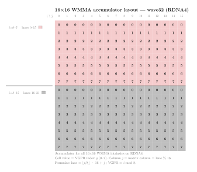

.. meta::
   :description: Reference for RDNA4 dense wave-matrix multiply-accumulate
      intrinsics, covering all __builtin_amdgcn_wmma_gfx12 variants, parameters, and output layouts.
   :keywords: RDNA4, gfx1200, gfx1201, WMMA, dense matrix, wave-matrix,
      HIP intrinsics, FP32, FP16, BF16, FP8, BF8, INT8, INT4,
      __builtin_amdgcn_wmma, global_load_tr

.. _rdna4-dense-wmma-intrinsics:

********************************************************************************
RDNA4 dense WMMA intrinsics
********************************************************************************

Wave-Matrix Multiply-Accumulate (WMMA) intrinsics let you issue hardware
dense matrix multiply-accumulate operations directly from HIP device code on
RDNA4 GPUs (``gfx1200``, ``gfx1201``).  Each WMMA instruction multiplies a
dense :math:`\pmb{A}` fragment by a dense :math:`\pmb{B}` fragment and
accumulates the result into a :math:`\pmb{C}` fragment, all within a single
32-wide wavefront.

RDNA4 supports the same FP16, BF16, INT8, and INT4 WMMA shapes as RDNA3 and
adds FP8 (E4M3), BF8 (E5M2) input formats and a deeper-K INT4 variant
(16x16x32).  RDNA4 also provides sparse
:ref:`sparse WMMA <rdna4-sparse-wmma-intrinsics>` variants that halve the
:math:`\pmb{A}` bandwidth using 2:4 structured sparsity.

CDNA (Instinct) GPUs provide a comparable dense operation through
:doc:`Matrix Fused Multiply-Accumulate (MFMA) <../cdna/dense-mfma-intrinsics>`.  The two differ in wavefront
size (wave32 for WMMA, wave64 for MFMA) and accumulator storage.

.. note::

   RDNA4 WMMA builtins use a ``_gfx12`` suffix
   (for example, ``__builtin_amdgcn_wmma_f32_16x16x16_f16_w32_gfx12``) to
   distinguish them from the RDNA3 builtins, which lack this suffix.  The
   two generations have different fragment sizes and accumulator layouts
   despite sharing the same tile dimensions.

.. note::

   RDNA4 GPUs run all shader programs in ``wave32`` mode by default.  The
   ``_w32`` suffix in each intrinsic name reflects this: all WMMA intrinsics on
   this page require ``wavefrontsize32``.

Architecture availability
=========================

The intrinsics on this page target RDNA4 GPUs.  To automatically enable them,
pass the Low Level Virtual Machine (LLVM) target architecture flag at compile time:

.. code-block:: bash

   amdclang++ --offload-arch=gfx1200 ...
   amdclang++ --offload-arch=gfx1201 ...

Equivalent dense WMMA intrinsics for the previous generation are documented on
the :ref:`rdna3-dense-wmma-intrinsics` page.

Naming convention
=================

All dense WMMA intrinsics on this page follow the pattern:

.. code-block:: text

   __builtin_amdgcn_wmma_<out_type>_<M>x<N>x<K>_<in_type>[_<in_type_b>]_w32_gfx12

``out_type``
    Accumulator element type (``f32``, ``f16``, ``bf16``, or ``i32``).

``M``, ``N``, ``K``
    Tile dimensions in elements.  The instruction computes the contribution of
    a K-wide panel of :math:`\pmb{A}` (:math:`M \times K`) and a K-wide panel
    of :math:`\pmb{B}` (:math:`K \times N`) to an :math:`M \times N` output
    tile.

``in_type``
    Input element type of :math:`\pmb{A}` (and :math:`\pmb{B}` when both share
    the same type): ``f16``, ``bf16``, ``iu8``, ``iu4``, ``fp8``, or ``bf8``.
    The ``iu`` prefix means the intrinsic accepts either signed or unsigned
    integers, controlled by the ``a_neg`` and ``b_neg`` parameters.

``in_type_b`` (optional)
    Input element type of :math:`\pmb{B}` when it differs from :math:`\pmb{A}`.
    Used only for mixed FP8 and BF8 variants.

``_w32``
    Wavefront size suffix.  All RDNA4 WMMA intrinsics use wave32.

``_gfx12``
    Architecture suffix distinguishing RDNA4 builtins from the RDNA3 variants.

.. _rdna4-dense-wmma-accumulator-layout:

Fragment layouts
================

All WMMA intrinsics on this page use a :math:`16 \times 16` output tile
computed by one wave32 wavefront.  The 32 lanes split into two groups of 16;
each group owns a contiguous block of 8 output rows.  This is a
*lane-group-split* layout.  Unlike RDNA3's matrix replication, RDNA4 splits
the K dimension across lane groups: the two groups cover different K
positions in the A and B fragments, interleaved in groups of 4 consecutive
K values.  The diagram and tables below show the mapping between matrix
elements and lane or Vector General-Purpose Register (VGPR) positions for each operand.

Accumulator layout
------------------

Each lane holds 8 output elements across VGPRs 0--7.  This layout is
identical to the
:ref:`SWMMAC accumulator <rdna4-swmmac-accumulator-layout>` on the same
hardware.

         by lanes 0-15; rows 8-15 (grey) by lanes 16-31.  Each cell shows the
         VGPR index g (0-7).  Column j equals lane mod 16.
   :align: center
   :width: 80%

Given lane :math:`L` and VGPR index :math:`g`:

.. math::

   i &= \lfloor \frac{L}{16} \rfloor \cdot 8 + g \\
   j &= L \bmod 16

Conversely, given output element :math:`(i, j)`:

.. math::

   \text{lane} &= \lfloor \frac{i}{8} \rfloor \cdot 16 + j \\
   \text{VGPR} &= i \bmod 8

The row-to-lane mapping:

.. list-table::
   :header-rows: 1
   :widths: auto

   * - Rows
     - Lanes
     - VGPRs
   * - 0--7
     - 0--15
     - 0--7
   * - 8--15
     - 16--31
     - 0--7

.. note::

   RDNA3 uses an interleaved row assignment (even rows in lanes 0--15, odd
   rows in lanes 16--31), while RDNA4 uses contiguous 8-row blocks.  See
   :ref:`rdna3-wmma-accumulator-layout` for the RDNA3 layout.

srcA and srcB (FP16 and BF16)
-----------------------------

Each lane holds 8 input elements of :math:`\pmb{A}` (``v8half``, 4 VGPRs ×
2 FP16), covering one row of the :math:`16 \times 16` A fragment; similarly,
each lane holds 8 elements of :math:`\pmb{B}` covering one column of the
:math:`16 \times 16` B fragment.  For srcA, ``lane % 16`` gives the matrix
row; for srcB, ``lane % 16`` gives the matrix column.  The VGPR-to-K mapping
is the same for both operands (transposed orientation).

Unlike RDNA3, where both lane groups carry identical copies of A and B
(matrix replication), RDNA4 splits the K dimension across lane groups.  The
two groups cover different K positions in an interleaved pattern: groups of
4 consecutive K values alternate between lane groups.  **Lane group 0
(lanes 0--15) covers K {0--3, 8--11}; lane group 1 (lanes 16--31) covers K
{4--7, 12--15}**.  Both groups cover all 16 rows (srcA) or columns (srcB).

The row and column-to-lane mapping:

.. list-table::
   :header-rows: 1
   :widths: auto

   * - Row (srcA) or Column (srcB)
     - Lanes
     - VGPRs
   * - 0
     - 0, 16
     - 0--3
   * - 1
     - 1, 17
     - 0--3
   * - 2
     - 2, 18
     - 0--3
   * - 3
     - 3, 19
     - 0--3
   * - 4
     - 4, 20
     - 0--3
   * - 5
     - 5, 21
     - 0--3
   * - 6
     - 6, 22
     - 0--3
   * - 7
     - 7, 23
     - 0--3
   * - 8
     - 8, 24
     - 0--3
   * - 9
     - 9, 25
     - 0--3
   * - 10
     - 10, 26
     - 0--3
   * - 11
     - 11, 27
     - 0--3
   * - 12
     - 12, 28
     - 0--3
   * - 13
     - 13, 29
     - 0--3
   * - 14
     - 14, 30
     - 0--3
   * - 15
     - 15, 31
     - 0--3

The 8 FP16 elements per lane are distributed across VGPRs:

.. list-table::
   :header-rows: 1
   :widths: auto

   * - Lane group
     - VGPR 0
     - VGPR 1
     - VGPR 2
     - VGPR 3
   * - 0 (lanes 0--15)
     - K {0, 1}
     - K {2, 3}
     - K {8, 9}
     - K {10, 11}
   * - 1 (lanes 16--31)
     - K {4, 5}
     - K {6, 7}
     - K {12, 13}
     - K {14, 15}

Using WMMA intrinsics as a compute policy
=========================================

:ref:`mfma-compute-policy` explains the ``ComputePolicy`` pattern used to
separate the multiply-accumulate logic from the rest of a kernel.  Two policy
variants are provided for RDNA4.

The complete source file is available for download:

* :download:`matrix_multiply_rdna4_wmma.hip <../../tools/example_codes/matrix_multiply_rdna4_wmma.hip>`

Baseline policy
---------------

``WmmaRdna4F16Policy`` uses scalar Local Data Share (LDS) loads for both A and B fragments.
B is cooperatively transposed during the tile load (in the ``TilePolicy``).

Each wavefront computes a single :math:`16 \times 16` output tile.  The 32
lanes form 2 groups of 16 (``laneGroup = lane_id / 16``); each group covers
8 consecutive K-positions, so each lane supplies 8 FP16 values for both A
and B.

.. rubric:: Policy constants

``v_wmma_f32_16x16x16_f16`` consumes 16 FP16 K positions per call, so
``k_step = 16``.  The wavefront holds the entire :math:`16 \times 16` tile:
``thread_tile_m = thread_tile_n = 16`` and ``effective_lanes = 32``.

.. rubric:: Accumulator layout

The intrinsic returns a ``v8float`` holding 8 VGPR values per lane.  The
``store_c()`` pass maps ``(lane, VGPR index)`` back to :math:`(i, j)`
coordinates using the RDNA4 lane-group-split layout.

.. literalinclude:: ../../tools/example_codes/matrix_multiply_rdna4_wmma.hip
   :language: cpp
   :start-after: [Sphinx wmma rdna4 policy start]
   :end-before: [Sphinx wmma rdna4 policy end]

Hardware transpose policy
-------------------------

``WmmaRdna4F16TrPolicy`` replaces the scalar B transpose with a hardware-
accelerated ``GLOBAL_LOAD_TR_B128`` instruction
(``__builtin_amdgcn_global_load_tr_b128_v8f16``).  This intrinsic loads 128
bits per lane from global memory and transposes the data into LDS in a single
operation, avoiding the per-element scalar transpose loop.

The compute path (``load_a``, ``load_b``, ``mma``, ``store_c``) is identical
to the baseline -- only the tile policy's ``prefetch()`` stage changes.

.. literalinclude:: ../../tools/example_codes/matrix_multiply_rdna4_wmma.hip
   :language: cpp
   :start-after: [Sphinx wmma rdna4 tr policy start]
   :end-before: [Sphinx wmma rdna4 tr policy end]

.. rubric:: Instantiating the kernel

With either policy, plug it into the generic kernel alongside any
``TilePolicy`` whose ``block_tile_m`` and ``block_tile_n`` are multiples
of 16 and whose ``k_tile_size`` is a multiple of ``k_step = 16``.

.. literalinclude:: ../../tools/example_codes/matrix_multiply_rdna4_wmma.hip
   :language: cpp
   :start-after: [Sphinx wmma policy aliases start]
   :end-before: [Sphinx wmma policy aliases end]

.. literalinclude:: ../../tools/example_codes/matrix_multiply_rdna4_wmma.hip
   :language: cpp
   :start-after: [Sphinx wmma launch config start]
   :end-before: [Sphinx wmma launch config end]

.. literalinclude:: ../../tools/example_codes/matrix_multiply_rdna4_wmma.hip
   :language: cpp
   :start-after: [Sphinx wmma kernel launch start]
   :end-before: [Sphinx wmma kernel launch end]

**Compile and run:**

.. code-block:: bash

   amdclang++ -O3 -std=c++17 --offload-arch=gfx1200 \
       matrix_multiply_rdna4_wmma.hip -o mm_rdna4_wmma
   ./mm_rdna4_wmma

   amdclang++ -O3 -std=c++17 --offload-arch=gfx1201 \
       matrix_multiply_rdna4_wmma.hip -o mm_rdna4_wmma
   ./mm_rdna4_wmma

.. note::

   ``WmmaRdna4F16Policy`` and ``WmmaRdna4F16TrPolicy`` require an RDNA4 GPU
   (``gfx1200`` or ``gfx1201``).  The
   ``#if defined(__gfx1200__) || defined(__gfx1201__)`` guard in the example
   file falls back to ``ScalarFMAPolicy`` on other targets, so the file
   compiles without modification.

Register types used in this reference
=====================================

The signatures below use the following type aliases, which you can declare with
C++ attributes in any HIP translation unit:

.. code-block:: cpp

   using v8half   = _Float16 [[clang::ext_vector_type(8)]];
   using v8float  = float [[clang::ext_vector_type(8)]];
   using v8short  = short [[clang::ext_vector_type(8)]];
   using v8int    = int [[clang::ext_vector_type(8)]];
   using v4int    = int [[clang::ext_vector_type(4)]];
   using v2int    = int [[clang::ext_vector_type(2)]];

.. _rdna4-dense-wmma-common-parameters:

Common parameters
=================

The ``a_neg``, ``b_neg``, and ``clamp`` parameters appear only on integer
WMMA variants.

.. list-table::
   :header-rows: 1
   :widths: auto

   * - Parameter
     - Type
     - Description
   * - ``a_neg``
     - ``bool`` (compile-time constant)
     - Integer variants only.  When ``true``, the :math:`\pmb{A}` elements are
       treated as signed integers; when ``false``, as unsigned.
   * - ``b_neg``
     - ``bool`` (compile-time constant)
     - Integer variants only.  Same as ``a_neg`` but for :math:`\pmb{B}`.
   * - ``clamp``
     - ``bool`` (compile-time constant)
     - Integer variants only.  When ``true``, the INT32 accumulator output is
       clamped to the representable range of the input type on overflow.

.. _rdna4-dense-wmma-instruction-throughput:

Instruction throughput
======================

The cycle count below is the value used to compute theoretical peak
throughput: :math:`\text{peak throughput} =
\frac{\text{ops per instruction}}{\text{cycle count}} \times
\text{clock frequency}`.

.. list-table::
   :header-rows: 1
   :widths: auto

   * - Intrinsic
     - Ops
     - Cycle count
   * - ``__builtin_amdgcn_wmma_f32_16x16x16_f16_w32_gfx12``
     - 8192
     - 16
   * - ``__builtin_amdgcn_wmma_f32_16x16x16_bf16_w32_gfx12``
     - 8192
     - 16
   * - ``__builtin_amdgcn_wmma_f16_16x16x16_f16_w32_gfx12``
     - 8192
     - 16
   * - ``__builtin_amdgcn_wmma_bf16_16x16x16_bf16_w32_gfx12``
     - 8192
     - 16
   * - ``__builtin_amdgcn_wmma_i32_16x16x16_iu8_w32_gfx12``
     - 8192
     - 8
   * - ``__builtin_amdgcn_wmma_i32_16x16x16_iu4_w32_gfx12``
     - 8192
     - 8
   * - ``__builtin_amdgcn_wmma_i32_16x16x32_iu4_w32_gfx12``
     - 16384
     - 8
   * - ``__builtin_amdgcn_wmma_f32_16x16x16_fp8_fp8_w32_gfx12``
     - 8192
     - 8
   * - ``__builtin_amdgcn_wmma_f32_16x16x16_fp8_bf8_w32_gfx12``
     - 8192
     - 8
   * - ``__builtin_amdgcn_wmma_f32_16x16x16_bf8_fp8_w32_gfx12``
     - 8192
     - 8
   * - ``__builtin_amdgcn_wmma_f32_16x16x16_bf8_bf8_w32_gfx12``
     - 8192
     - 8

.. _rdna4-dense-wmma-intrinsic-reference:

Intrinsic reference
===================

The following sections list every dense WMMA intrinsic available on RDNA4,
grouped by accumulator type.

FP32-accumulate intrinsics
--------------------------

These intrinsics accumulate into FP32 and accept FP16, BF16, FP8, or BF8
matrix inputs.

FP16 inputs
^^^^^^^^^^^

The following intrinsics use FP16 matrix inputs.

.. include:: wmma-ref/f32-16x16x16f16-rdna4.rst

BF16 inputs
^^^^^^^^^^^

The following intrinsics use BF16 matrix inputs.

.. include:: wmma-ref/f32-16x16x16bf16-rdna4.rst

FP8 and BF8 inputs
^^^^^^^^^^^^^^^^^^

The following intrinsics use FP8 and BF8 matrix inputs.

.. include:: wmma-ref/f32-16x16x16fp8-fp8-rdna4.rst

.. include:: wmma-ref/f32-16x16x16fp8-bf8-rdna4.rst

.. include:: wmma-ref/f32-16x16x16bf8-fp8-rdna4.rst

.. include:: wmma-ref/f32-16x16x16bf8-bf8-rdna4.rst

FP16-accumulate intrinsics
--------------------------

This intrinsic accumulates into FP16 with FP16 inputs.

FP16 inputs
^^^^^^^^^^^

The following intrinsic uses FP16 matrix inputs.

.. include:: wmma-ref/f16-16x16x16f16-rdna4.rst

BF16-accumulate intrinsics
--------------------------

This intrinsic accumulates into BF16 with BF16 inputs.

BF16 inputs
^^^^^^^^^^^

The following intrinsic uses BF16 matrix inputs.

.. include:: wmma-ref/bf16-16x16x16bf16-rdna4.rst

INT32-accumulate intrinsics
---------------------------

Integer WMMA intrinsics accept either signed or unsigned 8-bit or 4-bit
integer inputs, controlled by the ``a_neg`` and ``b_neg`` compile-time
constants.

INT8 and UINT8 inputs (16x16x16)
^^^^^^^^^^^^^^^^^^^^^^^^^^^^^^^^

The following intrinsics use INT8 and UINT8 matrix inputs.

.. include:: wmma-ref/i32-16x16x16iu8-rdna4.rst

INT4 and UINT4 inputs (16x16x16)
^^^^^^^^^^^^^^^^^^^^^^^^^^^^^^^^

The following intrinsics use INT4 and UINT4 matrix inputs.

.. include:: wmma-ref/i32-16x16x16iu4-rdna4.rst

INT4 and UINT4 inputs (16x16x32)
^^^^^^^^^^^^^^^^^^^^^^^^^^^^^^^^

The following intrinsics use INT4 and UINT4 matrix inputs.

.. include:: wmma-ref/i32-16x16x32iu4-rdna4.rst
