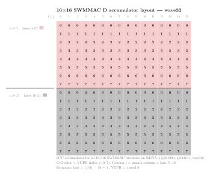
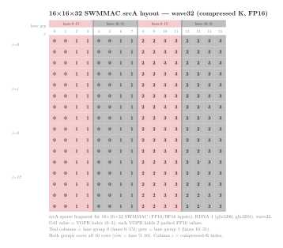
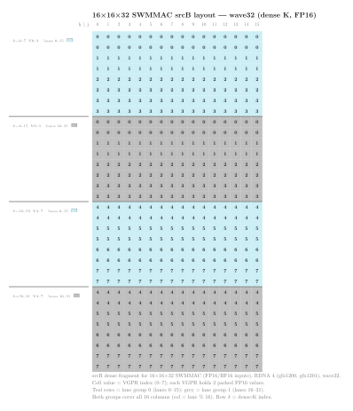

.. meta::
   :description: Reference for RDNA4 (gfx1200, gfx1201) sparse wave-matrix multiply-accumulate intrinsics, covering all supported __builtin_amdgcn_swmmac_* variants, parameters, and output layouts.
   :keywords: RDNA4, gfx1200, gfx1201, SWMMAC, sparse matrix, wave-matrix, HIP intrinsics, FP32, FP16, BF16, FP8, BF8, INT8, INT4, __builtin_amdgcn_swmmac

.. _rdna4-swmmac-intrinsics:

********************************************************************************
RDNA4 SWMMAC intrinsics
********************************************************************************

Sparse Wave-Matrix Multiply-Accumulate (SWMMAC) intrinsics let you issue
hardware sparse matrix multiply-accumulate operations directly from HIP device
code on RDNA4 GPUs (``gfx1200``, ``gfx1201``). Each SWMMAC instruction
multiplies a compressed sparse :math:`\pmb{A}` fragment by a dense
:math:`\pmb{B}` fragment and accumulates the result into a :math:`\pmb{D}`
fragment, all within a single 32-wide wavefront. Because the :math:`\pmb{A}`
operand is stored in compressed form, SWMMAC halves the storage and bandwidth
required for :math:`\pmb{A}` relative to a dense multiply of the same tile size.

.. note::

   RDNA4 GPUs run all shader programs in ``wave32`` mode by default. The
   ``_w32`` suffix in each intrinsic name reflects this: all SWMMAC
   intrinsics on this page require ``wavefrontsize32``. ``wavefrontsize64`` is not supported for HIP code.

Architecture availability
=========================

The intrinsics on this page target RDNA4 GPUs. To automatically enable them, pass the LLVM target architecture flag at compile time:

.. code-block:: bash

   amdclang++ --offload-arch=gfx1201 ...
   amdclang++ --offload-arch=gfx1200 ...

Naming convention
=================

All SWMMAC intrinsics follow the pattern:

.. code-block:: text

   __builtin_amdgcn_swmmac_<out_type>_<M>x<N>x<K>_<in_type>[_<in_type_b>]_w32

``out_type``
    Accumulator element type (``f32``, ``f16``, ``bf16``, or ``i32``).

``M``, ``N``, ``K``
    Tile dimensions. The K dimension refers to the *compressed* K of the sparse
    :math:`\pmb{A}` operand. The corresponding dense K is twice as large due to
    2:4 sparsity.

``in_type``
    Input element type of :math:`\pmb{A}` (and :math:`\pmb{B}` when both share
    the same type): ``f16``, ``bf16``, ``fp8``, ``bf8``, ``iu8``, or ``iu4``.
    The ``iu`` prefix means the intrinsic accepts either signed or unsigned
    integers, controlled by the ``a_neg`` and ``b_neg`` parameters.

``in_type_b`` (optional)
    Input element type of :math:`\pmb{B}` when it differs from :math:`\pmb{A}`.
    Used only for mixed FP8/BF8 variants.

``_w32``
    Wavefront size suffix. All RDNA4 SWMMAC intrinsics use wave32.

Structured sparsity (2:4 pattern)
==================================

SWMMAC instructions require the :math:`\pmb{A}` matrix to obey 2:4 structured
sparsity: in every contiguous group of four elements along the K dimension,
exactly two are non-zero and the other two are zero. This constraint allows the
:math:`\pmb{A}` operand to be stored in a compressed representation containing
only the non-zero values, reducing the storage to half the original K
dimension.

Along with the compressed non-zero values, the hardware requires a sparsity
index that encodes which two of the four positions in each group hold the
non-zeros. This index is passed as the ``index`` argument to every SWMMAC
intrinsic. The hardware uses it at execution time to align the compressed
:math:`\pmb{A}` elements against the correct rows of the :math:`\pmb{B}`
operand before accumulating the products.

Host-side compression is straightforward: walk the K dimension in groups of
four, extract the two non-zero positions, and pack them consecutively into the
output buffer. The example kernel in this topic uses a fixed pattern that keeps
positions 0 and 2 of every group, producing a compressed buffer of half the
original K length.

.. _rdna4-swmmac-accumulator-layout:

Fragment layouts
================

All SWMMAC intrinsics on this page use a :math:`16 \times 16` output tile
computed by one wave32 wavefront. The 32 lanes split into two groups of 16;
each group owns half the output rows. The diagrams below show the mapping
between matrix elements and lane or VGPR positions for each operand.

D accumulator (srcC / output)
---------------------------------

Each lane holds 8 FP32 output elements across VGPRs 0--7.

         lanes 0–15; rows 8–15 (grey) by lanes 16–31. Each cell shows
         the VGPR index g (0–7) that holds element (i, j). Column j
         equals lane % 16.
   :align: center
   :width: 80%

Given lane :math:`L` and VGPR :math:`g`, the output element position is:

.. math::

   i &= \left\lfloor \frac{L}{16} \right\rfloor \cdot 8 + g \\
   j &= L \bmod 16

Inversely, output element :math:`(i, j)` is stored in:

.. math::

   \text{lane} &= \left\lfloor \frac{i}{8} \right\rfloor \cdot 16 + j \\
   \text{VGPR} &= i \bmod 8

srcA (sparse, FP16/BF16)
--------------------------

Each lane holds 8 compressed FP16 values (``v8fp16``, 4 VGPRs × 2 FP16)
covering one row of the sparse :math:`\pmb{A}` matrix. The compressed-K
positions are non-contiguous across the two lane groups.

         (compressed K 0–3 and 8–11) are held by lane group 0 (lanes
         0–15); grey columns (compressed K 4–7 and 12–15) by lane group
         1 (lanes 16–31). Each cell shows the VGPR index (0–3).
   :align: center
   :width: 80%

Lane :math:`L` covers matrix row :math:`L \bmod 16`. The 8 compressed
elements are distributed across VGPRs as follows:

.. list-table::
   :header-rows: 1
   :widths: auto

   * - Lane group
     - VGPR 0
     - VGPR 1
     - VGPR 2
     - VGPR 3
   * - 0 (lanes 0--15)
     - compressed K {0, 1}
     - compressed K {2, 3}
     - compressed K {8, 9}
     - compressed K {10, 11}
   * - 1 (lanes 16--31)
     - compressed K {4, 5}
     - compressed K {6, 7}
     - compressed K {12, 13}
     - compressed K {14, 15}

srcB (dense, FP16/BF16)
------------------------

Each lane holds 16 dense FP16 values (``v16fp16``, 8 VGPRs × 2 FP16)
covering one column of the dense :math:`\pmb{B}` matrix. The K-row positions
are non-contiguous across the two lane groups.

         and K 16–23) are held by lane group 0 (lanes 0–15); grey rows
         (K 8–15 and K 24–31) by lane group 1 (lanes 16–31). Each cell
         shows the VGPR index (0–7).
   :align: center
   :width: 80%

Lane :math:`L` covers matrix column :math:`L \bmod 16`. The 16 dense
K rows are distributed across VGPRs as follows:

.. list-table::
   :header-rows: 1
   :widths: auto

   * - Lane group
     - VGPRs 0--3
     - VGPRs 4--7
   * - 0 (lanes 0--15)
     - K rows 0--7
     - K rows 16--23
   * - 1 (lanes 16--31)
     - K rows 8--15
     - K rows 24--31

The notation used in the rest of this page:

* :math:`i` -- zero-based row index within the tile, :math:`0 \le i < 16`
* :math:`j` -- zero-based column index within the tile, :math:`0 \le j < 16`
* **lane** -- wavefront lane, :math:`0 \le \text{lane} < 32`
* **VGPR** -- zero-based index into that lane's register vector

Register types used in this reference
======================================

The signatures below use the following type aliases, which you can declare with
C++ attributes in any HIP translation unit:

.. code-block:: cpp

   using v2int    = int    [[clang::ext_vector_type(2)]];
   using v4int    = int    [[clang::ext_vector_type(4)]];
   using v8int    = int    [[clang::ext_vector_type(8)]];
   using v8float  = float  [[clang::ext_vector_type(8)]];
   using v8short  = short  [[clang::ext_vector_type(8)]];   // BF16 storage
   using v16short = short  [[clang::ext_vector_type(16)]];  // BF16 storage
   using v8fp16   = __fp16 [[clang::ext_vector_type(8)]];
   using v16fp16  = __fp16 [[clang::ext_vector_type(16)]];

Each type alias maps one-to-one to the corresponding LLVM vector type used in
the intrinsic definition. The number in the name is the element count per lane.

.. note::

   BF16 matrix inputs use ``short`` as the storage type for RDNA4 SWMMAC
   (not ``__bf16``). Reinterpret your BF16 data with ``__builtin_bit_cast``
   or a union before passing it to the intrinsic.

.. _rdna4-swmmac-common-parameters:

Common parameters
=================

The ``index`` parameter is shared by all SWMMAC intrinsics. The ``a_neg``,
``b_neg``, and ``clamp`` parameters appear only on integer variants.

.. list-table::
   :header-rows: 1
   :widths: auto

   * - Parameter
     - Type
     - Description
   * - ``index``
     - ``int``
     - Sparsity index register. Each pair of bits encodes the position (0--3)
       of one non-zero element within its block of four consecutive
       :math:`\pmb{A}` elements along K. The 32-bit ``int`` holds indices for
       all elements owned by one lane. Must satisfy the 2:4 constraint: exactly
       two of the four elements in each block must be selected.
   * - ``a_neg``
     - ``bool`` (compile-time constant)
     - Integer variants only. When ``true``, the :math:`\pmb{A}` elements are
       treated as signed integers; when ``false``, as unsigned.
   * - ``b_neg``
     - ``bool`` (compile-time constant)
     - Integer variants only. Same as ``a_neg`` but for :math:`\pmb{B}`.
   * - ``clamp``
     - ``bool`` (compile-time constant)
     - Integer variants only. When ``true``, the INT32 accumulator output is
       clamped to the representable range of the input type on overflow.

Example kernel
==============

The matrix multiplication tutorial in :ref:`matrix-multiply-optimization` uses
a ``ComputePolicy`` type parameter to separate the multiply-accumulate logic
from the rest of the kernel. The example below implements
``SwmmacRdna4F16Policy`` using
``__builtin_amdgcn_swmmac_f32_16x16x32_f16_w32`.

Each wavefront computes a single :math:`16 \times 16` output tile. The
:math:`\pmb{A}` operand is pre-sparsified: half the K positions are zero and
omitted from storage, so the compressed K dimension is 16 (representing 32
dense K positions).

.. rubric:: Policy constants

``swmmac_f32_16x16x32_f16_w32`` consumes 32 dense K positions per call
(compressed to K=16 in :math:`\pmb{A}`), so ``k_step = 32``. The
wavefront holds the entire :math:`16 \times 16` tile: ``thread_tile_m =
thread_tile_n = 16`` and ``effective_lanes = 32``.

.. rubric:: Sparsity index

Each lane's ``index`` register encodes two bits per compressed K position,
identifying which of the four elements in each 2:4 block is non-zero. The
example constructs a simple even-column sparsity pattern (elements at positions
0 and 2 in each block of four) at the host and passes it to the device.

.. rubric:: Accumulator layout

The intrinsic returns a ``v8float`` holding 8 FP32 values per lane. The
``store_c()`` pass maps ``(lane, VGPR index)`` back to :math:`(i, j)`
coordinates using the SWMMAC accumulator layout.

.. literalinclude:: ../../tools/example_codes/matrix_multiply_rdna4_swmmac.hip
   :language: cuda
   :start-after: [Sphinx swmmac rdna4 policy start]
   :end-before: [Sphinx swmmac rdna4 policy end]

.. rubric:: Instantiating the kernel

With ``SwmmacRdna4F16Policy`` in place, plug it into the generic kernel
alongside a ``TilePolicy`` whose ``block_tile_m`` and ``block_tile_n`` are
multiples of 16 and whose ``k_tile_size`` is a multiple of ``k_step = 32``.

.. literalinclude:: ../../tools/example_codes/matrix_multiply_rdna4_swmmac.hip
   :language: cuda
   :start-after: [Sphinx swmmac policy aliases start]
   :end-before: [Sphinx swmmac policy aliases end]

.. literalinclude:: ../../tools/example_codes/matrix_multiply_rdna4_swmmac.hip
   :language: cuda
   :start-after: [Sphinx swmmac launch config start]
   :end-before: [Sphinx swmmac launch config end]

.. literalinclude:: ../../tools/example_codes/matrix_multiply_rdna4_swmmac.hip
   :language: cuda
   :start-after: [Sphinx swmmac kernel launch start]
   :end-before: [Sphinx swmmac kernel launch end]

**Compile and run:**

.. code-block:: bash

   amdclang++ -O3 -std=c++17 --offload-arch=gfx1201 \
       matrix_multiply_rdna4_swmmac.hip -o mm_rdna4_swmmac
   ./mm_rdna4_swmmac

   amdclang++ -O3 -std=c++17 --offload-arch=gfx1200 \
       matrix_multiply_rdna4_swmmac.hip -o mm_rdna4_swmmac
   ./mm_rdna4_swmmac

.. note::

   ``SwmmacRdna4F16Policy`` requires an RDNA4 GPU (``gfx1200`` or ``gfx1201``).
   The ``#if defined(__gfx1200__) || defined(__gfx1201__)``
   guard in the example file falls back to ``ScalarFMASPolicy`` on other targets,
   so the file compiles without modification.

   The example uses pre-sparsified input data with a fixed 2:4 pattern. In a
   production kernel, apply a sparsity pruning pass to the weight matrix offline
   and store the compressed values and index tensor separately.

.. _rdna4-swmmac-intrinsic-reference:

Intrinsic reference
===================

The following sections list every SWMMAC intrinsic available on RDNA4,
grouped by accumulator type.

FP32-accumulate intrinsics
--------------------------

These intrinsics accumulate into FP32 and accept FP16, BF16, FP8, or BF8
matrix inputs.

FP16 inputs
^^^^^^^^^^^

.. code-block:: cpp

   v8float __builtin_amdgcn_swmmac_f32_16x16x32_f16_w32(
       v8fp16  srcA,
       v16fp16 srcB,
       v8float srcC,
       int     index);

Computes one step of a sparse :math:`16 \times 16` FP32 accumulation with FP16
inputs. :math:`\pmb{A}` is a compressed sparse fragment (8 FP16 values per lane
representing 16 K positions after 2:4 expansion). :math:`\pmb{B}` is a dense
fragment (16 FP16 values per lane). The ``index`` register identifies the
non-zero positions in :math:`\pmb{A}`.

.. list-table::
   :header-rows: 1
   :widths: auto

   * - Parameter
     - Type
     - Description
   * - ``srcA``
     - v8fp16
     - Eight compressed FP16 elements of :math:`\pmb{A}` per lane.
   * - ``srcB``
     - v16fp16
     - Sixteen dense FP16 elements of :math:`\pmb{B}` per lane.
   * - ``srcC``
     - v8float
     - Accumulator input: eight FP32 elements per lane.
   * - ``index``
     - int
     - Sparsity index, see :ref:`rdna4-swmmac-common-parameters`.

**Returns** ``v8float`` -- updated accumulator
(:math:`\text{expand}(\text{srcA}, \text{index}) \times \text{srcB} + \text{srcC}`).

BF16 inputs
^^^^^^^^^^^

.. code-block:: cpp

   v8float __builtin_amdgcn_swmmac_f32_16x16x32_bf16_w32(
       v8short  srcA,
       v16short srcB,
       v8float  srcC,
       int      index);

Computes one step of a sparse :math:`16 \times 16` FP32 accumulation with BF16
inputs. BF16 values are passed as ``short`` (16-bit storage). Otherwise
identical in structure to the FP16 variant.

.. list-table::
   :header-rows: 1
   :widths: auto

   * - Parameter
     - Type
     - Description
   * - ``srcA``
     - v8short
     - Eight compressed BF16 elements of :math:`\pmb{A}` per lane (BF16 stored
       as ``short``).
   * - ``srcB``
     - v16short
     - Sixteen dense BF16 elements of :math:`\pmb{B}` per lane.
   * - ``srcC``
     - v8float
     - Accumulator input: eight FP32 elements per lane.
   * - ``index``
     - int
     - Sparsity index, see :ref:`rdna4-swmmac-common-parameters`.

**Returns** ``v8float`` -- updated accumulator.

FP8 and BF8 inputs
^^^^^^^^^^^^^^^^^^

These intrinsics accept 8-bit floating-point inputs in either FP8 (E4M3) or
BF8 (E5M2) format. FP8 and BF8 values are packed four-per-register into
``int`` fields. The intrinsic name encodes the format of :math:`\pmb{A}` first
and :math:`\pmb{B}` second.

.. code-block:: cpp

   // FP8 A × FP8 B → FP32
   v8float __builtin_amdgcn_swmmac_f32_16x16x32_fp8_fp8_w32(
       v2int   srcA,
       v4int   srcB,
       v8float srcC,
       int     index);

   // FP8 A × BF8 B → FP32
   v8float __builtin_amdgcn_swmmac_f32_16x16x32_fp8_bf8_w32(
       v2int   srcA,
       v4int   srcB,
       v8float srcC,
       int     index);

   // BF8 A × FP8 B → FP32
   v8float __builtin_amdgcn_swmmac_f32_16x16x32_bf8_fp8_w32(
       v2int   srcA,
       v4int   srcB,
       v8float srcC,
       int     index);

   // BF8 A × BF8 B → FP32
   v8float __builtin_amdgcn_swmmac_f32_16x16x32_bf8_bf8_w32(
       v2int   srcA,
       v4int   srcB,
       v8float srcC,
       int     index);

All four variants share the same parameter layout:

.. list-table::
   :header-rows: 1
   :widths: auto

   * - Parameter
     - Type
     - Description
   * - ``srcA``
     - v2int
     - Eight compressed FP8 or BF8 elements of :math:`\pmb{A}` per lane,
       packed into two 32-bit registers (four 8-bit values per register).
   * - ``srcB``
     - v4int
     - Sixteen dense FP8 or BF8 elements of :math:`\pmb{B}` per lane, packed
       into four 32-bit registers.
   * - ``srcC``
     - v8float
     - Accumulator input: eight FP32 elements per lane.
   * - ``index``
     - int
     - Sparsity index, see :ref:`rdna4-swmmac-common-parameters`.

**Returns** ``v8float`` -- updated accumulator.

FP16-accumulate intrinsics
--------------------------

This intrinsic accumulates into FP16 with FP16 inputs.

.. code-block:: cpp

   v8fp16 __builtin_amdgcn_swmmac_f16_16x16x32_f16_w32(
       v8fp16  srcA,
       v16fp16 srcB,
       v8fp16  srcC,
       int     index);

Computes one step of a sparse :math:`16 \times 16` FP16 accumulation. Both
inputs and the accumulator are FP16. Operand sizes and the sparsity index are
identical to the FP32-accumulate FP16 variant.

.. list-table::
   :header-rows: 1
   :widths: auto

   * - Parameter
     - Type
     - Description
   * - ``srcA``
     - v8fp16
     - Eight compressed FP16 elements of :math:`\pmb{A}` per lane.
   * - ``srcB``
     - v16fp16
     - Sixteen dense FP16 elements of :math:`\pmb{B}` per lane.
   * - ``srcC``
     - v8fp16
     - Accumulator input: eight FP16 elements per lane.
   * - ``index``
     - int
     - Sparsity index, see :ref:`rdna4-swmmac-common-parameters`.

**Returns** ``v8fp16`` -- updated accumulator.

BF16-accumulate intrinsics
--------------------------

This intrinsic accumulates into BF16 with BF16 inputs.

.. code-block:: cpp

   v8short __builtin_amdgcn_swmmac_bf16_16x16x32_bf16_w32(
       v8short  srcA,
       v16short srcB,
       v8short  srcC,
       int      index);

Computes one step of a sparse :math:`16 \times 16` BF16 accumulation. Both
inputs and the accumulator are BF16 (stored as ``short``).

.. list-table::
   :header-rows: 1
   :widths: auto

   * - Parameter
     - Type
     - Description
   * - ``srcA``
     - v8short
     - Eight compressed BF16 elements of :math:`\pmb{A}` per lane.
   * - ``srcB``
     - v16short
     - Sixteen dense BF16 elements of :math:`\pmb{B}` per lane.
   * - ``srcC``
     - v8short
     - Accumulator input: eight BF16 elements per lane (stored as ``short``).
   * - ``index``
     - int
     - Sparsity index, see :ref:`rdna4-swmmac-common-parameters`.

**Returns** ``v8short`` -- updated accumulator (BF16 stored as ``short``).

INT32-accumulate intrinsics
---------------------------

Integer SWMMAC intrinsics accept either signed or unsigned 8-bit or 4-bit
integer inputs, controlled by the ``a_neg`` and ``b_neg`` compile-time
constants.

INT8 and UINT8 inputs (16x16x32)
^^^^^^^^^^^^^^^^^^^^^^^^^^^^^^^^^

.. code-block:: cpp

   v8int __builtin_amdgcn_swmmac_i32_16x16x32_iu8_w32(
       bool  a_neg,
       v2int srcA,
       bool  b_neg,
       v4int srcB,
       v8int srcC,
       int   index,
       bool  clamp);

Computes one step of a sparse :math:`16 \times 16` INT32 accumulation with
8-bit integer inputs. :math:`\pmb{A}` is packed as two ``int`` registers per
lane (8 bytes = 8 INT8 elements after 2:4 expansion to 16 K positions).
:math:`\pmb{B}` is packed as four ``int`` registers per lane (16 bytes = 16
INT8 elements).

.. list-table::
   :header-rows: 1
   :widths: auto

   * - Parameter
     - Type
     - Description
   * - ``a_neg``
     - bool
     - ``true`` for signed INT8, ``false`` for unsigned UINT8. Compile-time
       constant.
   * - ``srcA``
     - v2int
     - Eight compressed 8-bit elements of :math:`\pmb{A}` per lane, packed
       into two 32-bit registers.
   * - ``b_neg``
     - bool
     - ``true`` for signed INT8, ``false`` for unsigned UINT8 in
       :math:`\pmb{B}`. Compile-time constant.
   * - ``srcB``
     - v4int
     - Sixteen dense 8-bit elements of :math:`\pmb{B}` per lane, packed into
       four 32-bit registers.
   * - ``srcC``
     - v8int
     - Accumulator input: eight INT32 elements per lane.
   * - ``index``
     - int
     - Sparsity index, see :ref:`rdna4-swmmac-common-parameters`.
   * - ``clamp``
     - bool
     - Clamp output to input type range on overflow. Compile-time constant.

**Returns** ``v8int`` -- updated accumulator.

INT4 and UINT4 inputs (16x16x32)
^^^^^^^^^^^^^^^^^^^^^^^^^^^^^^^^^^

.. code-block:: cpp

   v8int __builtin_amdgcn_swmmac_i32_16x16x32_iu4_w32(
       bool  a_neg,
       int   srcA,
       bool  b_neg,
       v2int srcB,
       v8int srcC,
       int   index,
       bool  clamp);

Computes one step of a sparse :math:`16 \times 16` INT32 accumulation with
4-bit integer inputs. Eight INT4 elements of :math:`\pmb{A}` fit into a single
``int`` per lane; sixteen INT4 elements of :math:`\pmb{B}` fit into two
``int`` registers.

.. list-table::
   :header-rows: 1
   :widths: auto

   * - Parameter
     - Type
     - Description
   * - ``a_neg``
     - bool
     - ``true`` for signed INT4, ``false`` for unsigned UINT4 in
       :math:`\pmb{A}`. Compile-time constant.
   * - ``srcA``
     - int
     - Eight compressed 4-bit elements of :math:`\pmb{A}` per lane, packed
       into one 32-bit register.
   * - ``b_neg``
     - bool
     - ``true`` for signed INT4, ``false`` for unsigned UINT4 in
       :math:`\pmb{B}`. Compile-time constant.
   * - ``srcB``
     - v2int
     - Sixteen dense 4-bit elements of :math:`\pmb{B}` per lane, packed into
       two 32-bit registers.
   * - ``srcC``
     - v8int
     - Accumulator input: eight INT32 elements per lane.
   * - ``index``
     - int
     - Sparsity index, see :ref:`rdna4-swmmac-common-parameters`.
   * - ``clamp``
     - bool
     - Clamp output to input type range on overflow. Compile-time constant.

**Returns** ``v8int`` -- updated accumulator.

INT4 and UINT4 inputs (16x16x64)
^^^^^^^^^^^^^^^^^^^^^^^^^^^^^^^^^^

.. code-block:: cpp

   v8int __builtin_amdgcn_swmmac_i32_16x16x64_iu4_w32(
       bool  a_neg,
       v2int srcA,
       bool  b_neg,
       v4int srcB,
       v8int srcC,
       int   index,
       bool  clamp);

Computes one step of a sparse :math:`16 \times 16` INT32 accumulation with
4-bit integer inputs over a deeper K=64 strip. Sixteen INT4 elements of
:math:`\pmb{A}` are packed into two ``int`` registers per lane; thirty-two
INT4 elements of :math:`\pmb{B}` into four ``int`` registers.

.. list-table::
   :header-rows: 1
   :widths: auto

   * - Parameter
     - Type
     - Description
   * - ``a_neg``
     - bool
     - ``true`` for signed INT4, ``false`` for unsigned UINT4 in
       :math:`\pmb{A}`. Compile-time constant.
   * - ``srcA``
     - v2int
     - Sixteen compressed 4-bit elements of :math:`\pmb{A}` per lane, packed
       into two 32-bit registers.
   * - ``b_neg``
     - bool
     - ``true`` for signed INT4, ``false`` for unsigned UINT4 in
       :math:`\pmb{B}`. Compile-time constant.
   * - ``srcB``
     - v4int
     - Thirty-two dense 4-bit elements of :math:`\pmb{B}` per lane, packed
       into four 32-bit registers.
   * - ``srcC``
     - v8int
     - Accumulator input: eight INT32 elements per lane.
   * - ``index``
     - int
     - Sparsity index, see :ref:`rdna4-swmmac-common-parameters`.
   * - ``clamp``
     - bool
     - Clamp output to input type range on overflow. Compile-time constant.

**Returns** ``v8int`` -- updated accumulator.
