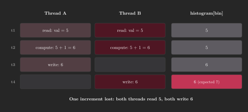
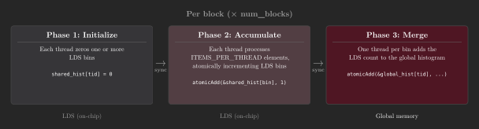
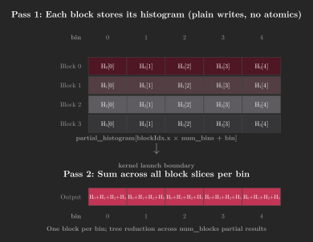

.. meta::
  :description:  Learn how to optimize GPU histogram computation in HIP using shared memory atomics, LDS accumulation, and vectorized loads on AMD CDNA and RDNA GPUs.
  :keywords: AMD, ROCm, HIP, histogram, atomics, shared memory, LDS, vectorized loads, tutorial

.. _histogram:

********************************************************************************
Optimizing histogram in HIP
********************************************************************************

Histogram is an operation that counts how often each value (or range of
values) appears in an input dataset. It appears throughout GPU workloads,
including image processing, radix sort, database operations, and machine
learning. The challenge on GPUs is that the output location of each write is
determined by the input value at runtime, meaning multiple threads can attempt
to update the same output bin simultaneously. Efficiently managing this concurrent access
is the central optimization problem.

This tutorial walks through a series of HIP kernels for computing a 256-bin
histogram over a large array of unsigned integers. Starting from a naive kernel
that issues one global atomic per input element, each step reduces global atomic
traffic: first by moving accumulation into shared memory, then by having each
thread process more elements so fewer blocks are launched. The final approach
eliminates global atomics at the merge step entirely by having each block write
its local histogram to a private slice of a temporary buffer, then summing those
slices in a separate reduction kernel.

The complete source file for all kernels is available at:

* :download:`Histogram kernels <../../tools/example_codes/histogram.hip>`

.. note::

   All kernels compute a 256-bin histogram over a large array of unsigned
   integers and are validated against a sequential reference implementation.
   They compile with ``amdclang++ -O3 -std=c++17`` and run on any
   ROCm-supported GPU architecture.

Prerequisites
=============

Before starting this tutorial, ensure the following are in place.

* ROCm installed and ``amdclang++`` available on ``PATH``.
* Familiarity with the HIP execution model (grids, blocks, wavefronts) and its
  mapping to AMD GPU hardware (dispatches, workgroups, wavefronts).
* :ref:`rocprofiler-sdk:using-rocprofv3` installed for performance analysis.

Histogram fundamentals
======================

A histogram maps each element of an input array to one of ``num_bins`` output
counters, called bins, and increments that counter. Formally, for an input
sequence :math:`x_1, \ldots, x_N` and a bin mapping function :math:`f`, the
count for bin :math:`b` is:

.. math::

   H[b] = \sum_{i=1}^{N} \delta\bigl(b - \lfloor f(x_i) \rfloor\bigr)

where :math:`\delta( )` is 1 when its argument is zero and 0 otherwise.
For a simple integer input, :math:`f(x_i) = x_i \bmod B` maps each value to
one of :math:`B` bins by remainder.

The algorithm consists of three steps:

1. Read each input element.
2. Determine its bin.
3. Increment that bin's counter.

On a CPU, this is straightforward. On a GPU, thousands of threads execute these
steps simultaneously, and many might land in the same bin at the same time.

Race conditions
===============

A race condition occurs when two or more threads concurrently attempt to read-modify-write
the same memory location. Consider two threads that both want to
increment ``histogram[bin]``:

.. code-block:: cpp

   histogram[bin] = histogram[bin] + 1;

If both threads read the value before either writes back, they both compute the
same result, and the second write overwrites the first, so one increment is
lost. This is a natural consequence of parallel execution: with many threads
running concurrently across compute units, some will read the same value before
any of them writes back.

         before either writes back, resulting in a lost increment.

When multiple threads map to the same bin, this kind of overlap is expected.
Atomic operations, covered in the next section, are the standard solution.

Atomic operations
=================

An atomic operation executes a read-modify-write sequence as an indivisible
unit. No other thread can observe a partially completed operation or interleave
its own update between the read and write. From the hardware's perspective,
the memory arbitration unit locks the relevant cache line, performs the update,
and releases the lock. All competing threads observe results as if the
operations occurred in a single sequential order.

HIP provides a set of atomic primitives for both global and shared memory:

.. list-table::
   :header-rows: 1
   :widths: 25 75

   * - Operation
     - Description
   * - ``atomicAdd``
     - Adds a value to a memory location and returns the old value.
   * - ``atomicSub``
     - Subtracts a value from a memory location and returns the old value.
   * - ``atomicExch``
     - Exchanges a register value with a memory location.
   * - ``atomicCAS``
     - Compares a memory location to an expected value and, if equal, replaces
       it with a new value. The fundamental building block for custom atomic
       operations.
   * - ``atomicMax``/``atomicMin``
     - Updates a memory location to the maximum or minimum of its current value
       and a given value.
   * - ``atomicInc``/``atomicDec``
     - Atomically increments or decrements a counter, wrapping at a boundary.

Atomic operations can target shared memory (block scope), global memory
(device scope), or system memory, depending on hardware support. For more
information, see the
`GPU atomics operations reference <https://rocm.docs.amd.com/en/latest/reference/gpu-atomics-operation.html>`_.

**Compile and run:**

.. code-block:: bash

   amdclang++ -O3 -std=c++17 histogram.hip -o histogram
   ./histogram

**Profile wall-clock time with rocprofv3:**

.. code-block:: bash

   rocprofv3 --kernel-trace --output-format csv -- ./histogram

The ``--kernel-trace`` CSV reports ``End_Timestamp - Start_Timestamp`` (both in
nanoseconds) for each kernel dispatch.  Compare the duration column across
kernel variants to measure the impact of each optimization step.

Naive kernel
============

The naive kernel issues one global ``atomicAdd`` per thread:

.. literalinclude:: ../../tools/example_codes/histogram.hip
   :language: cpp
   :linenos:
   :start-after: [Sphinx histogram naive kernel start]
   :end-before: [Sphinx histogram naive kernel end]

Global memory atomics must traverse the full memory hierarchy. When many
threads target the same bin, the hardware serializes their updates. That is, only one can
proceed at a time while the others stall. This is called **atomic contention**,
and it limits throughput in proportion to the number of threads competing for the same
address.

Two factors make contention worse in practice:

- **Hot bins:** When the input distribution is skewed, a small number of bins
  receive a disproportionate share of increments. Every thread targeting a hot
  bin serializes against every other thread.

- **Wavefront serialization:** Within a wavefront, if multiple lanes map to the same bin,
  the hardware issues their atomic operations one at a time, stalling the whole
  wavefront until each completes.

The example code uses a skewed input where every fourth element is fixed to
bin 1, to reflect a realistic distribution in which one bin is significantly
busier than the others.

What to observe
---------------

Profile the naive kernel and record the following counter.

.. list-table::
   :header-rows: 1
   :widths: auto

   * - Counter
     - What to look for
   * - Kernel duration (kernel-trace CSV)
     - ``End_Timestamp - Start_Timestamp`` establishes the baseline.  Global
       atomic contention on hot bins makes this the slowest variant.

Shared memory histogram
=======================

Atomic operations in shared memory (the Local Data Share, or LDS, on AMD
GPUs) are an order of magnitude faster than global memory atomics because the
LDS is on-chip and directly connected to the compute units. The shared memory
kernel reduces global atomic traffic in two independent ways: moving
accumulation into LDS, and having each thread process multiple elements so
fewer blocks are launched overall.

The kernel has three phases:

1. Initialize the per-block histogram in LDS to zero.
2. Each thread processes ``ITEMS_PER_THREAD`` input elements (default: 16),
   atomically incrementing the appropriate LDS bin for each.
3. One thread per bin merges the LDS histogram into the global histogram with a
   single global atomic.

         accumulation in LDS, and a global merge step.

.. literalinclude:: ../../tools/example_codes/histogram.hip
   :language: cpp
   :linenos:
   :start-after: [Sphinx histogram shared kernel start]
   :end-before: [Sphinx histogram shared kernel end]

The inner loop uses the stride ``i * blockDim.x``, so consecutive threads in a
wavefront always read consecutive memory addresses in each iteration, so the access
pattern remains coalesced throughout. Because ``ITEMS_PER_THREAD`` is a
compile-time constant, ``#pragma unroll`` allows the compiler to eliminate the
loop counter and branch overhead.

With ``block_size = 256`` and ``ITEMS_PER_THREAD = 16``, each block covers
4,096 input elements. For a 16 M-element input, this launches 4,096 blocks,
compared to 65,536 for the naive kernel. The global merge step issues at most
``num_bins`` atomics per block: 256 per block × 4,096 blocks = ~1 M global
atomics total, versus 16 M for the naive kernel.

.. note::

   The LDS histogram occupies ``num_bins * sizeof(unsigned int)`` bytes. For
   256 bins, this is 1 KB, well within the 64 KB of LDS available per Compute
   Unit on CDNA GPUs and per Work Group Processor on RDNA GPUs.

What to observe
---------------

Compare the following counter against the naive kernel baseline.

.. list-table::
   :header-rows: 1
   :widths: auto

   * - Counter
     - What to look for
   * - Kernel duration (kernel-trace CSV)
     - ``End_Timestamp - Start_Timestamp`` should drop significantly versus
       the naive kernel.  LDS atomics are an order of magnitude faster than
       global atomics, and processing multiple elements per thread reduces
       the total block count and global merge traffic.

Partial histograms
==================

The shared memory kernel still issues up to ``num_bins`` global atomics per
block during the merge phase. For 4,096 blocks and 256 bins, that is roughly
one million global atomic operations.

A partial histogram avoids this by deferring the merge entirely. Instead of
each block atomically adding its local counts into a single shared output array,
each block writes its ``num_bins`` counts to its own reserved slice of a
temporary ``partial_histogram`` buffer - using plain stores, with no
contention. The global output is then computed in a second kernel that sums
across all the per-block slices for each bin. Because the two passes are
separated, neither requires global atomics: the first pass uses conflict-free
stores, and the second pass is a straightforward parallel reduction (see
:ref:`reduction`).

         slice of a temporary buffer in pass 1, then a reduction kernel summing
         across all block slices per bin in pass 2.

The first kernel is identical to the shared memory kernel except for the merge
step, which becomes a plain store rather than a global atomic:

.. literalinclude:: ../../tools/example_codes/histogram.hip
   :language: cpp
   :linenos:
   :start-after: [Sphinx histogram partial kernel start]
   :end-before: [Sphinx histogram partial kernel end]

The ``partial_histogram`` array has ``num_blocks * num_bins`` elements, laid
out as ``partial_histogram[blockIdx.x * num_bins + bin]``. Writing a full row
of ``num_bins`` consecutive values per block keeps the stores coalesced.

The second kernel assigns one block to each bin. Threads within each block
accumulate their share of the partial results with a stride loop, then reduce
to a single bin count using a shared memory tree reduction:

.. literalinclude:: ../../tools/example_codes/histogram.hip
   :language: cpp
   :linenos:
   :start-after: [Sphinx histogram reduce kernel start]
   :end-before: [Sphinx histogram reduce kernel end]

The kernel launches a number of blocks equal to ``num_bins``, with each block
consisting of ``block_size`` threads. Every thread accumulates data from every
``blockDim.x``-th partial block into a register accumulator. It then writes the
result to shared memory and participates in the tree reduction process. The
access pattern ``partial_histogram[i * num_bins + bin]`` strides by ``num_bins``
between iterations, so consecutive threads in a wavefront read consecutive addresses
so the reads are coalesced.

.. note::

   The ``partial_histogram`` buffer requires ``num_blocks * num_bins *
   sizeof(unsigned int)`` bytes of device memory. With ``ITEMS_PER_THREAD =
   16``, ``block_size = 256``, and a 16 M-element input, this is 4,096 blocks
   × 256 bins × 4 bytes = 4 MB.

What to observe
---------------

Compare the following counters against the shared memory kernel.

.. list-table::
   :header-rows: 1
   :widths: auto

   * - Counter
     - What to look for
   * - Kernel duration (kernel-trace CSV)
     - Compare ``End_Timestamp - Start_Timestamp`` for both passes (the
       partial histogram kernel and the reduction kernel) against the single-pass
       shared memory kernel.  The two-pass approach eliminates global atomics
       at the merge step but introduces overhead from the additional kernel
       launch and the tree reduction.
   * - ``VGPR_Count`` (kernel-trace CSV)
     - From ``--kernel-trace`` CSV: compare register usage between the
       shared-memory kernel and the partial histogram kernel to confirm
       similar resource consumption.

.. tip::

   Increasing ``ITEMS_PER_THREAD`` reduces the block count, which reduces
   merge overhead in all variants.  Performance improves until the kernel
   becomes compute-bound within each block and the benefit plateaus.  Use
   ``rocprofv3 --kernel-trace`` to find the crossover point for your target
   GPU.

Further reading
===============

The following resources provide deeper coverage of the tools and hardware referenced in this tutorial.

* :doc:`rocPRIM <rocprim:index>`
  - production-quality histogram primitives that handle edge cases and
  automatically apply architecture-specific tuning.
* :ref:`rocprofv3 documentation <rocprofiler-sdk:using-rocprofv3>` - detailed
  guide to timeline and counter profiling.
* `AMD GPU architecture guides (ISA references) <https://gpuopen.com/amd-gpu-architecture-programming-documentation/>`_
  - VGPR budgets, LDS bank geometry, and wavefront scheduling details for each
  architecture family.
