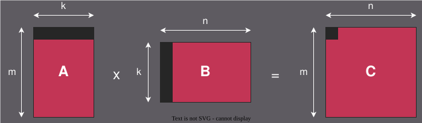

.. meta::
  :description: Optimize a HIP GEMM kernel step by step: LDS tiling, register tiling, double buffering, vectorized loads, occupancy tuning, and a generic policy-based kernel for AMD Instinct and AMD Radeon GPUs.
  :keywords: AMD, ROCm, HIP, GEMM, matrix multiplication, LDS, register tiling, double buffering, vectorized loads, launch_bounds, occupancy, generic kernel, MFMA, WMMA, CDNA, RDNA

.. _matrix-multiply-optimization:

********************************************************************************
Optimizing matrix multiplication: a step-by-step guide
********************************************************************************

Matrix multiplication is one of the most fundamental GPU workloads.  It
underlies the compute-intensive layers of deep neural networks — fully connected
layers, convolutional layers expressed as implicit GEMMs, and attention
mechanisms — and is central to scientific computing, computer vision, and
recommendation systems.  GPUs are heavily optimized for matrix multiplication,
and understanding how to write an efficient GEMM kernel is an effective way to
learn how GPU hardware resources interact.

This tutorial walks through seven progressive optimization steps applied to a
general-purpose single-precision (FP32) matrix multiplication kernel
(GEMM: :math:`\pmb{C} = \pmb{A} \times \pmb{B}`).  Each step builds on the
previous one, introducing a specific technique and explaining how to measure its
effect with the ROCm performance analysis stack.

The complete source files for all steps are available at:

* :download:`Step 1 - Naive <../../tools/example_codes/matrix_multiply_naive.hip>`
* :download:`Step 2 - LDS tiling <../../tools/example_codes/matrix_multiply_lds.hip>`
* :download:`Step 3 - Register tiling <../../tools/example_codes/matrix_multiply_register_tiling.hip>`
* :download:`Step 4 - Double buffering <../../tools/example_codes/matrix_multiply_double_buffer.hip>`
* :download:`Step 5 - Vectorized loads <../../tools/example_codes/matrix_multiply_vectorized.hip>`
* :download:`Step 6 - Register pressure <../../tools/example_codes/matrix_multiply_launch_bounds.hip>`
* :download:`Step 7 - Generic kernel <../../tools/example_codes/matrix_multiply_generic.hip>`

.. note::

   All examples target :math:`4096 \times 4096` matrices in FP32 row-major
   layout and are validated against the identity-matrix test
   (:math:`B = I \implies C = A`).  They compile with
   ``amdclang++ -O3 -std=c++17`` and run on any ROCm-supported GPU architecture.

Prerequisites
=============

Before starting this tutorial, ensure the following are in place.

* ROCm installed and ``amdclang++`` available on ``PATH``.
* Familiarity with the HIP execution model (grids, blocks, warps) and its
  mapping to AMD GPU hardware (dispatches, workgroups, wavefronts).
* :ref:`rocprofiler-sdk:using-rocprofv3` installed for performance analysis.

.. tip::

   Hardware performance counter availability varies by ROCm version, Linux
   kernel version, and system permissions.  A counter that appears in
   ``rocprofv3 --list-avail`` might still return only zero values on a given
   system.  If that happens, the counter is unavailable. Kernel duration
   (``End_Timestamp - Start_Timestamp`` from ``rocprofv3 --kernel-trace``) is
   always available and provides a reliable baseline across all steps and
   architectures.

GEMM fundamentals
==================

A GEMM multiplies an :math:`M \times K` matrix :math:`\pmb{A}` by a
:math:`K \times N` matrix :math:`\pmb{B}` to produce an :math:`M \times N`
output matrix :math:`\pmb{C}`.  Each element :math:`C_{ij}` is the inner
product of the *i*-th row of :math:`\pmb{A}` and the *j*-th column of
:math:`\pmb{B}`:

A CPU implementation applies three nested loops over *m*, *n*, and *k*,
performing one multiply-accumulate per iteration — 2 × M × N × K scalar
operations in total.

A GPU implementation is `embarrassingly parallel <https://en.wikipedia.org/wiki/Embarrassingly_parallel>`_ across the output elements.
A HIP kernel assigns one thread (or a small tile of threads) to each output
element, eliminating the *m* and *n* loops entirely and leaving only the
*k* reduction loop inside each thread.  With :math:`M \times N` output
elements and a modern AMD GPU fielding tens of thousands of concurrent threads,
the full output matrix can be computed in a single dispatch — provided data
can be supplied fast enough to keep the compute units busy.

Background: the GEMM arithmetic intensity
==========================================

For an :math:`M \times K \times N` GEMM the arithmetic intensity—floating-point
operations per byte of DRAM traffic—is:

.. math::

   I = \frac{2 \cdot M \cdot N \cdot K}{\text{sizeof}(\text{float}) \cdot (M \cdot K + K \cdot N + M \cdot N)}

For :math:`M = N = K = n` this simplifies to :math:`\frac{n}{6}`.  With
:math:`n = 4096` that gives roughly **683 FLOPs/byte**, far above the roofline
ridge point of any current AMD GPU.  GEMM is therefore **compute-bound** in
principle—but only if data is supplied fast enough to keep the compute units
busy.  The naive kernel falls well below the roofline because it is
*memory-bound in practice*: global memory latency stalls dominate.

The optimization steps that follow progressively close the gap between actual
and theoretical throughput by improving data reuse and instruction-level
efficiency.

Step 1: Naive kernel
=====================

The naive kernel assigns one thread per output element.  Each thread reads a
full row of :math:`\pmb{A}` and a full column of :math:`\pmb{B}` directly from
global memory.

While this maps naturally onto the GPU's parallel execution model, it produces
severe **cache thrashing**.  Consider that any element :math:`A[i][k]` is needed
by *all N threads* that compute a different output column in the same row, and
:math:`B[k][j]` is needed by all *M threads* that compute a different output
row in the same column.  With tens of thousands of threads in flight
simultaneously, the working set far exceeds the L2 cache, so data that should
be reused is evicted before the next thread requests it.  The result is that
total DRAM traffic is a large multiple of the minimum required bandwidth
(``sizeof(float) * (M*K + K*N + M*N)``), and the kernel is firmly
memory-bound despite GEMM's high arithmetic intensity in principle.

.. literalinclude:: ../../tools/example_codes/matrix_multiply_naive.hip
   :language: cuda
   :start-after: [Sphinx naive kernel start]
   :end-before: [Sphinx naive kernel end]

Launch configuration:

.. literalinclude:: ../../tools/example_codes/matrix_multiply_naive.hip
   :language: cuda
   :start-after: [Sphinx naive launch config start]
   :end-before: [Sphinx naive launch config end]
   :dedent:

**Compile and run:**

.. code-block:: bash

   amdclang++ -O3 -std=c++17 matrix_multiply_naive.hip -o mm_naive
   ./mm_naive

**Profile wall-clock time with rocprofv3:**

.. code-block:: bash

   rocprofv3 --kernel-trace --output-format csv -- ./mm_naive

Kernel duration is ``End_Timestamp - Start_Timestamp`` (both in nanoseconds).
The trace also captures ``VGPR_Count`` and ``Scratch_Size`` for each dispatch.

The ``--kernel-trace`` CSV is sufficient to establish the baseline: the naive
kernel's ``End_Timestamp - Start_Timestamp`` will be the slowest of all steps
because every global memory access is a cache miss.

Step 2: LDS tiling
==================

The root cause of the naive kernel's cache thrashing is that all threads share
a single transparent L2 cache with no way to guarantee that a loaded value
stays resident until every thread that needs it has read it.  AMD GPUs expose
**Local Data Share (LDS)** — a low-latency, high-bandwidth on-chip memory that
is explicitly managed by the programmer, functioning as a programmable L1 cache.
Unlike CPU hardware caches, data placed in LDS stays there until the kernel
explicitly overwrites or discards it.

The key insight is that every element of :math:`\pmb{A}` is used by :math:`N`
threads (one per output column) and every element of :math:`\pmb{B}` is used by
:math:`M` threads.  Caching a ``TILE_SIZE * TILE_SIZE`` strip of :math:`\pmb{A}`
and :math:`\pmb{B}` in LDS lets all ``TILE_SIZE²`` threads in a block reuse
that data without touching global memory again.

.. literalinclude:: ../../tools/example_codes/matrix_multiply_lds.hip
   :language: cuda
   :start-after: [Sphinx LDS tile size start]
   :end-before: [Sphinx LDS tile size end]

**Shared memory allocation:**

.. literalinclude:: ../../tools/example_codes/matrix_multiply_lds.hip
   :language: cuda
   :start-after: [Sphinx LDS shared memory start]
   :end-before: [Sphinx LDS shared memory end]
   :dedent:

**Load phase (cooperative, one element per thread):**

.. literalinclude:: ../../tools/example_codes/matrix_multiply_lds.hip
   :language: cuda
   :start-after: [Sphinx LDS load phase start]
   :end-before: [Sphinx LDS load phase end]
   :dedent:

**Compute phase (inner product from LDS):**

.. literalinclude:: ../../tools/example_codes/matrix_multiply_lds.hip
   :language: cuda
   :start-after: [Sphinx LDS compute phase start]
   :end-before: [Sphinx LDS compute phase end]
   :dedent:

LDS bank conflict analysis
--------------------------

Moving data into LDS is only half the battle — *how* threads access that data
determines whether the LDS delivers its full bandwidth.  LDS is divided into
independently addressable **banks**.  When threads in the same cycle access
different addresses that map to the same bank, the hardware must serialize
those accesses.  This is called a **bank conflict**, and it directly reduces
the effective LDS bandwidth by the degree of the conflict (a *k*-way conflict
takes *k* cycles instead of one).

Bank mapping is straightforward: consecutive 4-byte words are assigned to
consecutive banks in round-robin order.  For a 32-bank LDS, word at byte
address ``a`` maps to bank ``(a / 4) % 32``.  Two threads accessing the
*same* address are not in conflict — the hardware broadcasts the value to
both.

The number of LDS banks varies across AMD GPU architectures:

+---------------------+---------------+----------------------------------------+
| Architecture        | Bank          | Entries per bank (4 byte each)         |
+=====================+===============+========================================+
| CDNA                | 32            | 512                                    |
+---------------------+---------------+----------------------------------------+
| CDNA2               | 32            | 512                                    |
+---------------------+---------------+----------------------------------------+
| CDNA3               | 32            | 512                                    |
+---------------------+---------------+----------------------------------------+
| CDNA4               | 64            | 640                                    |
+---------------------+---------------+----------------------------------------+
| RDNA2               | 64            | 512                                    |
+---------------------+---------------+----------------------------------------+
| RDNA3               | 64            | 512                                    |
+---------------------+---------------+----------------------------------------+
| RDNA3.5             | 64            | 512                                    |
+---------------------+---------------+----------------------------------------+
| RDNA4               | 64            | 512                                    |
+---------------------+---------------+----------------------------------------+

For this kernel's compute phase—an inner product over the K-strip:

.. code-block:: cuda

   sum += tile_a[ty][i] * tile_b[i][tx];

—the access pattern with ``float`` data is **inherently conflict-free
regardless of tile size**:

* ``tile_a[ty][i]``: all threads in a wavefront that share the same ``ty``
  read the *same address*.  The hardware broadcasts the value — no conflict.
* ``tile_b[i][tx]``: each thread has a unique ``tx``, and because each
  ``float`` is exactly 4 bytes (= one bank slot), consecutive ``tx`` values
  always map to consecutive banks.  No two threads in the same cycle can hit
  the same bank at a different address, regardless of how large ``TILE_SIZE``
  is.  The ``i`` loop iterates sequentially within each thread, so accesses
  to different rows of ``tile_b`` are never concurrent.

In other words, with FP32 data and the simple inner-product pattern of this
step, bank conflicts are a non-issue.  The bank mechanism is worth
understanding now, however, because it becomes a real concern later.

**Compile and run:**

.. code-block:: bash

   amdclang++ -O3 -std=c++17 matrix_multiply_lds.hip -o mm_lds
   ./mm_lds

**Profile wall-clock time with rocprofv3:**

.. code-block:: bash

   rocprofv3 --kernel-trace --output-format csv -- ./mm_lds

Compare ``End_Timestamp - Start_Timestamp`` against the Step 1 baseline.  To
measure L2-to-HBM read traffic on CDNA GPUs:

.. code-block:: bash

   # CDNA only
   rocprofv3 --pmc TCP_TCC_READ_REQ_sum --output-format csv -- ./mm_lds

What to observe after this step
-------------------------------

+---------------------+--------------------------------------------------------+
| Counter             | What to look for                                       |
+=====================+========================================================+
| Kernel duration     | ``End_Timestamp - Start_Timestamp`` should drop        |
| (kernel-trace CSV)  | significantly vs the naive kernel, confirming that LDS |
|                     | data reuse is reducing global memory traffic           |
+---------------------+--------------------------------------------------------+
| ``TCP_TCC_READ_REQ  | CDNA only: reduction proportional to ``TILE_SIZE``     |
| _sum`` (CDNA)       | confirms fewer L2-to-HBM read requests                 |
+---------------------+--------------------------------------------------------+
| ``LDSBankConflict`` | Should remain at or near zero for ``TILE_SIZE=16``     |
|                     | with FP32 data (confirms no bank conflicts)            |
+---------------------+--------------------------------------------------------+

Step 3: Register tiling
=======================

In the LDS kernel each thread computes exactly one output element, reading
``TILE_SIZE`` values from ``tile_a`` and ``TILE_SIZE`` values from ``tile_b``
for every K-strip.  If instead each thread computes a
``THREAD_TILE_M × THREAD_TILE_N`` sub-tile in registers, it amortizes the LDS
load cost across ``THREAD_TILE_M × THREAD_TILE_N`` outputs.

The outer product of a length-``THREAD_TILE_M`` column fragment of A and a
length-``THREAD_TILE_N`` row fragment of B produces a full
``THREAD_TILE_M × THREAD_TILE_N`` block of C contributions using only
``THREAD_TILE_M + THREAD_TILE_N`` LDS reads instead of
``THREAD_TILE_M × THREAD_TILE_N``.

**Tile parameters:**

.. literalinclude:: ../../tools/example_codes/matrix_multiply_register_tiling.hip
   :language: cuda
   :start-after: [Sphinx register tiling params start]
   :end-before: [Sphinx register tiling params end]

**Transposed tile_b layout:**

``tile_b`` is stored transposed in LDS as ``tile_b_T[BLOCK_TILE_N][K_TILE_SIZE]``
(column-major for B).  This layout choice is motivated by two concerns:

1. **Stride-1 reads during the outer-product compute phase**: In the
   outer-product pattern, each thread loads a fragment of ``THREAD_TILE_N``
   consecutive elements from ``tile_b_T`` along the ``ki`` dimension.  Because
   the inner dimension of ``tile_b_T`` is ``K_TILE_SIZE``, consecutive ``ki``
   values are adjacent in memory — stride-1 access. Without transposition
   (``tile_b[K_TILE_SIZE][BLOCK_TILE_N]``), the fragment load would stride
   across the large ``BLOCK_TILE_N`` dimension, producing
   scattered LDS reads.
2. **Bank-conflict safety for sub-4-byte types**: In Step 2's simple
   inner-product loop, each ``float`` occupies exactly one 4-byte LDS bank slot,
   so bank conflicts cannot arise regardless of tile dimensions.  This property
   does not hold for smaller data types. When architecture-specific intrinsics
   introduce half-precision (FP16, 2 bytes) or quarter-precision (FP8, 1 byte)
   data in follow-up sections, multiple elements pack into a single 4-byte bank
   slot.  If the row stride of ``tile_b`` equals or is a multiple of the bank
   count, different threads can address different sub-word elements within the
   same bank slot, producing conflicts that are impossible with FP32. The
   transposed layout decouples the fragment access stride (``K_TILE_SIZE``)
   from the tile's outer dimension (``BLOCK_TILE_N``), avoiding this class of
   conflict regardless of element size or bank count.

**LDS allocation:**

.. literalinclude:: ../../tools/example_codes/matrix_multiply_register_tiling.hip
   :language: cuda
   :start-after: [Sphinx register tiling shared memory start]
   :end-before: [Sphinx register tiling shared memory end]
   :dedent:

**Cooperative tile load:**

.. literalinclude:: ../../tools/example_codes/matrix_multiply_register_tiling.hip
   :language: cuda
   :start-after: [Sphinx register tiling load phase start]
   :end-before: [Sphinx register tiling load phase end]
   :dedent:

**Outer-product accumulation:**

.. literalinclude:: ../../tools/example_codes/matrix_multiply_register_tiling.hip
   :language: cuda
   :start-after: [Sphinx register tiling compute phase start]
   :end-before: [Sphinx register tiling compute phase end]
   :dedent:

**Write-back:**

.. literalinclude:: ../../tools/example_codes/matrix_multiply_register_tiling.hip
   :language: cuda
   :start-after: [Sphinx register tiling store start]
   :end-before: [Sphinx register tiling store end]
   :dedent:

**Compile and run:**

.. code-block:: bash

   amdclang++ -O3 -std=c++17 matrix_multiply_register_tiling.hip -o mm_register_tiling
   ./mm_register_tiling

**Profile wall-clock time with rocprofv3:**

.. code-block:: bash

   rocprofv3 --kernel-trace --output-format csv -- ./mm_register_tiling

For LDS and arithmetic instruction counts:

.. code-block:: bash

   rocprofv3 --pmc SQ_INSTS_LDS --output-format csv -- ./mm_register_tiling

What to observe
---------------

+---------------------+--------------------------------------------------------+
| Counter             | What to look for                                       |
+=====================+========================================================+
| ``VALUInsts``       | Increase in VALU instructions per wave (more FMAs per  |
| (RDNA, CDNA, CDNA2) | LDS read).                                             |
| / ``SQ_INSTS_VALU`` |                                                        |
| (CDNA3, CDNA4)      |                                                        |
+---------------------+--------------------------------------------------------+
| ``SQ_INSTS_LDS``    | Reduction in LDS instructions per wave                 |
|                     | (``THREAD_TILE_M + THREAD_TILE_N`` instead of          |
|                     | ``2 × THREAD_TILE_M × THREAD_TILE_N``)                 |
+---------------------+--------------------------------------------------------+
| ``SQ_WAIT_INST_LDS``| Reduction in LDS stall cycles (register reuse hides    |
|                     | LDS latency).                                          |
+---------------------+--------------------------------------------------------+

Tile parameter tuning guidance
------------------------------

The tile dimensions (``BLOCK_TILE_M``, ``BLOCK_TILE_N``, ``K_TILE_SIZE``,
``THREAD_TILE_M``, ``THREAD_TILE_N``) are not one-size-fits-all.  Optimal
values depend on several interacting constraints:

**Matrix dimensions**
   Tile sizes should evenly divide the matrix dimensions to avoid boundary
   handling overhead.  Padding the matrices to a multiple of the tile size
   is common in production GEMM libraries.

**LDS capacity**
   Each workgroup allocates ``BLOCK_TILE_M × K_TILE_SIZE`` and
   ``K_TILE_SIZE × BLOCK_TILE_N`` floats in LDS.  LDS capacity varies
   across AMD GPU architectures (typically 64–160 KiB per compute unit).
   Exceeding the LDS budget reduces occupancy by limiting how many
   workgroups can be resident simultaneously.

**Register file**
   Each thread holds a ``THREAD_TILE_M × THREAD_TILE_N`` accumulator array
   plus fragment temporaries.  Larger thread tiles increase arithmetic
   intensity but consume more VGPRs, reducing occupancy.  Step 6 addresses
   this tradeoff directly.

**Architecture-to-architecture variation**
   LDS bank counts, wavefront widths, VGPR file size, and L1/L2 cache line
   sizes differ across CDNA and RDNA families.  Tile sizes that are optimal
   on a CDNA3 GPU might not be optimal on an RDNA4 GPU.  Use
   ``rocprofv3 --pmc`` to measure LDS efficiency, VGPR usage, and occupancy on
   each target, and re-tune accordingly.

Step 4: Double buffering
========================

Every iteration of the K-strip loop stalls at ``__syncthreads()`` waiting for
LDS tile loads to complete before compute can begin.  Software double buffering
hides this latency by maintaining two LDS buffer pairs (a *ping* and a *pong*)
and loading the next tile into the background buffer while the current buffer
is being consumed.

Both buffering strategies are hidden behind a ``TilePolicy`` interface so that
the kernel body is identical regardless of the chosen approach.

**Policy interface overview:**

+-----------------+------------------------------------------------------------+
| Method          | Responsibility                                             |
+=================+============================================================+
| ``prologue``    | Load tile 0 into buffer 0 and synchronize (double-buffer   |
|                 | only; no-op for single)                                    |
+-----------------+------------------------------------------------------------+
| ``prefetch``    | Issue the load for the next tile into the background       |
|                 | buffer                                                     |
+-----------------+------------------------------------------------------------+
| ``acquire``     | Synchronize before compute (single-buffer:                 |
|                 | ``__syncthreads()``; double: no-op)                        |
+-----------------+------------------------------------------------------------+
| ``release``     | Synchronize after compute (both: ``__syncthreads()``)      |
+-----------------+------------------------------------------------------------+
| ``buf_idx``     | Return which buffer to read for the current iteration      |
+-----------------+------------------------------------------------------------+

**Single-buffer policy** (baseline — same logic as Step 3):

.. literalinclude:: ../../tools/example_codes/matrix_multiply_double_buffer.hip
   :language: cuda
   :start-after: [Sphinx single buffer policy start]
   :end-before: [Sphinx single buffer policy end]

**Software double-buffer policy:**

.. literalinclude:: ../../tools/example_codes/matrix_multiply_double_buffer.hip
   :language: cuda
   :start-after: [Sphinx double buffer policy start]
   :end-before: [Sphinx double buffer policy end]

**Compile-time policy validation:**

.. literalinclude:: ../../tools/example_codes/matrix_multiply_double_buffer.hip
   :language: cuda
   :start-after: [Sphinx tile policy static assert start]
   :end-before: [Sphinx tile policy static assert end]

**Unified kernel template:**

.. literalinclude:: ../../tools/example_codes/matrix_multiply_double_buffer.hip
   :language: cuda
   :start-after: [Sphinx double buffer kernel start]
   :end-before: [Sphinx double buffer kernel end]

.. note::

   The LDS footprint doubles with software double buffering: two copies of the
   A and B tile buffers are needed instead of one.  For the parameters in this
   example
   (``BLOCK_TILE_M = BLOCK_TILE_N = 128``, ``K_TILE_SIZE = 16``):

   * Single-buffer LDS: 128 × 16 × 4 × 2 = 16 KiB
   * Double-buffer LDS: 16 KiB × 2 = 32 KiB

   This is within the 64–160 KiB LDS budget on all supported architectures, but
   leaves less headroom for occupancy.  Use ``rocprofv3 --pmc MeanOccupancyPerCU``
   to verify occupancy does not drop when switching from single- to double-buffered
   policy.

**Compile and run:**

.. code-block:: bash

   amdclang++ -O3 -std=c++17 matrix_multiply_double_buffer.hip -o mm_double_buffer
   ./mm_double_buffer

**Profile wall-clock time with rocprofv3:**

.. code-block:: bash

   rocprofv3 --kernel-trace --output-format csv -- ./mm_double_buffer

To measure LDS stall cycles (RDNA3 and all CDNA):

.. code-block:: bash

   # RDNA3 and all CDNA
   rocprofv3 --pmc SQ_WAIT_INST_LDS --output-format csv -- ./mm_double_buffer

What to observe
---------------

.. list-table::
   :header-rows: 1
   :widths: auto

   * - Counter
     - What to look for
   * - ``SQ_WAIT_INST_LDS``
     - Reduction in LDS stall cycles (load latency hidden by prefetch).
   * - Kernel duration (kernel-trace CSV)
     - Should remain similar to Step 3 (prefetch hides latency but does not
       reduce total data fetched).
   * - ``TCP_TCC_READ_REQ_sum``
     - CDNA only: roughly constant vs Step 3 (same number of L2-to-HBM reads;
       only latency is hidden, not traffic).

Step 5: Vectorized loads
========================

Each global memory load instruction in the tile-loading loop fetches one
``float`` per thread.  Replacing it with a ``float2`` or ``float4`` load
fetches 2 or 4 ``float`` values per instruction — the same total data moves
through the cache hierarchy, but in fewer instructions.  This reduces pressure
on the VMEM instruction-issue pipeline and can improve overall throughput when
instruction issue is the bottleneck rather than memory bandwidth.

To put this in context, consider how a single coalesced scalar load of a
``float`` maps to cache lines on each architecture family:

+--------------+-----------------+-----------------------+---------------------------------------+
| Architecture | Wavefront width | L1/L0 cache line size | Cache lines per coalesced scalar load |
+==============+=================+=======================+=======================================+
| CDNA         | 64 lanes        | 64 bytes              | 64 × 4 B / 64 B = **4**               |
+--------------+-----------------+-----------------------+---------------------------------------+
| CDNA2        | 64 lanes        | 64 bytes              | 64 × 4 B / 64 B = **4**               |
+--------------+-----------------+-----------------------+---------------------------------------+
| CDNA3        | 64 lanes        | 128 bytes             | 64 × 4 B / 128 B = **2**              |
+--------------+-----------------+-----------------------+---------------------------------------+
| CDNA4        | 64 lanes        | 128 bytes             | 64 × 4 B / 128 B = **2**              |
+--------------+-----------------+-----------------------+---------------------------------------+
| RDNA2        | 32 lanes        | 128 bytes             | 32 × 4 B / 128 B = **1**              |
+--------------+-----------------+-----------------------+---------------------------------------+
| RDNA3        | 32 lanes        | 128 bytes             | 32 × 4 B / 128 B = **1**              |
+--------------+-----------------+-----------------------+---------------------------------------+
| RDNA3.5      | 32 lanes        | 128 bytes             | 32 × 4 B / 128 B = **1**              |
+--------------+-----------------+-----------------------+---------------------------------------+
| RDNA4        | 32 lanes        | 128 bytes             | 32 × 4 B / 128 B = **1**              |
+--------------+-----------------+-----------------------+---------------------------------------+

On RDNA GPUs, a coalesced scalar ``float`` load already fills exactly one cache
line — wider vector loads do not reduce cache traffic.  On CDNA and CDNA2 a
scalar load spans 4 cache lines. On CDNA3 and CDNA4, it spans 2.  In all cases,
vector loads do not change the number of cache lines accessed; they reduce
the number of **instructions** the wavefront must issue to move the same
amount of data.

Two vector widths are shown alongside the scalar baseline:

+-------+------------+-----------+---------------------------------------------+
| Width | HIP type   | Alignment | Instruction                                 |
+=======+============+===========+=============================================+
| 1     | ``float``  | 4 bytes   | ``buffer_load_dword`` (one 4 B element per  |
|       |            |           | thread)                                     |
+-------+------------+-----------+---------------------------------------------+
| 2     | ``float2`` | 8 bytes   | ``buffer_load_dwordx2`` (two 4 B elements   |
|       |            |           | per thread)                                 |
+-------+------------+-----------+---------------------------------------------+
| 4     | ``float4`` | 16 bytes  | ``buffer_load_dwordx4`` (four 4 B elements  |
|       |            |           | per thread)                                 |
+-------+------------+-----------+---------------------------------------------+

**Vector type helper:**

.. literalinclude:: ../../tools/example_codes/matrix_multiply_vectorized.hip
   :language: cuda
   :start-after: [Sphinx vector type start]
   :end-before: [Sphinx vector type end]

**Vectorized load function:**

.. literalinclude:: ../../tools/example_codes/matrix_multiply_vectorized.hip
   :language: cuda
   :start-after: [Sphinx vector load function start]
   :end-before: [Sphinx vector load function end]

**Alignment requirements:**

The ``reinterpret_cast`` in ``vectorized_load`` is only safe when the source
pointer is aligned to ``sizeof(Vec)`` bytes.  Two alignment guarantees apply:

1. ``hipMalloc`` returns a pointer aligned to at least 256 bytes, satisfying
   ``float4`` (16 bytes) for the base of any matrix.
2. Each row of A begins at offset ``row × K × sizeof(float)``.  For ``float4``
   loads the row length ``K`` must be a multiple of 4.  A compile-time
   ``static_assert`` enforces this for the tile parameters.

A runtime check is included in the example to catch misaligned user-supplied
pointers:

.. literalinclude:: ../../tools/example_codes/matrix_multiply_vectorized.hip
   :language: cuda
   :start-after: [Sphinx alignment check start]
   :end-before: [Sphinx alignment check end]

.. note::

   Only the A-tile load is vectorized because its elements are contiguous in
   global memory (row-major, stride 1).  The B-tile is loaded column-by-column
   (stride N in global memory), which is not amenable to simple vector loads.
   Architecture-specific intrinsics (MFMA and WMMA), covered in follow-up sections,
   address this asymmetry.

Vectorized loads and smaller data types
---------------------------------------

For FP32, vectorized loads are a moderate optimization: they reduce instruction
count, but a scalar load already fills cache lines well (see table above).
The picture changes significantly for smaller data types.  With FP16 (2 bytes)
or FP8 (1 byte), a scalar load per thread no longer fills a full cache line:

+--------------+---------+-----------------------------+------------------------------+
| Element type | Size    | RDNA scalar load (32 lanes) | Cache line fill (128 B line) |
+==============+=========+=============================+==============================+
| FP32         | 4 bytes | 32 × 4 = 128 B              | 100% (1 full line)           |
+--------------+---------+-----------------------------+------------------------------+
| FP16         | 2 bytes | 32 × 2 = 64 B               | **50%** (half a line wasted) |
+--------------+---------+-----------------------------+------------------------------+
| FP8          | 1 byte  | 32 × 1 = 32 B               | **25%** (three quarters      |
|              |         |                             | wasted)                      |
+--------------+---------+-----------------------------+------------------------------+

The wasted portion of each cache line is fetched from DRAM but never used —
this is pure bandwidth overhead.  A 2-wide vector load for FP16 or a 4-wide
vector load for FP8 restores the full cache line fill.  On CDNA3/CDNA4
(128 B cache line, 64-wide wavefronts), FP8 scalar loads similarly fill only
half a line.

This is why the ``TilePolicy`` parameterizes the vector load width: the
optimal width depends on both the element type and the target architecture.
For the FP32 case in this tutorial, the benefit is modest, but for the
low-precision intrinsics introduced in follow-up sections, vectorized loads
become essential to avoid wasting memory bandwidth.

**Compile and run:**

.. code-block:: bash

   amdclang++ -O3 -std=c++17 matrix_multiply_vectorized.hip -o mm_vectorized
   ./mm_vectorized

**Profile wall-clock time with rocprofv3:**

.. code-block:: bash

   rocprofv3 --kernel-trace --output-format csv -- ./mm_vectorized

To compare VMEM instruction cycles across scalar and vector variants:

.. code-block:: bash

   # RDNA (combined VMEM counter)
   rocprofv3 --pmc SQ_INST_CYCLES_VMEM --output-format csv -- ./mm_vectorized

   # CDNA (read counter only; GEMM tile loads are reads)
   rocprofv3 --pmc SQ_INST_CYCLES_VMEM_RD --output-format csv -- ./mm_vectorized

What to observe
---------------

+------------------------+-----------------------------------------------------+
| Counter                | What to look for                                    |
+========================+=====================================================+
| ``SQ_INST_CYCLES_VMEM``| Reduction in VMEM instruction cycles (fewer         |
| (all RDNA GPUS) /      | instructions for the same total data). CDNA GPUs    |
| ``SQ_INST_CYCLES_      | split this into ``SQ_INST_CYCLES_VMEM_RD`` (reads)  |
| VMEM_RD`` (all CDNA)   | and ``SQ_INST_CYCLES_VMEM_WR`` (writes); use the    |
|                        | read counter for GEMM tile loads.                   |
+------------------------+-----------------------------------------------------+
| ``TCP_TOTAL_CACHE_     | CDNA only: total L2 cache accesses should remain    |
| ACCESSES``             | roughly constant (cache-line traffic does not       |
|                        | change — only the instruction count does)           |
+------------------------+-----------------------------------------------------+

Step 6: Register pressure and occupancy
========================================

GPU occupancy—the ratio of active wavefronts to the hardware maximum—is set by
the most constrained resource.  For register-tiled GEMM kernels that resource
is typically the **VGPR file**: each thread holds
``THREAD_TILE_M × THREAD_TILE_N`` accumulator registers plus fragment arrays,
and the compiler might allocate additional temporaries.

Higher register usage means fewer concurrent wavefronts per CU, which reduces
the GPU's ability to hide memory latency through wavefront switching.  Conversely,
forcibly reducing register usage can increase register spilling to scratch memory
(a slow VGPR-to-DRAM path), degrading performance.

Three kernel variants illustrate the tradeoff:

**No annotation (compiler decides freely):**

.. literalinclude:: ../../tools/example_codes/matrix_multiply_launch_bounds.hip
   :language: cuda
   :start-after: [Sphinx no hint kernel start]
   :end-before: [Sphinx no hint kernel end]

**``__launch_bounds__``:**

.. literalinclude:: ../../tools/example_codes/matrix_multiply_launch_bounds.hip
   :language: cuda
   :start-after: [Sphinx launch bounds kernel start]
   :end-before: [Sphinx launch bounds kernel end]

The two-argument form ``__launch_bounds__(max_threads, min_waves_per_eu)``
tells the compiler to allocate VGPRs such that at least ``min_waves_per_eu``
wavefronts can be resident per EU simultaneously, given
``max_threads / warpSize`` wavefronts per block.

**``[[clang::amdgpu_waves_per_eu]]``:**

.. literalinclude:: ../../tools/example_codes/matrix_multiply_launch_bounds.hip
   :language: cuda
   :start-after: [Sphinx amdgpu waves per eu kernel start]
   :end-before: [Sphinx amdgpu waves per eu kernel end]

This Clang attribute directly instructs the backend to target a wavefront
occupancy in the range ``[min, max]`` per EU.

**Compile and run:**

.. code-block:: bash

   amdclang++ -O3 -std=c++17 matrix_multiply_launch_bounds.hip -o mm_launch_bounds
   ./mm_launch_bounds

Finding optimal values with rocprofv3
-------------------------------------

1. Collect static kernel metadata for all three variants:

   .. code-block:: bash

      rocprofv3 --kernel-trace --output-format csv -- ./mm_launch_bounds

   In the resulting CSV, compare the ``VGPR_Count`` and ``Scratch_Size``
   columns across the three kernels.

2. Collect dynamic occupancy counters:

   .. code-block:: bash

      rocprofv3 --pmc SQ_WAVES_sum MeanOccupancyPerCU SQ_WAIT_INST_LDS --output-format csv -- ./mm_launch_bounds

      # if SQ_WAIT_INST_LDS not available
      rocprofv3 --pmc SQ_WAVES_sum MeanOccupancyPerCU --output-format csv -- ./mm_launch_bounds

      # if MeanOccupancyPerCU and SQ_WAVES_sum not available
      rocprofv3 --pmc SQ_LEVEL_WAVES SQ_WAIT_INST_LDS --output-format csv -- ./mm_launch_bounds

3. Open both CSVs and note the values of:

   * **VGPR_Count** (vector registers allocated per thread, from the kernel-trace CSV)
   * **Scratch_Size** (>0 means VGPRs are spilling to DRAM—avoid this)
   * **MeanOccupancyPerCU** or **SQ_LEVEL_WAVES**:
     mean active wavefronts per CU, from the PMC CSV

4. Calculate the theoretical maximum occupancy from ``VGPR_Count`` using the
   formula for your architecture (available in the AMD ISA reference).
5. If the compiler allocated more VGPRs than necessary and occupancy is below
   the target, add ``__launch_bounds__`` with a ``min_waves_per_eu`` that
   reflects the desired occupancy.
6. Re-profile and re-check ``Scratch_Size``—if it increases significantly, the
   compiler was forced to spill and the constraint is too aggressive.

.. note::

   The numeric values ``MIN_WAVES_PER_EU = 2`` and ``WAVES_PER_EU_MAX = 4``
   in the example are illustrative.  Optimal values depend on the target GPU
   and the exact kernel register usage shown in the ``rocprofv3 --kernel-trace`` CSV.
   Always re-profile with ``rocprofv3`` after applying the annotation to
   confirm that occupancy improves without introducing scratch-memory spilling.

What to observe
---------------

+------------------------------+-----------------------------------------------+
| Counter / column             | What to look for                              |
+==============================+===============================================+
| ``VGPR_Count``               | From ``--kernel-trace`` CSV: should decrease  |
| (kernel-trace CSV)           | after adding the annotation                   |
+------------------------------+-----------------------------------------------+
| ``Scratch_Size``             | From ``--kernel-trace`` CSV: must remain zero |
| (kernel-trace CSV)           | (non-zero means register spilling to DRAM)    |
+------------------------------+-----------------------------------------------+
| ``MeanOccupancyPerCU``       | From ``--pmc`` CSV: mean active wavefronts    |
| + ``SQ_WAVES_sum``           | per CU; should rise with fewer VGPRs.         |
| / ``SQ_LEVEL_WAVES``         |                                               |
+------------------------------+-----------------------------------------------+
| ``SQ_WAIT_INST_LDS``         | LDS stall cycles (fall when more wavefronts   |
|                              | are resident).                                |
+------------------------------+-----------------------------------------------+

Step 7: Generic kernel
======================

By this point the kernel is already a strong general-purpose implementation: it
uses LDS tiling to exploit data reuse, register tiling to maximize arithmetic
intensity, software double buffering to hide load latency, and vectorized loads
to reduce memory transaction overhead.  For many workloads this is sufficient.

Squeezing out the last few percent of throughput, however, requires
architecture-specific matrix-multiply instructions: MFMA on CDNA GPUs and WMMA
on RDNA3 and RDNA4.  These instructions perform a small matrix multiply directly in
hardware and deliver substantially higher FLOP/s than an equivalent sequence of
scalar FMAs.

Steps 1–6 produced a well-optimized scalar GEMM kernel, but repeating the same
work for each architecture-specific instruction set—MFMA on CDNA, WMMA on RDNA3,
the relaxed WMMA variant on RDNA4—would mean maintaining several near-identical
copies of the kernel with only the inner computation swapped out.  Any future
improvement (a new tiling strategy, a wider vector load, a different buffering
depth) would have to be applied to every copy independently.

The goal of this step is to factor the kernel so that the **optimized
orchestration is written once** and architecture-specific intrinsics can be
**dropped in later as a policy**, without touching any kernel code.

The insight from the preceding steps is that all the work decomposes into
exactly two independent concerns:

1. **Data movement** (``TilePolicy``) — tile shape, LDS layout, vector load
   width, and buffering strategy.  These optimizations are identical regardless
   of which instruction is used to compute the output; a ``float4`` load into a
   double-buffered LDS tile is just as beneficial whether the inner loop uses
   scalar FMAs or MFMA.

2. **Arithmetic** (``ComputePolicy``) — how a thread's register fragment is
   loaded from LDS and how the output accumulator is updated.  This is the only
   part that differs between scalar code and architecture-specific intrinsics.

Following the principle of *lifting* an algorithm into its most general form,
these two responsibilities are encapsulated in two orthogonal *policy classes*:
``TilePolicy`` and ``ComputePolicy``.  A single kernel template
``matrix_multiply_generic<TilePolicy, ComputePolicy>`` orchestrates the common
control flow while delegating all architecture-specific details to the policies.

The kernel presented here uses ``ScalarFMAPolicy`` as the ``ComputePolicy``.
It already incorporates all the optimizations from the preceding steps: LDS
tiling, register tiling, software double buffering, and vectorized loads.  When
an MFMA or WMMA ``ComputePolicy`` is provided in one of the
architecture-specific intrinsics chapters, the same data-movement infrastructure
and the same kernel orchestration are reused unchanged—only the inner arithmetic
changes.

Policy interfaces
-----------------

Both interfaces are documented in full in ``matrix_multiply_generic.hip``.
The key design decisions are:

**TilePolicy interface summary:**

+-------------------------+----------------------------------------------------+
| Requirement             | Rationale                                          |
+=========================+====================================================+
| ``num_buffers = 1 | 2`` | Governs LDS layout (one or two buffer pairs) and   |
|                         | sync strategy                                      |
+-------------------------+----------------------------------------------------+
| ``block_tile_m``,       | Tile shape needed by the kernel to compute grid    |
| ``block_tile_n``,       | dimensions                                         |
| ``k_tile_size``         |                                                    |
+-------------------------+----------------------------------------------------+
| ``SharedStorage``       | Placed in ``__shared__``; must not require a       |
| (trivially destructible)| destructor call                                    |
+-------------------------+----------------------------------------------------+
| ``prologue``,           | Data movement hooks; see below                     |
| ``prefetch``,           |                                                    |
| ``acquire``,            |                                                    |
| ``release``             |                                                    |
+-------------------------+----------------------------------------------------+

**ComputePolicy interface summary:**

+-------------------------+----------------------------------------------------+
| Requirement             | Rationale                                          |
+=========================+====================================================+
| ``thread_tile_m``,      | Output sub-tile per thread; kernel derives block   | 
| ``thread_tile_n``       | dimensions from these                              |
+-------------------------+----------------------------------------------------+
| ``effective_lanes``     | Unique output lanes per wavefront                  |
+-------------------------+----------------------------------------------------+
| ``thread_tile_offset``, | Architecture-aware thread→output mapping           |
| ``tid``, ``lane_id``,   |                                                    |
| ``*row``, *col``        |                                                    |
+-------------------------+----------------------------------------------------+
| ``elem_a``, ``elem_b``  | Element types of the register fragments (for       |
|                         | example, ``float`` or ``__half``); the kernel loop |
|                         | is fully templated on these                        |
+-------------------------+----------------------------------------------------+
| ``k_step``              | Number of k-indices consumed per ``mma()`` call (1 |
|                         | for scalar FMA; higher values for intrinsics that  |
|                         | process multiple k-indices per call); the kernel   |
|                         | loop advances ``ki`` by this amount                |
+-------------------------+----------------------------------------------------+
| ``load_a``, ``load_b``, | Fragment load, multiply-accumulate, and write-back |
| ``mma``, ``store_c``    |                                                    |
+-------------------------+----------------------------------------------------+

Data type scope: policy coverage
~~~~~~~~~~~~~~~~~~~~~~~~~~~~~~~~~~~~~~~~~~~~~~~~~~~~~~~~~~~~~

``elem_a`` and ``elem_b`` parameterize the *register fragment* type and are
already fully wired through the kernel loop.  A future ``ComputePolicy`` can
set ``elem_a = __half`` and the float-to-half conversion happens entirely
inside ``load_a`` / ``load_b``—the kernel body is untouched.

However, two things are not yet parameterized and are hardcoded to
``float`` in this file:

* The **LDS storage type** — ``SharedStorage`` in every ``TilePolicy`` holds
  ``float`` arrays, and the cooperative load helpers write ``float`` into LDS.
* The **global memory pointer type** — the kernel signature takes
  ``const float* A``, ``const float* B``, ``float* C``.

This means two distinct cases arise when introducing intrinsics in follow-up
sections:

+---------------+------------------------+-------------------------------------+
| Case          | Example                | What needs to change                |
+===============+========================+======================================
| FP32 in       | Global ``float`` → LDS | Only ``ComputePolicy::load_a`` and  |
| memory,       | ``float`` → ``__half`` | ``load_b`` (conversion in           | 
| low-precision | fragment for MFMA      | registers). ``TilePolicy`` and the  |
| fragments     |                        | kernel signature are unchanged.     |
+---------------+------------------------+-------------------------------------+
| Low-precision | Global ``__half`` →    | ``TilePolicy`` needs an ``InputT``  | 
| in memory     | LDS ``__half`` →       | template parameter so               |
|               | ``__half`` fragment    | ``SharedStorage`` and the           |
|               |                        | cooperative load helpers use        |
|               |                        | ``InputT`` instead of ``float``.    |
|               |                        | The kernel signature changes from   |
|               |                        | ``const float*`` to                 |
|               |                        | ``const InputT*``.                  |
+---------------+------------------------+-------------------------------------+

The global memory and LDS remain ``float`` throughout this tutorial, so only
Case 1 applies.  The ``DirectLoadTilePolicy``
:ref:`below <direct-load-drop-in>` is a Case 1 example at the ``TilePolicy``
level; a ``ComputePolicy`` that converts to FP16 in its ``load_a`` /
``load_b`` would be a Case 1 example at the compute level.  Case 2 is left
as an extension for architecture-specific follow-up sections that operate on
native FP16 or FP8 input matrices.

Compile-time validation
-----------------------

Both policy interfaces are validated with C++17 ``static_assert`` traits:

**TilePolicy traits:**

.. literalinclude:: ../../tools/example_codes/matrix_multiply_generic.hip
   :language: cuda
   :start-after: [Sphinx tile policy traits start]
   :end-before: [Sphinx tile policy traits end]

**ComputePolicy traits:**

.. literalinclude:: ../../tools/example_codes/matrix_multiply_generic.hip
   :language: cuda
   :start-after: [Sphinx compute policy traits start]
   :end-before: [Sphinx compute policy traits end]

C++17 versus C++20: concept syntax
~~~~~~~~~~~~~~~~~~~~~~~~~~~~~~~

The ``static_assert`` approach above is portable to C++17 but requires the
traits struct to be instantiated explicitly, and error messages appear at the
trait instantiation site.  C++20 ``requires`` clauses provide a more ergonomic
alternative:

.. literalinclude:: ../../tools/example_codes/matrix_multiply_generic.hip
   :language: cuda
   :start-after: [Sphinx cpp20 concept start]
   :end-before: [Sphinx cpp20 concept end]

With C++20, the constraint is expressed directly in the function signature and
violations are reported at the point of the invalid template instantiation with
a clear "constraint not satisfied" diagnostic.

Concrete policies
-----------------

**ScalarFMAPolicy** — portable scalar FP32 outer-product (no intrinsics):

.. literalinclude:: ../../tools/example_codes/matrix_multiply_generic.hip
   :language: cuda
   :start-after: [Sphinx scalar fma policy start]
   :end-before: [Sphinx scalar fma policy end]

**SingleBufferTilePolicy** — single LDS buffer pair, equivalent to Step 3:

.. literalinclude:: ../../tools/example_codes/matrix_multiply_generic.hip
   :language: cuda
   :start-after: [Sphinx single buffer policy start]
   :end-before: [Sphinx single buffer policy end]

**SoftwareDoubleBufferTilePolicy** — ping-pong LDS buffers, equivalent to Step 4:

.. literalinclude:: ../../tools/example_codes/matrix_multiply_generic.hip
   :language: cuda
   :start-after: [Sphinx double buffer policy start]
   :end-before: [Sphinx double buffer policy end]

Generic kernel template
-----------------------

.. literalinclude:: ../../tools/example_codes/matrix_multiply_generic.hip
   :language: cuda
   :start-after: [Sphinx gemm kernel start]
   :end-before: [Sphinx gemm kernel end]

Architecture dispatch
---------------------

A compile-time dispatch block selects the appropriate ``ComputePolicy`` based
on the target ISA.  The architecture-specific MFMA and WMMA policies are stubs
to be filled by follow-up architecture-specific sections:

.. literalinclude:: ../../tools/example_codes/matrix_multiply_generic.hip
   :language: cuda
   :start-after: [Sphinx arch dispatch start]
   :end-before: [Sphinx arch dispatch end]

**Policy aliases used in this example:**

.. literalinclude:: ../../tools/example_codes/matrix_multiply_generic.hip
   :language: cuda
   :start-after: [Sphinx policy aliases start]
   :end-before: [Sphinx policy aliases end]

**Compile and run:**

.. code-block:: bash

   amdclang++ -O3 -std=c++17 matrix_multiply_generic.hip -o mm_generic
   ./mm_generic

The program launches three variants:

1. ``GemmKernel<SingleBufPolicy, ScalarPolicy>`` — single-buffer, scalar FP32
2. ``GemmKernel<DoubleBufPolicy, ScalarPolicy>`` — double-buffer, scalar FP32
3. ``GemmKernel<DirectLoadPolicy, ScalarPolicy>`` — direct global-to-LDS loads
   (CDNA3 and CDNA4 only)

The first two differ only in their ``TilePolicy``; the third replaces the
standard cooperative load with a hardware-specific intrinsic.  All three share
the same kernel template and ``ComputePolicy``.

**Profile wall-clock time with rocprofv3:**

.. code-block:: bash

   rocprofv3 --kernel-trace --output-format csv -- ./mm_generic

The ``--kernel-trace`` CSV shows ``VGPR_Count`` and ``LDS_Block_Size`` for each
of the three dispatched kernels.  Compare these columns across the
``SingleBufPolicy``, ``DoubleBufPolicy``, and ``DirectLoadPolicy`` variants to
confirm the expected differences in register and LDS usage.

.. _direct-load-drop-in:

Intrinsic drop-in: ``DirectLoadTilePolicy``
-------------------------------------------

The ``DirectLoadTilePolicy`` demonstrates how an architecture-specific
intrinsic can be used as a drop-in ``TilePolicy`` without touching the kernel
template or the ``ComputePolicy``.

On CDNA3 and CDNA4, the ``__builtin_amdgcn_global_load_lds`` intrinsic
transfers data from global memory directly into LDS without staging in vector
registers:

.. code-block:: cuda

   // Gather 64 floats from global memory into 64 contiguous LDS locations.
   // Each lane provides its own global source address (per-lane VADDR).
   // The hardware writes lane k's value to dst_chunk + k * sizeof(float).
   __builtin_amdgcn_global_load_lds(
       src_lane,      // per-lane global address (VADDR)
       dst_chunk,     // wave-uniform LDS base (-> M0)
       4,             // size per lane in bytes (immediate)
       0,             // offset (immediate)
       0);            // cache policy (immediate)

There are three distinct benefits:

1. **Instruction count reduction** — each ``global_load_lds_dword`` replaces a
   ``global_load_dword`` into a VGPR followed by a ``ds_write_b32`` from that
   VGPR into LDS.  A single instruction does the work of two, halving the total
   instruction count for the tile-load phase.  For the tile parameters in this
   example (``BLOCK_TILE_M = 128``, ``K_TILE_SIZE = 16``, 4 wavefronts) each
   wavefront issues 32 ``global_load_lds_dword`` instructions instead of 32
   ``global_load_dword`` + 32 ``ds_write_b32`` = 64 instructions.  This
   directly frees instruction-issue bandwidth for the FMA compute phase.

2. **VGPR file bandwidth** — the VGPR file is no longer used as a staging area
   for tile data during the load phase.  Its read/write bandwidth is fully
   available to the outer-product FMA loop, reducing contention between the
   load and compute phases.

3. **VGPR count** — the loaded data never occupies vector registers.  Fewer
   VGPRs allocated means more wavefronts can be resident per CU simultaneously
   (see Step 6), which improves the hardware's ability to hide memory latency
   through wavefront switching.

On throughput-sensitive workloads the first effect dominates: if the scalar
tile-load sequence is instruction-issue-bound, halving its instruction count
can produce speedups larger than VGPR savings alone would suggest.

At the ISA level, ``global_load_lds_dword`` is a **wavefront-wide gather**:

* ``VADDR`` (a vector register) provides each lane's global source address —
  the global pointer need not be wave-uniform.
* ``M0`` (a scalar register) provides the LDS base address — wave-uniform.
* The LDS write destination is implicitly offset per lane:
  lane *k* writes to ``M0 + offset + k * 4`` (for ``size <= 4``), or
  ``M0 + offset + k * 16`` (for ``size > 4``).

A single ``global_load_lds_dword`` instruction therefore gathers **64 floats**
(256 bytes) from 64 potentially different global addresses into 64 contiguous
LDS locations — all without touching VGPRs.

The ``DirectLoadTilePolicy`` treats the tile as a flat array of elements and
processes it in chunks of 64 (one wavefront width per instruction).  For
``BLOCK_TILE_M = 128``, ``K_TILE_SIZE = 16``: 2048 elements / 64 per
instruction = 32 chunks.  With 4 wavefronts: **8 instructions per wavefront**
to fill the entire tile.

.. literalinclude:: ../../tools/example_codes/matrix_multiply_generic.hip
   :language: cuda
   :start-after: [Sphinx direct load policy start]
   :end-before: [Sphinx direct load policy end]

.. note::

Because the arithmetic is unchanged (full FP32 scalar outer-product), the
``DirectLoadPolicy`` variant produces results identical to the other two.
The only difference is the data path during the tile load phase.

For the full intrinsic reference — signatures, parameter tables, address
calculation formulas, and cache policy encoding — see
:ref:`direct-to-lds-intrinsics`.

**What to observe:**

+---------------------+--------------------------------------------------------+
| Counter             | What to look for                                       |
+=====================+========================================================+
| Kernel duration     | Should be similar to or better than                    |
| (kernel-trace CSV)  | ``SingleBufPolicy`` (same tile parameters mean same    |
|                     | DRAM traffic)                                          |
+---------------------+--------------------------------------------------------+
| ``VGPR_Count``      | From ``--kernel-trace`` CSV: should be lower for       |
| (kernel-trace CSV)  | ``DirectLoadPolicy`` than for ``SingleBufPolicy``      |
|                     | (tile data bypasses VGPRs during load)                 |
+---------------------+--------------------------------------------------------+
| ``LDS_Block_Size``  | From ``--kernel-trace`` CSV: same as                   |
| (kernel-trace CSV)  | ``SingleBufPolicy`` (both use one buffer pair)         |
+---------------------+--------------------------------------------------------+

Further reading
===============

The following resources provide deeper coverage of the tools and hardware referenced in this tutorial.

* :ref:`rocprofv3 documentation <rocprofiler-sdk:using-rocprofv3>` — detailed
  guide to timeline and counter profiling.
* `AMD GPU architecture guides (ISA references) <https://gpuopen.com/amd-gpu-architecture-programming-documentation/>`_
  — VGPR budgets, LDS bank geometry, and wavefront scheduling details for each
  architecture family.
