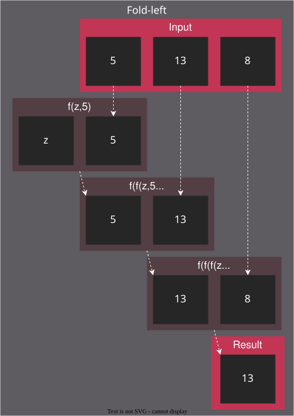
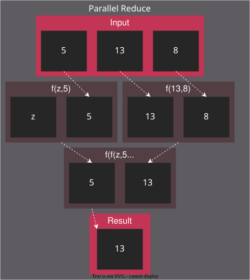
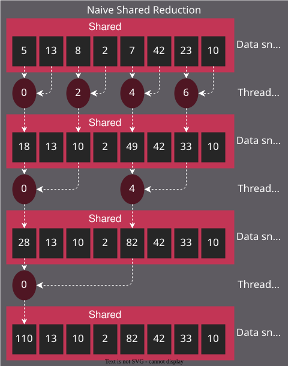
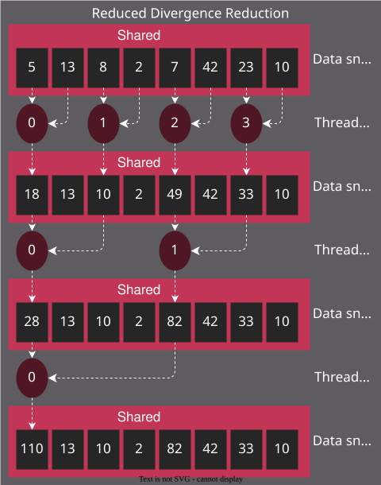
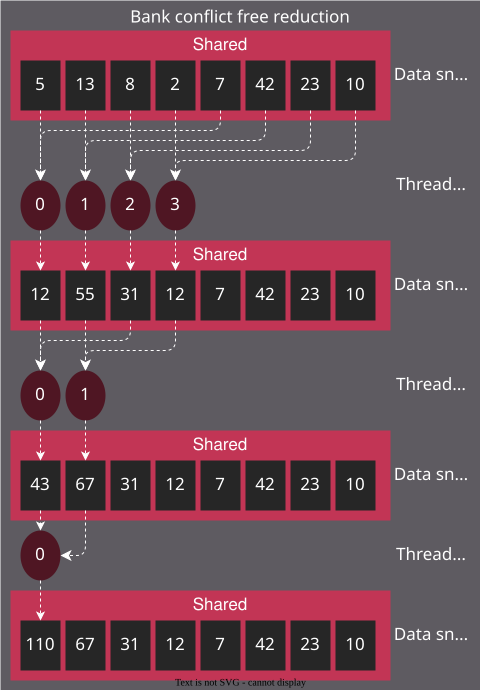
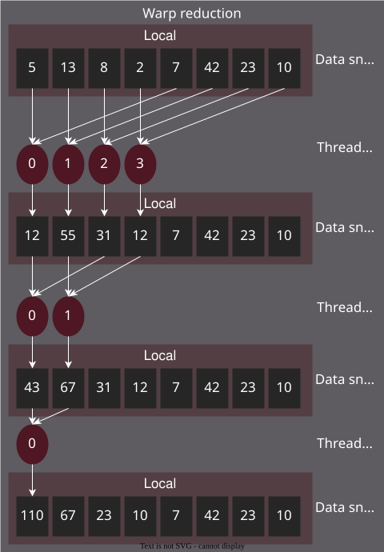
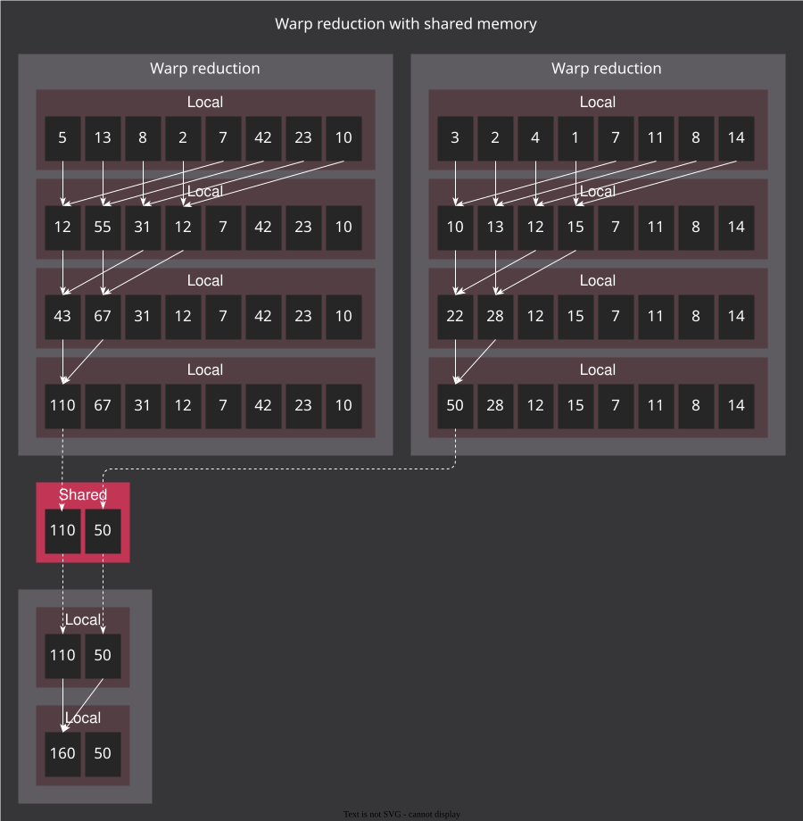

.. meta::
  :description: Optimize a HIP reduction kernel step by step by eliminating thread divergence, resolving bank conflicts, and using vectorized loads on AMD GPUs.
  :keywords: AMD, ROCm, HIP, reduction, shared memory, bank conflicts, warp, wavefront, vectorized loads, tutorial

.. _reduction:

********************************************************************************
Optimizing reduction in HIP
********************************************************************************

Reduction is a fundamental operation that uses a parallel pattern to combine a range of input
values into a single scalar using a binary operation such as sum, maximum, or product.
It appears throughout GPU workloads and is a practical vehicle for studying
shared memory, thread divergence, bank conflicts, and memory bandwidth
optimization.

This tutorial walks through a series of HIP kernels for summing a large array
of floating-point values, with each step addressing a specific performance
bottleneck. Starting from a naive interleaved-addressing kernel, each version
eliminates a specific bottleneck: thread divergence, shared-memory bank
conflicts, redundant synchronization barriers, and finally memory bandwidth.

The complete source file for all kernels is available at:

* :download:`Reduction kernels <../../tools/example_codes/reduction.hip>`

.. note::

   All kernels target a large array of single-precision floating-point values
   and are validated against a sequential reference sum.  They compile with
   ``amdclang++ -O3 -std=c++17`` and run on any ROCm-supported GPU architecture.

Prerequisites
=============

Before starting this tutorial, ensure the following are in place.

* ROCm installed and ``amdclang++`` available on ``PATH``.
* Familiarity with the HIP execution model (grids, blocks, warps) and its
  mapping to AMD GPU hardware (dispatches, workgroups, wavefronts).
* :ref:`rocprofiler-sdk:using-rocprofv3` installed for performance analysis.

Reduction fundamentals
======================

In functional programming, reduction is known as
`fold <https://en.wikipedia.org/wiki/Fold_(higher-order_function)>`_. In the
C++ standard library, it appears as ``std::accumulate`` and, since C++17, as
``std::reduce``. A reduction takes a range of inputs, an identity element, and
a binary operation, and repeatedly applies the operation until a single value
remains. For addition, the identity is 0.

On a GPU, a parallel reduction takes a tree-shaped form. In each round, threads
pair up and evaluate two values, reducing them to one, halving the number of live values until
one remains.

        number of live values until one result remains.

Each block independently reduces its portion of the input to a single partial
result. Repeating this process on successive output arrays until only one
element remains completes the device-wide reduction without requiring global
synchronization within a single kernel launch.

**Compile and run:**

.. code-block:: bash

   amdclang++ -O3 -std=c++17 reduction.hip -o reduction
   ./reduction

**Profile wall-clock time with rocprofv3:**

.. code-block:: bash

   rocprofv3 --kernel-trace --output-format csv -- ./reduction

The ``--kernel-trace`` CSV reports ``End_Timestamp - Start_Timestamp`` (both in
nanoseconds) for each kernel dispatch.  Compare the duration column across
kernel variants to measure the impact of each optimization step.

Naive kernel
============

The naive kernel loads one element per thread into shared memory and applies a
tree-shaped reduction using an interleaved addressing pattern. At each step,
only threads whose index is a multiple of ``2 * stride`` are active and
participate in the reduction.

The following kernel implements this pattern:

This causes thread divergence. Within a warp, all lanes must execute the
same instruction at the same time. When some lanes take a branch, and others do
not, the hardware must execute both paths serially with the inactive lanes
masked off. In the interleaved pattern, at least one lane in each warp
hits the ``if`` statement at every level of the tree, so warps remain
active long after the majority of their lanes have stopped doing useful work.

.. literalinclude:: ../../tools/example_codes/reduction.hip
   :language: cpp
   :linenos:
   :start-after: [Sphinx reduction naive kernel start]
   :end-before: [Sphinx reduction naive kernel end]

What to observe
---------------

Profile the naive kernel and record the following counter.

.. list-table::
   :header-rows: 1
   :widths: auto

   * - Counter
     - What to look for
   * - Kernel duration (kernel-trace CSV)
     - ``End_Timestamp - Start_Timestamp`` establishes the baseline.  This is the
       slowest variant because interleaved addressing keeps warps partially active
       at every tree level.

Reducing thread divergence
==========================

Reduce divergence by reassigning which threads are active so that
inactive threads accumulate uniformly toward the upper end of the thread index
range. Once an entire warp is inactive, it can skip directly to
``__syncthreads()``, rather than executing the branch with all lanes masked.

        by concentrating active threads in the lower index range.

This pattern, however, introduces a new problem: bank conflicts.

Resolving bank conflicts
========================

With AMD GPUs, shared memory (Local Data Share, or LDS) is organized into
banks of 4 bytes each.  On CDNA GPUs each Compute Unit has 32 banks.  On RDNA
GPUs the Work Group Processor has 64 banks, sub-divided into two sets of 32
banks each affiliated with a pair of SIMD32 units; a wavefront executes on one
SIMD32 and maps its accesses to the affiliated 32-bank set.  A bank conflict
occurs when two or more threads in the same warp access different addresses
that map to the same bank, causing those accesses to be serialized.

The reduced-divergence pattern still causes conflicts because the stride
between active threads' memory accesses doesn't align with the bank layout.
The fix is to set the stride to half the block size and halve each step,
so that active threads always occupy the lower half of the remaining live range
and access consecutive banks.

        active threads access consecutive shared memory banks.

.. note::

   To avoid bank conflicts, read and write shared memory in a coalesced manner,
   where each lane in a warp accesses a consecutive location. For more
   details, see the data share operations chapter of the
   `CDNA3 ISA <https://www.amd.com/content/dam/amd/en/documents/instinct-tech-docs/instruction-set-architectures/amd-instinct-mi300-cdna3-instruction-set-architecture.pdf>`_
   or
   `RDNA3 ISA <https://www.amd.com/content/dam/amd/en/documents/radeon-tech-docs/instruction-set-architectures/rdna3-shader-instruction-set-architecture-feb-2023_0.pdf>`_.

.. literalinclude:: ../../tools/example_codes/reduction.hip
   :language: cpp
   :linenos:
   :start-after: [Sphinx reduction sequential kernel start]
   :end-before: [Sphinx reduction sequential kernel end]

What to observe
---------------

Compare the following counters against the naive kernel baseline.

.. list-table::
   :header-rows: 1
   :widths: auto

   * - Counter
     - What to look for
   * - Kernel duration (kernel-trace CSV)
     - ``End_Timestamp - Start_Timestamp`` should drop versus the naive kernel.
       Sequential addressing eliminates both thread divergence and bank conflicts.
   * - ``LDSBankConflict``
     - Should be at or near zero, confirming that consecutive active threads
       access consecutive LDS banks.

Warp reduction
==============

Every ``__syncthreads()`` operation in the reduction loop is necessary while threads from
different warps are cooperating. Within a single warp, however,
threads execute in lockstep: they all advance through instructions together, so
a write by one lane is immediately visible to all other lanes in the same
warp without a barrier. Once the active thread count drops to one
warp, the remaining barriers are unnecessary overhead.

The warp reduction kernel exploits this by restructuring the algorithm into
two phases. First, each warp independently reduces its own slice of shared
memory without any barriers.

        shared memory in parallel.

Lane 0 of each warp then writes its partial result into a compact staging area,
and a single ``__syncthreads()`` makes all partial results visible. The first
warp then reduces the staging area, again without barriers.

        reduced by a single warp.

.. literalinclude:: ../../tools/example_codes/reduction.hip
   :language: cpp
   :linenos:
   :start-after: [Sphinx reduction warp reduce helper start]
   :end-before: [Sphinx reduction warp reduce helper end]

.. literalinclude:: ../../tools/example_codes/reduction.hip
   :language: cpp
   :linenos:
   :start-after: [Sphinx reduction warp kernel start]
   :end-before: [Sphinx reduction warp kernel end]

.. note::

   The warp-level reduction shown here uses shared memory. On AMD GPUs, the
   same result can be achieved without shared memory traffic using shuffle
   instructions or Data Parallel Primitives (DPP), which exchange values
   between lanes entirely in registers. These techniques are covered in the
   :doc:`../../compiler-builtins/introduction` chapter.

WGP mode and CU mode on RDNA GPUs
----------------------------------

For a full list of supported GPUs, see the
`ROCm system requirements <https://rocm.docs.amd.com/projects/install-on-linux/en/latest/reference/system-requirements.html>`_.

On CDNA GPUs, the array is organized as a set of Compute Unit (CU) pipelines.
Each CU contains four SIMD64 units and its own Local Data Share (LDS), which
threads from warps running on that CU can access. CDNA does not offer Work Group Processor
mode as RDNA does, so the following information does not apply.

On RDNA GPUs, the array is organized as a set of Work Group Processor (WGP)
pipelines. Each WGP contains two CUs, each with two SIMD32 units. The LDS is
attached to the WGP, so threads from different warps can access the same LDS
if they run on CUs within the same WGP.

Warps are dispatched in one of two modes. These control whether warps are
distributed across two SIMD32s within a single CU (CU mode) or across all
four SIMD32s within a WGP (WGP mode).

CU mode executes two warps per block on a CU and provides only half
the LDS to each warp. Independence between CUs can improve performance for
workloads that avoid inter-warp communication.

WGP mode executes four warps per block on a WGP with a shared LDS. It can
increase occupancy and improve performance for workloads without heavy
inter-warp communication, but it can degrade performance for programs that rely
on atomics or extensive inter-warp communication through shared memory.

The warp reduction kernel communicates partial results between warps through
shared memory, making it sensitive to this distinction. The inter-warp staging
step benefits from CU mode because all warps in the block are guaranteed to
share the same LDS instance. Compile with ``-mcumode`` to enable CU mode on
RDNA GPUs. Memory-bandwidth-bound kernels such as the vectorized loads
kernel are unaffected by this setting.

What to observe
---------------

Compare the following counters against the sequential-addressing kernel.

.. list-table::
   :header-rows: 1
   :widths: auto

   * - Counter
     - What to look for
   * - Kernel duration (kernel-trace CSV)
     - ``End_Timestamp - Start_Timestamp`` should drop versus the sequential
       kernel.  Eliminating unnecessary ``__syncthreads()`` barriers removes
       synchronization overhead.
   * - ``SQ_WAIT_INST_LDS``
     - Reduction in LDS stall cycles (fewer barriers mean less time waiting
       for shared memory to become consistent).

Vectorized loads
================

All kernels so far issue one 32-bit load per thread. The GPU memory system can
issue 128-bit loads at the same cost, so replacing four scalar loads with a
single ``float4`` read quadruples the data moved per instruction. Each thread
loads four consecutive elements, reduces them to a scalar in registers, and
then enters the same warp reduction as before.

.. literalinclude:: ../../tools/example_codes/reduction.hip
   :language: cpp
   :linenos:
   :start-after: [Sphinx reduction float4 kernel start]
   :end-before: [Sphinx reduction float4 kernel end]

.. note::

   The ``float4`` reinterpret cast requires the input pointer to be 16-byte
   aligned. Allocations from ``hipMalloc`` satisfy this requirement.

What to observe
---------------

Compare the following counters against the warp reduction kernel.

.. list-table::
   :header-rows: 1
   :widths: auto

   * - Counter
     - What to look for
   * - Kernel duration (kernel-trace CSV)
     - ``End_Timestamp - Start_Timestamp`` should drop versus the warp
       reduction kernel.  Each thread moves four times as much data per
       instruction.
   * - ``SQ_INST_CYCLES_VMEM`` (RDNA) / ``SQ_INST_CYCLES_VMEM_RD`` (CDNA)
     - Reduction in VMEM instruction cycles (fewer instructions for the same
       total data moved).

Device-level reduction
======================

The block kernels above each produce one partial result per block. To reduce
an entire array to a scalar, apply the block kernel repeatedly on successively
smaller arrays, alternating between two scratch buffers, until only one value
remains. For an input of N elements processed B elements per block, this
completes in log\ :sub:`B`\(N) passes.

.. literalinclude:: ../../tools/example_codes/reduction.hip
   :language: cpp
   :linenos:
   :start-after: [Sphinx reduction device level start]
   :end-before: [Sphinx reduction device level end]

Further reading
===============

The following resources provide deeper coverage of the tools and hardware referenced in this tutorial.

* :doc:`rocPRIM <rocprim:index>`
  — production-quality reduction primitives that handle edge cases and
  automatically apply architecture-specific tuning.
* :ref:`rocprofv3 documentation <rocprofiler-sdk:using-rocprofv3>` — detailed
  guide to timeline and counter profiling.
* `AMD GPU architecture guides (ISA references) <https://gpuopen.com/amd-gpu-architecture-programming-documentation/>`_
  — VGPR budgets, LDS bank geometry, and wavefront scheduling details for each
  architecture family.
